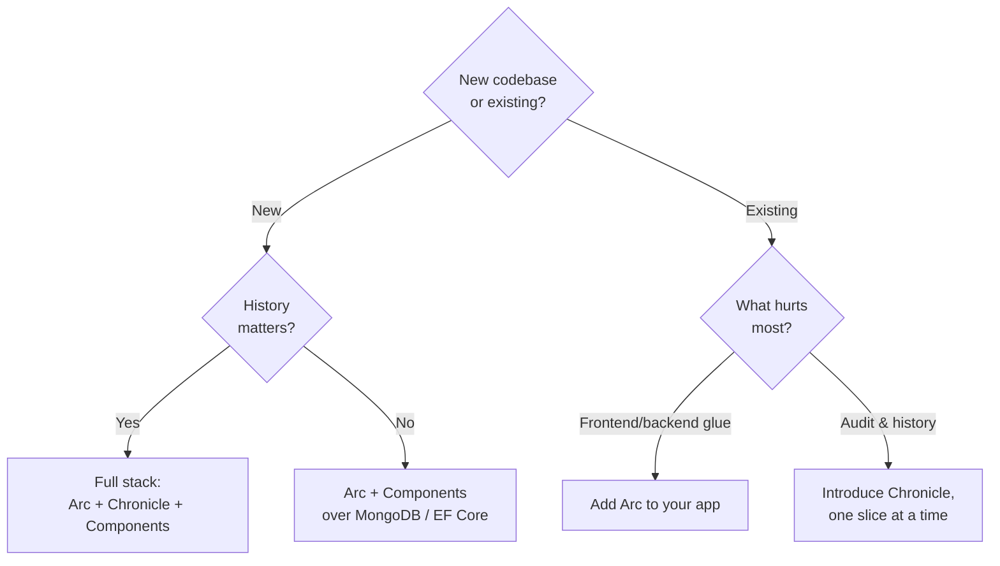

import { CardGrid, Aside } from '@astrojs/starlight/components';
import SimpleCard from '@components/SimpleCard.astro';
import TopicHero from '@components/TopicHero.astro';

<TopicHero icon="rocket" eyebrow="Getting oriented" title="Where to start">
Cratis is three products that stand on their own and compose when you want them to. So the first question isn't "how do I use Cratis?" — it's "which piece solves the problem in front of me today?" This page helps you choose, whether you're starting from a blank folder or wiring Cratis into a system that already exists.
</TopicHero>

## Pick your entry point

Two things decide where you start: **what you're building on** — a new codebase or an existing one — and **whether history matters**: do you need an audit trail and the ability to ask "how did we get here?", or is the current state enough?

| Your situation | Start with | Why |
| --- | --- | --- |
| New app, you want the full typed loop *and* history | **Arc + Chronicle + Components** | The whole stack working together — the [full-stack tutorial](/arc/tutorial/) builds exactly this. |
| New app, current state is enough (CRUD-ish) | **Arc + Components** over a database | Typed commands, queries, and a generated React client with no event sourcing — [Arc without event sourcing](/arc/arc-without-event-sourcing/). |
| Existing .NET API, frontend glue is the pain | **Arc**, added to your app | A typed TS client for new endpoints, without rewriting what you have. |
| Existing system, you need history or audit | **Chronicle**, incrementally | Event-source one bounded context; leave the rest as it is. |
| Not sure event sourcing fits at all | Read first | [When to use event sourcing](/chronicle/concepts/when-to-use-event-sourcing/), then [Why developers choose Cratis](/why-cratis/). |

## Starting from scratch (greenfield)

A new project is the easy case — nothing to migrate, no constraints. The only real decision is how far up the stack to start:

- **Want the full experience?** Scaffold the stack and follow [getting started](/chronicle/get-started/), then the [tutorial](/arc/tutorial/). You'll have the command → event → projection → query → React loop running, with history available from the event log.
- **Not sure you need events yet?** Start with [Arc over a database](/arc/arc-without-event-sourcing/). You get the typed full-stack app immediately — and because adopting Chronicle is a write-side change, you can turn on event sourcing later without touching your queries or your frontend. There's no penalty for waiting.

<Aside type="tip" title="You can defer the biggest decision">
The choice between "event sourcing" and "just a database" is the one teams agonize over. With Cratis you don't have to make it on day one: build on Arc, ship, and add Chronicle the day an auditor, a "show me the history" feature, or a new read model makes it worth it.
</Aside>

## Adding to an existing system (brownfield)

You rarely get to start clean. Cratis is built to be adopted a slice at a time, alongside code that already works — you don't rewrite, you grow into it.

### Add Arc to an existing ASP.NET Core app

If your pain is the **frontend-to-backend boundary** — hand-written controllers, DTOs duplicated in TypeScript, fetch wrappers that drift out of sync — Arc slots into an app you already have. Register it on your existing host and start expressing *new* endpoints as commands and queries; Arc generates their typed proxies while your existing controllers keep running untouched.

Arc's persistence meets your data where it already lives: its [MongoDB](/arc/backend/mongodb/) and [Entity Framework](/arc/backend/entity-framework/) integrations read and write the database you already use — EF Core even has a [direct-registration path](/arc/backend/entity-framework/getting-started/) designed for slotting into an existing application without taking over the whole framework. For controllers and MediatR handlers, the [MediatR, MVC, and Arc](/arc/coming-from-mediatr-and-mvc/) bridge maps familiar concepts onto Arc's model.

### Introduce Chronicle into an existing domain

If your pain is **history** — you need an audit trail, a "how did this order get into this state?" view, or a new read model the current schema can't serve — you don't have to event-source the whole system. Pick the one bounded context where history actually matters and event-source just that:

1. Model the facts for that area as [events](/chronicle/concepts/event/), and append them when the corresponding things happen — for new behavior, append the event; for existing writes, append alongside the current write.
2. Build [projections](/chronicle/projections/) that fold those events into exactly the read models that context needs. They can sit right next to your existing tables.
3. Let the rest of the system keep working as it is. Event sourcing earns its place one context at a time, not as a big-bang rewrite.

The [CRUD, EF Core, and Chronicle](/chronicle/coming-from-crud/) guide maps tables and `SaveChanges` onto events — that's the mental shift that makes this click.

<Aside type="caution" title="Adopt where history pays for itself">
Don't event-source a context just because you can. Reach for Chronicle where someone will genuinely ask "what changed, and when" — and leave the genuinely-CRUD corners on Arc-over-a-database. [When to use event sourcing](/chronicle/concepts/when-to-use-event-sourcing/) is the honest filter.
</Aside>

## Grow into the full stack

However you start, the pieces are designed to be *added*, not swapped out. The common growth paths:

- **Arc-over-a-database → add Chronicle.** Move a slice's write side from a direct insert to appending an event with a projection behind it. The query and the React don't change — see the side-by-side in [Arc without event sourcing](/arc/arc-without-event-sourcing/).
- **Chronicle-only service → add Arc and a frontend.** Already event-sourcing from a worker or service? Put Arc in front to expose typed commands and queries, and Components to render them — without changing how your events are stored.
- **Any backend → add Components.** The React library consumes Arc's generated proxies, so adding it is a frontend-only step.

## Next steps

<CardGrid>
  <SimpleCard title="Why developers choose Cratis" icon="open-book" link="/why-cratis/">
    How the three products stand alone and compose — the map this page navigates.
  </SimpleCard>
  <SimpleCard title="Arc without event sourcing" icon="puzzle" link="/arc/arc-without-event-sourcing/">
    The standalone Arc shape, and the write-side swap that adds Chronicle later.
  </SimpleCard>
  <SimpleCard title="Build the full loop" icon="rocket" link="/arc/tutorial/">
    The full-stack tutorial — command to live React screen, with history.
  </SimpleCard>
</CardGrid>
