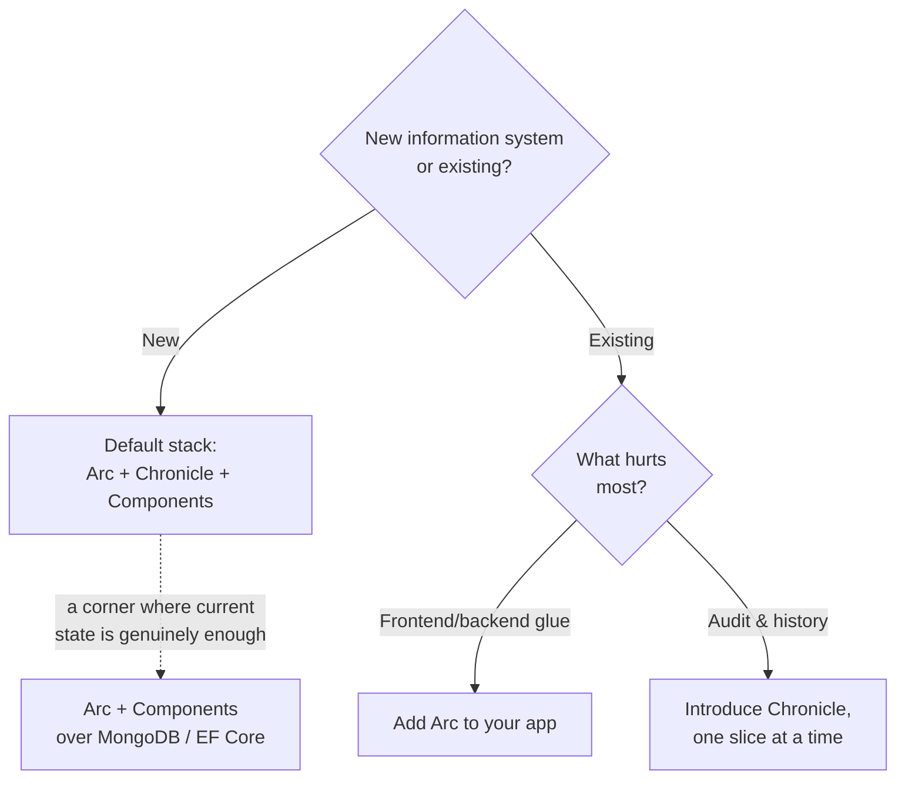

import { CardGrid, Aside } from '@astrojs/starlight/components';
import SimpleCard from '@components/SimpleCard.astro';
import TopicHero from '@components/TopicHero.astro';

<TopicHero icon="rocket" eyebrow="Getting oriented" title="Where to start">
Cratis products stand on their own and compose when you want them to. For a new information system, our default is the full loop: Chronicle for event sourcing, Arc for CQRS, Components for React, and AuthProxy at the edge. For an existing system or a bounded current-state slice, you can adopt one piece at a time without losing the path back to the full stack.
</TopicHero>

## Pick your entry point

Three things decide where you start: **what you're building on** — a new codebase or an existing one — **which boundary you are changing first**, and **which language your services are written in**. Event sourcing is the default architecture we recommend for information systems; CQRS, generated contracts, and edge identity can still be adopted independently.

```mermaid
flowchart TD
    Q1{New information system<br/>or existing?}
    Q1 -->|New| FULL["Default stack:<br/>Arc + Chronicle + Components"]
    FULL -.->|a corner where current<br/>state is genuinely enough| ARC["Arc + Components<br/>over MongoDB / EF Core"]
    Q1 -->|Existing| Q3{What hurts<br/>most?}
    Q3 -->|Frontend/backend glue| ADDARC["Add Arc to your app"]
    Q3 -->|Audit & history| ADDCHR["Introduce Chronicle,<br/>one slice at a time"]
```

| Your situation | Start with | Why |
| --- | --- | --- |
| New information system | **Arc + Chronicle + Components** | The default Cratis loop: CQRS at the boundary, event history underneath, React generated from C# — the [full-stack capstone](/build-a-full-app/) builds the shape. |
| Bounded slice where current state is genuinely enough | **Arc + Components** over a database | Typed commands, queries, and a generated React client with CQRS but no event log — [CQRS without event sourcing](/arc/arc-without-event-sourcing/). |
| Existing .NET API, frontend glue is the pain | **Arc**, added to your app | A typed TS client for new endpoints, without rewriting what you have. |
| Existing system, you need history or audit | **Chronicle**, incrementally | Event-source one bounded context; leave the rest as it is. |
| New full-stack app on Kotlin or Java | **Arc + Chronicle** on Spring Boot | The [Cratis Kotlin](/templates/cratis-kotlin/) and [Cratis Java](/templates/cratis-java/) templates scaffold the same full-stack shape with a React frontend. |
| Services in TypeScript, Kotlin/Java, or Elixir that need an event store | **Chronicle** with your language's client | Chronicle's clients talk to the same kernel over gRPC — see [Chronicle in your language](/chronicle-clients/). |
| Need to separate CQRS from event sourcing | Read first | [CQRS without event sourcing](/arc/arc-without-event-sourcing/), then [Why developers choose Cratis](/why-cratis/). |

## Starting from scratch (greenfield)

A new project is the easy case — nothing to migrate, no constraints. For an information system, start with the whole loop unless you have a clear reason not to:

- **Default to the full experience.** Follow [Build a full-stack feature](/build-a-full-app/): it scaffolds the application from the [Cratis templates](/templates/getting-started/) and adds one slice by hand. You'll have the command → event → projection → query → React loop running, with history available from the event log. The template wires Arc and Chronicle into one host through the [Cratis package](/arc/backend/csharp/chronicle/cratis-package/)'s `AddCratis`/`UseCratis`.
- **Use Arc-only for deliberate current-state slices.** If a bounded part of the app is just reference data, settings, or an adoption step, [Arc over a database](/arc/arc-without-event-sourcing/) still gives you CQRS, generated proxies, and live queries. Adopting Chronicle later is mostly a write-side change: the query contract and the React screens that use it can stay the same, though the query's implementation moves to the read model a projection builds.

<Aside type="tip" title="CQRS and event sourcing are independent">
Arc gives you CQRS: commands for information entering the system, queries for information leaving it. Chronicle gives you event sourcing: facts as the durable source of truth. They fit together extremely well, but either one can stand without the other.
</Aside>

## Adding to an existing system (brownfield)

You rarely get to start clean. Cratis is built to be adopted a slice at a time, alongside code that already works — you don't rewrite, you grow into it.

### Add Arc to an existing ASP.NET Core app

If your pain is the **frontend-to-backend boundary** — hand-written controllers, DTOs duplicated in TypeScript, fetch wrappers that drift out of sync — Arc slots into an app you already have. Register it on your existing host and start expressing *new* endpoints as commands and queries; Arc generates their typed proxies while your existing controllers keep running untouched. [Set up a standalone Arc backend](/arc/backend/csharp/getting-started/) shows the packages and the proxy-generation settings, with no Chronicle or template involved.

Arc's persistence meets your data where it already lives: its [MongoDB](/arc/backend/csharp/mongodb/) and [Entity Framework](/arc/backend/csharp/entity-framework/) integrations read and write the database you already use — EF Core even has a [direct-registration path](/arc/backend/csharp/entity-framework/getting-started/) designed for slotting into an existing application without taking over the whole framework. For controllers and MediatR handlers, the [MediatR, MVC, and Arc](/arc/backend/csharp/coming-from-mediatr-and-mvc/) bridge maps familiar concepts onto Arc's model.

### Introduce Chronicle into an existing domain

If your pain is **history** — you need an audit trail, a "how did this order get into this state?" view, or a new read model the current schema can't serve — you don't have to event-source the whole system in one move. Pick the bounded context where the model is clearest and event-source that first:

1. Model the facts for that area as [events](/chronicle/concepts/event/), and append them when the corresponding things happen — for new behavior, append the event; for existing writes, append alongside the current write. Existing rows do not become events on their own; decide whether you need historical events at all, and if so, write them deliberately.
2. Build [projections](/chronicle/projections/) that fold those events into exactly the read models that context needs. They can sit right next to your existing tables.
3. Let the rest of the system keep working as it is. Event sourcing earns its place one context at a time, not as a big-bang rewrite.

The [CRUD, EF Core, and Chronicle](/chronicle/coming-from-crud/) guide maps tables and `SaveChanges` onto events — that's the mental shift that makes this click.

<Aside type="caution" title="Writing to two places">
Appending an event alongside an existing write is a dual write: the two can succeed or fail independently. Decide which one is the source of truth for that context, make the other derived from it where you can, and plan how you detect and reconcile a mismatch. The [CRUD, EF Core, and Chronicle](/chronicle/coming-from-crud/) guide maps the concepts.
</Aside>

<Aside type="caution" title="Keep the boundary honest">
Event sourcing is the default for information systems, not a mandate that every settings table needs a stream. Use Chronicle for the facts and processes that define the domain, and leave genuinely current-state-only corners on Arc-over-a-database. [When to use event sourcing](/chronicle/concepts/when-to-use-event-sourcing/) is the honest filter.
</Aside>

## Grow into the full stack

However you start, the pieces are designed to be *added*, not swapped out. The common growth paths:

- **Arc-over-a-database → add Chronicle.** Move a slice's write side from a direct insert to appending an event with a projection behind it. The query's contract and the React that calls it can stay the same, while the query now reads the projected read model; see the side-by-side in [CQRS without event sourcing](/arc/arc-without-event-sourcing/).
- **Chronicle-only service → add Arc and a frontend.** Already event-sourcing from a worker or service? Put Arc in front to expose typed commands and queries, and Components to render them — without changing how your events are stored.
- **Any backend → add Components.** The React library consumes Arc's generated proxies, so adding it is a frontend-only step.

## Next steps

<CardGrid>
  <SimpleCard title="Why developers choose Cratis" icon="open-book" link="/why-cratis/">
    How the three products stand alone and compose — the map this page navigates.
  </SimpleCard>
  <SimpleCard title="CQRS without event sourcing" icon="puzzle" link="/arc/arc-without-event-sourcing/">
    The standalone Arc shape, and the write-side change that moves a slice to Chronicle.
  </SimpleCard>
  <SimpleCard title="Build the full loop" icon="rocket" link="/build-a-full-app/">
    The full-stack capstone — command to event to live React screen, with history.
  </SimpleCard>
</CardGrid>
