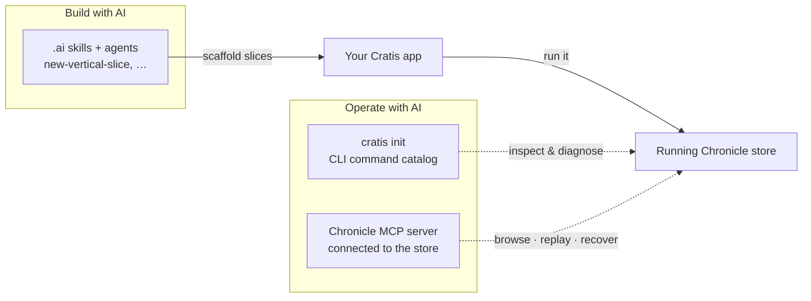

import { CardGrid, Aside } from '@astrojs/starlight/components';
import SimpleCard from '@components/SimpleCard.astro';
import TopicHero from '@components/TopicHero.astro';

<TopicHero icon="rocket" eyebrow="The Cratis Stack" title="Build and operate with AI agents">
Cratis is built to be driven by an AI assistant — not as an afterthought, but as part of the stack. There are two halves to it: tooling that teaches your agent to **build** applications the Cratis way, and tooling that lets it **operate** a running store. Here's how to turn both on.
</TopicHero>

## Why "AI-native"

An AI assistant is only as good as what it knows about your framework and your system. Drop a general-purpose agent into a Cratis codebase and it will *guess* — inventing handler classes, missing the vertical-slice conventions, hand-writing the API client you don't need. Point it at a running event store and it has no idea how to read the log or recover a stuck observer.

Cratis closes both gaps with tooling you install, so your assistant works *with* the grain of the framework instead of against it.

## Build with AI: agents and skills that know the Cratis way

The **Cratis AI configuration** is a set of agents, skills, and coding rules that teach an assistant the conventions — vertical slices, `[Command]` with `Handle()` on the record, model-bound projections, `ConceptAs<T>` instead of raw primitives. It works with **Claude Code** and **GitHub Copilot**, surfaced through the standard `.claude/` and `.github/` folders.

Among the skills it hands your assistant:

- **`new-vertical-slice`** — scaffold a whole feature end to end: command, events, projection, query, React, and specs.
- **`cratis-command`**, **`cratis-readmodel`**, **`add-projection`**, **`add-reactor`**, **`add-concept`** — build one artifact correctly, by convention.
- **`scaffold-feature`**, **`write-specs`**, **`review-code`** — set up a feature folder, cover it with BDD specs, and review the result against the project's standards.

Because the skills encode the conventions, an agent that uses them produces slices that look like the rest of your codebase — not a layered approximation of it. (The configuration is the canonical `.ai/` source in the Cratis AI repository, dropped into a project as its `.claude/` and `.github/` folders.)

<Aside type="tip" title="Model first, then generate">
Pair this with [Studio](/studio/): model the feature on the canvas, generate the C# shapes, then let an agent flesh out the slices around them. Design → generate → build, with AI at each step.
</Aside>

## Operate with AI: teach your assistant your store

Building is only half the loop. The other half is *operating* what you built — and Cratis makes the running store legible to an assistant two ways.

### `cratis init` — the CLI, made AI-aware

Run it once inside your project:

```bash
cratis init
```

It writes a **`CHRONICLE.md`** describing every command the CLI can run, installs instruction files for **Claude Code, GitHub Copilot, Cursor, and Windsurf**, and adds a **`chronicle-diagnose`** slash command. From then on your assistant knows how to browse events, watch observers, and diagnose a stuck partition through the [CLI](/cli/) — because the whole command catalog is in its context. Refresh it after a CLI upgrade with `cratis init --refresh`. The [CLI getting started](/cli/getting-started/) guide walks through it in full.

### The Chronicle MCP server — an agent, connected to the store

For tools that speak the **Model Context Protocol**, Cratis publishes a containerized MCP server that connects straight to a running Chronicle store. Point your tool at it with an `mcp.json`:

```json
{
    "servers": {
        "Chronicle": {
            "type": "stdio",
            "command": "docker",
            "args": ["run", "-i", "--rm",
                "-eCratis__Chronicle__Mcp__ConnectionString=chronicle://host.docker.internal:35000",
                "cratis/chronicle-mcp"]
        }
    }
}
```

With it connected, your assistant can — in plain language — do things like:

- **Explore** — list event stores and sequences, show event types and their schemas, and read the event log or the events for a single event source.
- **Run observers** — list observers, replay an observer or one partition, and recover a failed partition.
- **Act on recommendations** — list, perform, or ignore the store's recommendations.
- **Manage jobs** — resume, stop, or delete a running job.

It needs a Chronicle server running; everything it does, it does against the live store.

<Aside type="note" title="Operate, not mutate">
The MCP server and the CLI are *operate-and-inspect* tools — the agent reads the log and manages observers and jobs. To change application state you still go through commands and events. History stays honest.
</Aside>

## The whole loop, AI-accelerated



## Where to go next

<CardGrid>
  <SimpleCard title="The Cratis Stack" icon="rocket" link="/cratis-stack/">
    How design, build, and operate fit together end to end — AI accelerates every step.
  </SimpleCard>
  <SimpleCard title="CLI getting started" icon="rocket" link="/cli/getting-started/">
    Install the CLI, connect to your store, and run `cratis init` to set up AI tooling.
  </SimpleCard>
  <SimpleCard title="Vertical slices" icon="seti:folder" link="/arc/vertical-slices/">
    The convention the build-side skills follow — everything for a feature in one folder.
  </SimpleCard>
</CardGrid>
