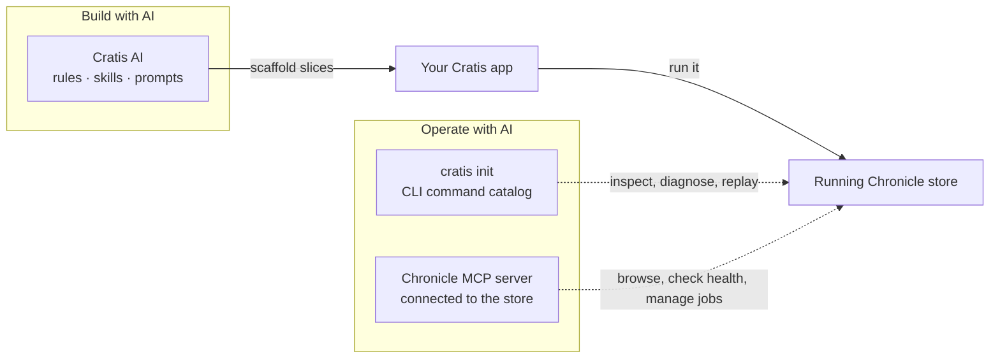

import { CardGrid, Aside } from '@astrojs/starlight/components';
import SimpleCard from '@components/SimpleCard.astro';
import TopicHero from '@components/TopicHero.astro';

<TopicHero icon="rocket" eyebrow="The Cratis Stack" title="Build and operate with AI agents">
Give your coding agent the same conventions, framework boundaries, and checks your team works to. Install the Cratis AI rules and skills into a repository with the Cratis CLI, or add the skills to one tool through its plugin. Then connect the agent to a running Chronicle store through the CLI and the Chronicle MCP server.
</TopicHero>

## Why "AI-native"

An assistant is only as good as what it knows about your framework and your
system. Drop a general-purpose agent into a Cratis codebase and it guesses: it
invents handler classes, misses the vertical-slice conventions, and hand-writes
the API client that proxy generation already produces. Point it at a running
event store and it has no idea how to read the log or find a failed partition.

Cratis addresses both halves. On the build side, Cratis AI gives the agent the
conventions. On the operate side, the CLI and the Chronicle MCP server give it a
documented way into the store.

## Build with AI: skills that know the Cratis way

**Cratis AI** is a shared corpus of rules, skills, prompts, and subagents that
teaches an assistant the conventions: vertical slices, `[Command]` with
`Handle()` on the record, model-bound projections, and `ConceptAs<T>` instead of
raw primitives. It is authored in [Cratis/AI](https://github.com/Cratis/AI) and
reaches you through one of three channels:

| Channel | What you get | Versioning |
| --- | --- | --- |
| `cratis ai install` | Rules, skills, prompts, agents, and hooks for every selected coding tool, filtered by profile and committed to your repository | Takes the current `main`; `--source` reads a checkout of a known commit |
| `@cratis/pi` on npm | Skills, rules, prompts, agents, and hooks inside Pi | Versioned per release |
| `cratis` marketplace plugin for Claude Code, Codex, GitHub Copilot, or Cursor | Skills only | Follows the default branch |

A few of what you get, by name:

- **`new-vertical-slice`** (prompt) scaffolds a whole feature end to end:
  command, events, projection, query, React, and specs.
- **`cratis-arc-command`**, **`cratis-chronicle-read-model`**,
  **`cratis-chronicle-projection`**, **`cratis-chronicle-reactor`**, and
  **`cratis-fundamentals-concept`** (skills) build one artifact by convention.
  The `add-projection`, `add-reactor`, and `add-concept` prompts start the same
  work as a slash command.
- **`scaffold-feature`** and **`write-specs`** (prompts) and
  **`cratis-code-review`** (skill) set up a feature folder, cover it with BDD
  specs, and review the result against the project's standards.

Prompts come with the managed install and `@cratis/pi`; the marketplace plugin
has the skills only. Because the skills encode the conventions, an agent that
uses them produces slices that look like the rest of your codebase instead of a
layered approximation of it.

Start with [Start using Cratis AI](/ai/getting-started/). The
[agent harness guide](/ai/harnesses/) has the command for each coding tool,
[profiles](/ai/profiles/) explains how to choose the guidance a repository
needs, and the [scenarios](/ai/scenarios/solo-developer/) cover solo, team, and
multi-tool setups. The [code-analysis rules](/code-analysis/) enforce the same
framework contracts during the build, whether or not an agent wrote the code.

<Aside type="tip" title="Model first, then build">
You can pair this with [Studio](/studio/) or [Screenplay](/screenplay/): model the
feature, then let an agent build the slices around it. Studio is live in beta;
review generated output from Stage, which remains experimental.
</Aside>

## Operate with AI: teach your assistant your store

Building is half the loop. The other half is *operating* what you built. Cratis
gives an assistant two ways into a running store.

### `cratis init` — the CLI, made AI-aware

Run it once inside your project:

```bash
cratis init
```

It writes a **`CHRONICLE.md`** describing every command the CLI can run, adds
instruction files for the AI tools it detects (Claude Code, GitHub Copilot,
Cursor, Windsurf, and Pi), and adds a **`chronicle-diagnose`** slash command.
Detection looks at the project's files and at environment variables each tool
sets. If it detects none, it configures none; pass `--tool <name>` to target one.

From then on your assistant can browse events, watch observers, and diagnose a
failed partition through the [CLI](/cli/), because the command catalog is in its
context. After a CLI upgrade, refresh the catalog with `cratis init --refresh`.
The [CLI getting started](/cli/getting-started/) guide covers it in full.

### The Chronicle MCP server — an agent, connected to the store

For tools that speak the **Model Context Protocol**, Cratis publishes the
[Chronicle MCP server](/chronicle-mcp/) as the `cratis/chronicle-mcp` container
image. It connects straight to a running Chronicle server. The setup depends on
your MCP host; [Chronicle MCP getting started](/chronicle-mcp/getting-started/)
has a working configuration and [configuration](/chronicle-mcp/configuration/)
covers connection strings and credentials.

<Aside type="caution" title="Local defaults">
Without configuration, the server uses Chronicle's development client
credentials and `localhost:35000`. Those defaults are for a local development
store only. Give it real credentials, or an API key, before you point it at
anything shared.
</Aside>

Once connected, your assistant can:

- **Explore**: list event stores, namespaces, event types, projections, and read
  models; read events and the tail sequence number; look at read model
  instances.
- **Check observer health**: list observers and failed partitions, get one
  observer's state, and list the recommendations the store has raised.
- **Manage jobs**: list jobs and their steps, and stop, resume, or delete a job.
- **Design against real data**: describe the system and its event types, build
  an event catalog, find event types nothing consumes, trace why an event
  source ended up in its state, run an ad-hoc projection, suggest next event
  types, and scaffold a read model.

To replay an observer or recover a failed partition, use the
[CLI](/cli/chronicle/) or the Workbench after the agent has helped you diagnose
the cause.

<Aside type="note" title="Operate, not change history">
The MCP server and the CLI inspect and operate the store: they read the log and
manage observers and jobs. To change application state you still go through
commands and events, so history stays honest.
</Aside>

## The whole loop, AI-accelerated



## Where to go next

<CardGrid>
  <SimpleCard title="Get started with AI" icon="rocket" link="/ai/getting-started/">
    Install Cratis AI into a repository and confirm your agent sees it.
  </SimpleCard>
  <SimpleCard title="Ecosystem support" icon="puzzle" link="/ai/ecosystems/">
    Which coding tools get what, through the managed install and each plugin.
  </SimpleCard>
  <SimpleCard title="Distribution" icon="approve-check" link="/ai/trust-and-distribution/">
    The three channels, how each is versioned, and how your own guidance stays yours.
  </SimpleCard>
  <SimpleCard title="The Cratis Stack" icon="rocket" link="/cratis-stack/">
    How design, build, and operate fit together end to end.
  </SimpleCard>
  <SimpleCard title="CLI getting started" icon="rocket" link="/cli/getting-started/">
    Install the CLI, connect to your store, and run `cratis init` to set up AI tooling.
  </SimpleCard>
  <SimpleCard title="Chronicle MCP" icon="puzzle" link="/chronicle-mcp/">
    The operate-side and design-time tools an agent gets against a live store.
  </SimpleCard>
  <SimpleCard title="Skills and plugins" icon="puzzle" link="/plugins/">
    What the corpus contains, and which channel delivers rules, skills, prompts, and hooks.
  </SimpleCard>
  <SimpleCard title="Code analysis" icon="approve-check" link="/code-analysis/">
    The Roslyn analyzers and ESLint rules that enforce the same conventions during the build.
  </SimpleCard>
  <SimpleCard title="Vertical slices" icon="seti:folder" link="/arc/vertical-slices/">
    The convention the build-side skills follow: everything for a feature in one folder.
  </SimpleCard>
</CardGrid>
