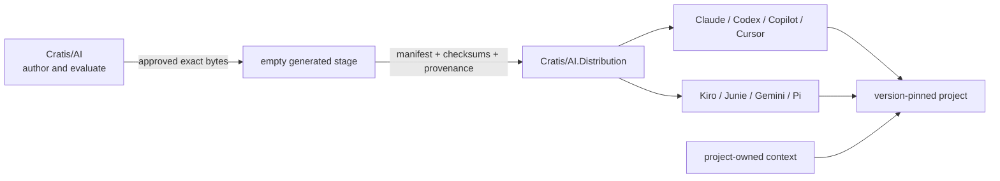

import { Aside } from '@astrojs/starlight/components';

An AI skill can influence every file an assistant reads or writes. Treating it
like a copied snippet makes updates hard to audit and rollback. Cratis therefore
separates authoring, generated distribution, host packaging, and project-owned
context.

## One source, generated packages

`Cratis/AI` is the canonical authoring and approval repository. A generator
selects an exact positive allowlist into an empty stage, verifies byte parity,
and emits target-native manifests. The generated repository contains no
hand-authored behavior.

`Cratis/AI.Distribution` is public but currently fixture-only. Its protected
`main` branch demonstrates the generated boundary; it does not grant public
installation or release status.

## Why Cratis does not propagate folders

The previous model copied shared AI folders across repositories. That creates
three problems:

1. repositories silently drift to different corpus versions;
2. a target can accidentally become another distribution source;
3. rollback means reconstructing overwritten files instead of changing a pin.

The replacement is ordinary versioned distribution. One source produces one
release manifest. Consumers install or pin that version through their host.
Workflows can canary, update, disable, and roll it back without rewriting the
project's own facts.

## Project context remains project-owned

Shared packages teach reusable Cratis concepts and workflows. They do not own a
project's architecture, environment names, commands, credentials, test fixtures,
or product decisions.

The controlled context design uses `.cratis/PROJECT.md` as canonical project
content, with minimal host bootstraps where a host cannot discover it directly.
Some current repositories still use `.agents/PROJECT.md` during migration. A
resolver chooses one; it never merges, overwrites, or deletes either file.

<Aside type="note" title="Uninstall must leave the project intact">
Removing a shared AI package must remove shared capabilities only. It must not
delete `AGENTS.md`, `CLAUDE.md`, `GEMINI.md`, `.cratis/PROJECT.md`, legacy project
context, or repository-local overrides.
</Aside>

## The release gates

A public capability moves through separate gates:

| Gate | Evidence required |
| --- | --- |
| Source authority | Owning product repository, immutable revision, owner, permission, claims, digest, and expiry |
| Target approval | Behavior, trigger, negative trigger, collision, security, originality, and portability evidence |
| Materialization | Exact file closure, native manifests, byte parity, checksums, and provenance |
| Package lifecycle | Pack, install, discovery, smoke, update, uninstall, and rollback |
| Canary | One approved consuming repository with observable version-bound results |
| Publication | Protected environment, machine identity, reviewer, immutable release, and vendor/npm approval |
| Retirement | Fleet visibility, rollback evidence, emergency disable, and proof the old topology cannot restart |

A green build at one gate never implies the next gate passed.

## Current state

Cratis has fixture evidence for native generation, package lifecycle, checksums,
local and hosted canary/rollback simulation, and a generated-only protected Git
repository. The one-time initialization credential was removed after use.

Still blocked:

- no real public skill target or product-source contract is approved;
- no PR/release-capable distribution bot is provisioned;
- `@cratis/ai` package ownership and trusted publishing are not configured;
- no real consuming-repository canary has run;
- marketplace review and listing are not complete.

That boundary is deliberate. Follow the [ecosystem support matrix](/ai/ecosystems/)
for status and [Using AI as a Cratis maintainer](/ai/cratis-maintainers/) for the
current internal workflow.
