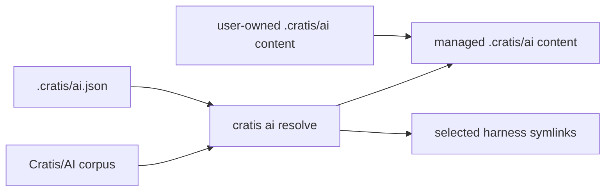

import { Aside } from '@astrojs/starlight/components';

Cratis AI is authored in one canonical corpus. A consuming repository declares
what it wants in `.cratis/ai.json`; the CLI resolves the relevant rules and
skills for its profiles, languages, and agent harnesses.



## Selection, not a universal copy

A repository can select several harnesses, profiles, and languages:

```json
{
  "harnesses": ["claude", "cursor", "opencode", "pi"],
  "profiles": ["cratis/chronicle", "cratis/arc"],
  "languages": ["csharp", "typescript"]
}
```

The selection is enough to determine the installed content. The CLI resolves it
for the managed path. The native Pi package reads the same file and applies the
same profile and language selection; when the file is absent, it exposes all
packaged skills.

## Ownership and synchronization

Cratis marks managed text with a stable `cratis-ai-managed` source identity and
records source identities and installed hashes in `.cratis/ai.manifest.json`.
The canonical local corpus is `.cratis/ai`; every harness adapter is a symlink
or configuration reference to that location. This makes updates predictable
without claiming user files:

- additions and changed upstream files are synchronized;
- moved or removed upstream files are removed only when their installed hash is
  unchanged;
- a locally changed managed file stops update or uninstall before any change;
- `--force` explicitly replaces or removes a modified managed file; and
- unrecognized files and user-created `.cratis/ai` content are left intact.

<Aside type="tip" title="Use the lifecycle commands">
Run `cratis ai status` before updating. It identifies local changes that need a
human decision. Run `cratis ai uninstall` when removing the integration; it
removes only unchanged Cratis-owned content and its own harness configuration.
</Aside>

## Quality is verification

Cratis does not gate corpus content on author identity, provenance records, or
approval chains that do not test behavior. A skill can provide a verification
scenario with the representative task, required fixture, and observable
assertions. The runner discovers scenarios, executes deterministic assertions,
and reports useful failures locally and in CI. Harness/model execution may add
coverage where practical. These checks establish behavior and consistency, not
traceability.

## Plugins and marketplaces

Plugins remain valuable for native skill discovery and marketplace visibility.
They are intentionally narrower than repository installation. A plugin does not
safely manage persistent rules, repository-specific composition, ownership
metadata, or a multi-harness lifecycle. Use plugins for convenient skill access;
use `cratis ai install` to configure a repository.
