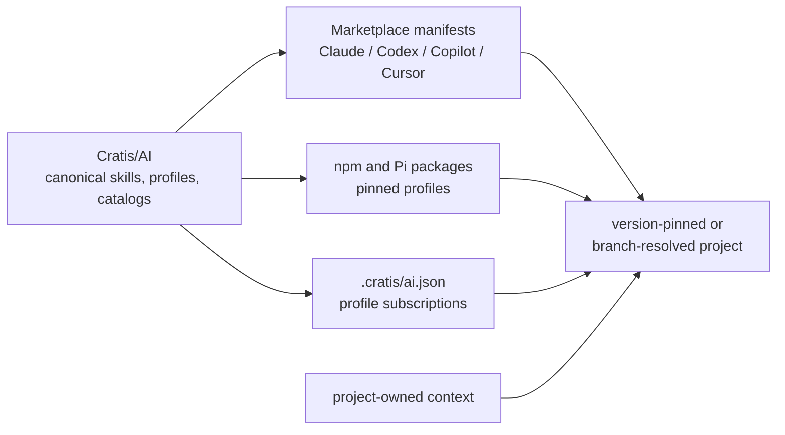

import { Aside } from '@astrojs/starlight/components';

An AI skill can influence every file an assistant reads or writes. Treating it
like a copied snippet makes updates hard to audit and rollback. Cratis therefore
separates authoring, distribution, and project-owned context.

## One source, many delivery shapes

`Cratis/AI` is the canonical authoring and approval repository. Committed
marketplace manifests resolve the `skills/` and `engineering/` directories
directly from its default branch — what a host installs is exactly what a
reviewer reads. Versioned packages (npm, consumed through Pi) and `.cratis/ai.json`
profile subscriptions carry the same skills at pinned versions for repositories
that need a narrower scope or reviewed updates.

The former generated distribution repository, `Cratis/AI.Distribution`, is
**retired**: its published tags keep resolving and are never deleted, but it
receives no further releases. There is no second repository to keep in sync, no
release branch, and no generated tree to maintain.

## Why Cratis does not propagate folders

The previous model copied shared AI folders across repositories. That creates
three problems:

1. repositories silently drift to different corpus versions;
2. a target can accidentally become another distribution source;
3. rollback means reconstructing overwritten files instead of changing a pin.

The replacement is ordinary versioned distribution. One canonical repository
feeds marketplace manifests, pinned packages, and profile subscriptions.
Consumers install or pin a version through their host. Workflows can canary,
update, disable, and roll it back without rewriting the project's own facts.

## Project context remains project-owned

Shared packages teach reusable Cratis concepts and workflows. They do not own a
project's architecture, environment names, commands, credentials, test fixtures,
or product decisions.

The controlled context design uses `.cratis/PROJECT.md` as canonical project
content, with minimal host bootstraps where a host cannot discover it directly.
Some current repositories still use `.agents/PROJECT.md` during migration. A
resolver chooses one; it never merges, overwrites, or deletes either file.

<Aside type="note" title="Uninstall must leave the project intact">
Removing a shared AI package must remove shared capabilities only. It must not
delete `AGENTS.md`, `CLAUDE.md`, `GEMINI.md`, `.cratis/PROJECT.md`, legacy project
context, or repository-local overrides.
</Aside>

## The release gates

Installing Cratis AI is open; *supporting* it is earned gate by gate. A public
capability moves through separate gates on the way from evaluation to a
supported release:

| Gate | Evidence required |
| --- | --- |
| Source authority | Owning product repository, immutable revision, owner, permission, claims, digest, and expiry |
| Target approval | Behavior, trigger, negative trigger, collision, security, originality, and portability evidence |
| Materialization | Exact file closure, native manifests, byte parity, checksums, and provenance |
| Package lifecycle | Pack, install, discovery, smoke, update, uninstall, and rollback |
| Canary | One approved consuming repository with observable version-bound results |
| Publication | Protected environment, machine identity, reviewer, immutable release, and vendor/npm approval |
| Retirement | Fleet visibility, rollback evidence, emergency disable, and proof the old topology cannot restart |

A green build at one gate never implies the next gate passed — and marketplace
availability at the evaluation tier does not skip any of them.

## Current state

Marketplace installation works today for Claude Code, Codex, GitHub Copilot, and
Cursor, and `@cratis/ai-fundamentals` is published to npm as a `0.x` evaluation
package. Profile subscriptions (`.cratis/ai.json`) record a repository's exact
scope and receive reviewed update pull requests as per-profile packages pass
their preview gates.

Still gated on the way to a supported release:

- every published artifact remains an unsupported `0.x` evaluation;
- the governed S9/S10 lane — real consumer lifecycle canaries, release
  evidence, and explicit support approval — has not run;
- vendor marketplace listings beyond the self-published manifests are pending
  review; and
- Kiro, Junie, Gemini CLI, and Pi have no working marketplace install until
  their manifests or packages land.

That boundary is deliberate. Follow the [ecosystem support matrix](/ai/ecosystems/)
for status, [Profiles](/ai/profiles/) to scope what a repository installs, and
[Using AI as a Cratis maintainer](/ai/cratis-maintainers/) for the current
internal workflow.
