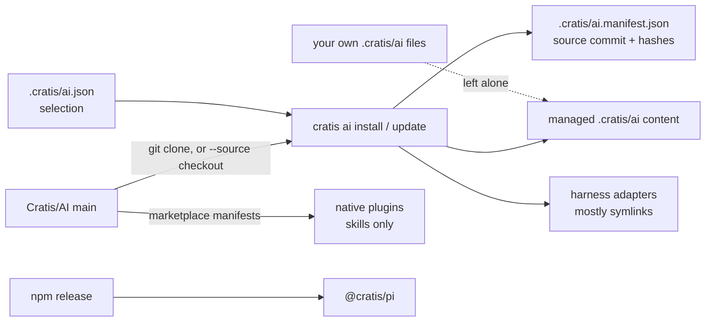

import { Aside } from '@astrojs/starlight/components';

Cratis AI is authored in one place, the [Cratis/AI](https://github.com/Cratis/AI)
repository, and reaches your repository or your coding tool through one of
three channels. They differ in what they deliver, how you pin them, and who owns
the files afterwards. This page explains those differences so you can pick a
channel and know what an update will do.

## Three channels

| Channel | Delivers | Version semantics |
| --- | --- | --- |
| `cratis ai install` / `cratis ai update` | Rules (filtered by profile and language), skills (filtered by profile), prompts, agents, hooks, and harness adapters, copied into the repository | Unpinned. Each run clones the current `main` of `Cratis/AI`. `--source <path>` reads a local checkout instead, which is how you fix a known commit or work offline. |
| `@cratis/pi` (npm) | Skills, rules, prompts, agents, a subagent tool, and quality hooks, inside Pi | Versioned per release. Pin and roll back by package version. |
| Marketplace plugins (Claude Code, Codex, GitHub Copilot, Cursor) | Skills only | Unpinned. Read from the current default branch of `Cratis/AI`. |

There is no separately published, per-profile versioned package, and
`.cratis/ai.json` has no version field. The managed install records the source
commit it used in `.cratis/ai.manifest.json`, so you can always see which
revision a repository has, and `cratis ai status` shows whether a newer one is
available.


```mermaid
flowchart LR
    C[Cratis/AI main] -->|git clone, or --source checkout| CLI[cratis ai install / update]
    J[.cratis/ai.json<br/>selection] --> CLI
    CLI --> A[managed .cratis/ai content]
    CLI --> M[.cratis/ai.manifest.json<br/>source commit + hashes]
    CLI --> H[harness adapters<br/>mostly symlinks]
    U[your own .cratis/ai files] -.->|left alone| A
    C -->|marketplace manifests| P[native plugins<br/>skills only]
    R[npm release] --> PI["@cratis/pi"]
```

## Selection, not a universal copy

A repository selects its harnesses, profiles, and languages:

```json
{
  "schemaVersion": "1.0",
  "harnesses": ["claude", "cursor", "opencode", "pi"],
  "profiles": ["cratis/application/csharp", "cratis/documentation"],
  "languages": ["csharp", "typescript"]
}
```

The CLI resolves that selection against the corpus it reads. The `@cratis/pi`
package reads the same file and exposes the matching skills; when the file is
absent, it exposes every packaged skill. The marketplace plugins ignore the file
and deliver every skill.

## Ownership and synchronization

Cratis marks each managed text file with a `cratis-ai-managed` source identity
and records source identities and installed hashes in
`.cratis/ai.manifest.json`. The local corpus lives in `.cratis/ai`, and each
harness adapter is a symbolic link or configuration entry that points there.
On update:

- new and changed upstream files are synchronized;
- upstream files that moved or were removed are deleted only when their
  installed hash is unchanged;
- a locally edited managed file stops update or uninstall before anything
  changes;
- `--force` replaces or removes an edited managed file on purpose; and
- files Cratis did not install, including your own `.cratis/ai` content, are
  left intact. If one of them sits where a Cratis file would go, the run reports
  a conflict and writes nothing.

<Aside type="tip" title="Use the lifecycle commands">
Run `cratis ai status` before updating; it exits non-zero when a managed file
was edited, so it also works as a CI check. Run `cratis ai update --dry-run` to
see what an update would change. Run `cratis ai uninstall` to remove unchanged
Cratis-owned content and the harness configuration the CLI created.
</Aside>

## Keep project knowledge in the repository

Shared guidance covers Cratis conventions and reusable workflows. Your
repository owns the rest: architecture decisions, build commands, environments,
approved secret mechanisms, fixtures. Put that in `.cratis/ai/rules/project.md`
and its concern files, and add repository-specific skills under
`.cratis/ai/skills/` with names that do not start with `cratis-`. No channel
merges, overwrites, or removes them.

Never copy `.cratis/ai`, `.claude`, `.github`, `.agents`, or `.pi` trees from one
repository into another, and never hand-edit managed files. A copied tree goes
stale without anyone noticing, and a hand edit blocks the next update. Change
shared guidance in `Cratis/AI` through a reviewed pull request, after removing
anything private or project-specific.

## Quality is verification

Cratis does not gate corpus content on author identity, provenance records, or
approval chains. The `Cratis/AI` CI checks corpus structure, profile
composition, harness adapters, and the Pi package, and loads the corpus through
Pi's resource loader to prove skills, prompts, and extensions are discovered.

A skill can carry a `verification.json` with an example input and assertions
that the skill contains the guidance that input needs. These are static checks.
They do not run a model, compile the skill's code examples, or prove the
guidance leads an agent to good results. That still takes a real task and a
review of what the agent produced.

## Plugins and marketplaces

Plugins are the quickest way to get Cratis skills into one tool. They are
deliberately narrower than a repository install: the marketplace plugins carry
no rules, no profile filtering, no ownership records, and no protection for
local edits. Use a plugin for convenient skill access; use `cratis ai install`
to configure a repository. [Updates and rollback](/ai/scenarios/updates-and-rollback/)
shows how to preview, pin, and undo each channel.
