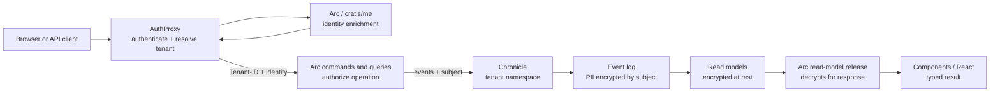

import { Aside, CardGrid, LinkCard } from '@astrojs/starlight/components';

Security in a Cratis application is not one feature in one package. A request crosses the edge, becomes
an Arc command or query, writes events through Chronicle, builds read models, and comes back to a React
screen. Authentication, authorization, tenant isolation, and compliance each belong to a different part
of that journey, and the stack is designed so each concern has one clear owner.

The short version: **AuthProxy authenticates and resolves tenant context, Arc authorizes the operation,
Chronicle stores events in the right namespace and encrypts PII by compliance subject, and Arc releases
PII before query results reach the client.**

## The edge owns authentication

Put [AuthProxy](/authproxy/) in front of your frontend and backend services when you want one place to
own the browser and API edge. It handles OpenID Connect, OAuth providers, JWT bearer authentication,
provider selection, invite onboarding, tenant resolution, and routing.

AuthProxy then forwards requests with the resolved tenant and identity context. In an Arc application,
the identity-enrichment endpoint is `/.cratis/me`: AuthProxy calls it, Arc composes the domain-specific
identity payload, and the frontend can consume the resulting identity state instead of making every
service rediscover the user.

<Aside type="note" title="Authentication is not authorization">
Authentication answers "who is calling?" Tenant resolution answers "which tenant are they acting in?"
Authorization answers "can they run this operation?" Compliance answers "whose personal data is this,
and how is it protected?"
</Aside>

## Arc owns operation-level access

Arc applies authorization where the behavior is declared: commands and queries. Use ASP.NET Core
authorization attributes, Arc's `[Roles]` convenience attribute, and policy-based authorization on the
command record or read-model query method that represents the operation.

That matters because authorization happens before the behavior runs. If a command is not authorized, its
`Handle()` method is not executed. If a query is not authorized, the read is not performed. The generated
frontend proxy receives authorization state as part of the command or query result, so screens can react
without hand-written protocol glue.

Use edge authentication for entry, then command/query authorization for business operations. Do not rely
on the UI hiding a button as the only access-control layer.

## Tenant context follows the request into Chronicle

In a multi-tenant Cratis application, the tenant resolved at the edge becomes application context in Arc.
When Arc is integrated with Chronicle, that tenant context is used as the Chronicle namespace. Events,
projections, reducers, and read models for one tenant stay separated from another tenant without every
command manually choosing a namespace.

This is the operational boundary:

| Concern | Owner | Result |
| --- | --- | --- |
| Resolve the tenant | AuthProxy or Arc tenancy resolvers | One tenant id for the request |
| Carry tenant through command/query handling | Arc | Commands, queries, filters, identity, and generated endpoints see the same tenant context |
| Isolate event-sourced state | Arc + Chronicle integration | Chronicle uses the tenant as the event-store namespace |

## Compliance subject decides the PII key

Chronicle compliance uses a **subject** to identify whose protected data an event contains. That subject
is the lookup key for PII encryption material. It is often a person or customer id; it is not always the
authenticated user, and it is not always the aggregate id.

For example, an order event may be appended to an `OrderId` event source while the protected email
address in the event belongs to a `CustomerId`. In that case the command should provide the customer as
the Chronicle `Subject`. If no explicit subject is provided, Chronicle falls back to the event source id.

Arc's Chronicle integration can resolve the subject from command return values, command properties,
`ICanProvideSubject`, or a `[Subject]`-marked property. The rule of thumb is simple: **set the subject to
the identity that owns the PII, not merely the thing being changed.**

## PII is protected at write and released at read

Chronicle detects `[PII]` on event properties and on `ConceptAs<T>` value types. At append time, those
values are encrypted under the subject's key before they are stored in the event log.

Read models keep that protection:

| Read-model style | How PII is tracked |
| --- | --- |
| Projection | Chronicle can infer PII lineage from mapped event properties. |
| Reducer | The read model must mark PII properties explicitly, because reducer logic is arbitrary C#. |
| Arc query response | Arc releases the read model before serving it, so clients receive decrypted values when the subject key exists. |

Managed read-model documents also carry Chronicle's reserved `_subject` field so the correct key can be
used during release. Do not model your own `_subject` property.

## Erasure is key deletion plus rebuild

The event log can stay structurally immutable while protected values become unreadable. For GDPR-style
erasure, Chronicle deletes the subject's PII encryption key. After that, PII encrypted with that key
cannot be decrypted.

For read models, finish the erasure by re-projecting or re-reducing affected models. Until then, stored
read-model documents may still contain ciphertext. The key is gone, so the value is unreadable, but
rebuilding the read model removes the remaining encrypted payload from the query store. If an entire
event payload must be removed, combine key deletion with [event redaction](/chronicle/events/redaction/).

## What to decide up front

| Decision | Ask this | Start here |
| --- | --- | --- |
| Identity provider | Where do browser users and API clients authenticate? | [AuthProxy authentication](/authproxy/authentication/) |
| Tenant resolution | Which host, claim, route, or configured value selects the tenant? | [AuthProxy tenancy](/authproxy/tenancy/) |
| Operation access | Which roles or policies can run each command or query? | [Arc authorization](/arc/backend/core/authorization/) |
| Compliance subject | Whose personal data does this event contain? | [Arc Chronicle subject](/arc/backend/chronicle/compliance/subject/) |
| PII modeling | Which event properties or concepts are personal data? | [Chronicle compliance](/chronicle/compliance/) |
| Erasure | What must be key-deleted, re-projected, or redacted? | [Chronicle read models and PII](/chronicle/compliance/read-models/) |

## Go deeper

<CardGrid>
  <LinkCard title="AuthProxy" description="Authenticate users, resolve tenants, enrich identity, and route requests at the edge." href="/authproxy/" />
  <LinkCard title="Arc identity" description="Expose /.cratis/me and compose the identity details AuthProxy and the frontend consume." href="/arc/backend/identity/" />
  <LinkCard title="Arc authorization" description="Authorize commands and queries with attributes, roles, and policies before behavior runs." href="/arc/backend/core/authorization/" />
  <LinkCard title="Chronicle subject" description="Set the compliance subject so PII is encrypted under the correct identity." href="/arc/backend/chronicle/compliance/subject/" />
  <LinkCard title="Chronicle compliance" description="Understand PII annotations, per-subject encryption keys, read models, and erasure." href="/chronicle/compliance/" />
  <LinkCard title="Production readiness" description="Review the operational checklist for TLS, secrets, storage, observability, and deployment." href="/production-readiness/" />
</CardGrid>

