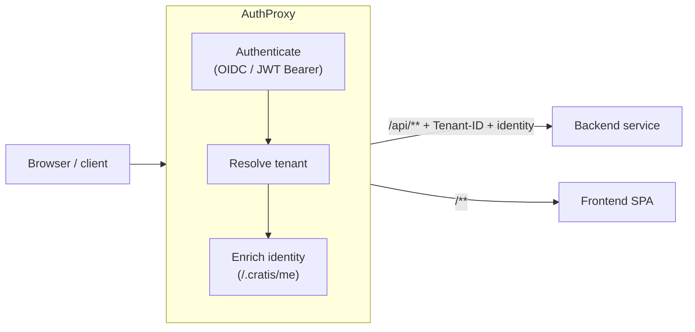

import { CardGrid, Aside, Tabs, TabItem } from '@astrojs/starlight/components';
import SimpleCard from '@components/SimpleCard.astro';
import TopicHero from '@components/TopicHero.astro';

<TopicHero icon="seti:lock" eyebrow="The Cratis Stack" title="A gateway for the edges of your app">
Every application eventually grows the same crop of edge concerns: who is this user, which tenant are they in, where does this request route, and how do you onboard someone who has been invited but doesn't have an account yet. **AuthProxy** is a small .NET gateway that owns those edges — so each of your services can assume the request is already authenticated, already scoped to a tenant, and already enriched with identity.
</TopicHero>

## The friction it removes

Without a gateway, every service re-implements the same boilerplate: an OpenID Connect handshake, tenant resolution from the host or a claim, a call to fetch the user's profile, the invite-acceptance flow. It's repetitive, it drifts between services, and it's exactly the kind of code you don't want copy-pasted across a fleet.

AuthProxy is a [reverse proxy](https://microsoft.github.io/reverse-proxy/) (built on YARP) that you put in front of your backend and frontend services. It authenticates the request, resolves the tenant, enriches the identity, and *then* forwards the request to your service — with the tenant and identity attached as headers. Your services trust the proxy and read those headers.



<Aside type="note" title="Standalone — not Cratis-only">
AuthProxy is a plain ASP.NET Core service. It pairs naturally with [Arc](/arc/)'s identity model (it calls a `/.cratis/me` endpoint to enrich identity, which Arc exposes), but it sits in front of *any* backend and frontend you point it at.
</Aside>

## What it handles

<CardGrid>
  <SimpleCard title="Authentication" icon="seti:lock">
    OpenID Connect (single or multi-provider) and JWT Bearer. Unauthenticated requests are challenged or sent to a provider-selection page.
  </SimpleCard>
  <SimpleCard title="Multi-tenancy" icon="seti:db">
    Resolve the current tenant per request — from the host, a subdomain, a claim, the route, or a fixed value — with optional remote verification.
  </SimpleCard>
  <SimpleCard title="Identity enrichment" icon="seti:json">
    Calls a <code>/.cratis/me</code> endpoint on your service and attaches the enriched identity to forwarded requests.
  </SimpleCard>
  <SimpleCard title="Invites &amp; lobby" icon="open-book">
    Invite-based onboarding with signed JWT tokens, plus an optional lobby service for users not yet assigned to a tenant.
  </SimpleCard>
</CardGrid>

## Configuration at a glance

AuthProxy is configured entirely through the `Cratis:AuthProxy` section of `appsettings.json` (or the equivalent `Cratis__AuthProxy__` environment variables). There is no code to write — you describe the providers, tenants, and services, and the proxy wires up the pipeline.

```json
{
  "Cratis": {
    "AuthProxy": {
      "Authentication": { },
      "TenantResolutions": [ ],
      "TenantVerification": { },
      "Tenants": { },
      "Services": { },
      "Invite": { },
      "PagesPath": ""
    }
  }
}
```

### Authentication

Configure one or more OpenID Connect providers. With a single provider, unauthenticated users are challenged directly; with several, they land on a built-in provider-selection page. Provider `Type` can be `Microsoft`, `Google`, `GitHub`, `Apple`, or `Custom`.

```json
{
  "Cratis": {
    "AuthProxy": {
      "Authentication": {
        "OidcProviders": [
          {
            "Name": "Microsoft",
            "Type": "Microsoft",
            "Authority": "https://login.microsoftonline.com/<tenant-id>/v2.0",
            "ClientId": "<client-id>",
            "ClientSecret": "<client-secret>"
          }
        ]
      }
    }
  }
}
```

For machine-to-machine and API calls, configure JWT Bearer instead of (or alongside) OIDC:

```json
{
  "Cratis": {
    "AuthProxy": {
      "Authentication": {
        "JwtBearer": {
          "Authority": "https://login.microsoftonline.com/<tenant-id>/v2.0",
          "Audience": "<api-audience>"
        }
      }
    }
  }
}
```

### Tenancy

`TenantResolutions` is an ordered list of strategies — AuthProxy tries each until one resolves a tenant. The resolved tenant id is forwarded to your services as a `Tenant-ID` header.

| Strategy | Resolves the tenant from… |
|---|---|
| `Host` | the request host, matched against configured `Domains` / `SourceIdentifiers` |
| `SubHost` | a subdomain convention (e.g. `acme.example.com` → `acme`) — handy for SaaS provisioning |
| `Claim` | a claim on the authenticated user |
| `Route` | a regex over the request path |
| `Specified` | a fixed tenant id |
| `Default` | a fallback tenant id |
| `Selection` | a `.cratis-tenant` cookie set by a tenant-selection page |

```json
{
  "Cratis": {
    "AuthProxy": {
      "TenantResolutions": [
        { "Strategy": "Host" }
      ],
      "Tenants": {
        "acme":    { "Domains": ["acme.example.com"] },
        "contoso": { "Domains": ["contoso.example.com"] }
      }
    }
  }
}
```

Optionally verify that a resolved tenant actually exists by pointing AuthProxy at a verification endpoint — a non-200 sends the user to the `tenant-not-found` page:

```json
{
  "Cratis": {
    "AuthProxy": {
      "TenantVerification": {
        "UrlTemplate": "https://platform.example.com/api/tenants/{tenantId}"
      }
    }
  }
}
```

### Services and routing

`Services` is where you declare what AuthProxy sits in front of. Each service can have a backend, a frontend, or both. Set `ResolveIdentityDetails` to have AuthProxy call the backend's `/.cratis/me` endpoint and attach the enriched identity to forwarded requests.

```json
{
  "Cratis": {
    "AuthProxy": {
      "Services": {
        "portal": {
          "Backend":  { "BaseUrl": "http://portal-api:8080/" },
          "Frontend": { "BaseUrl": "http://portal-web:3000/" },
          "ResolveIdentityDetails": true
        }
      }
    }
  }
}
```

With a single service, AuthProxy uses catch-all routes (`/api/**` → backend, `/**` → frontend). With multiple services, route by a `Service-ID` header or a `?service=` query parameter.

### Invites and lobby

For invite-based onboarding, AuthProxy validates a signed JWT invite token (against a configured public key), runs the user through login, then exchanges the token for tenant membership. Users without a tenant yet can be routed to an optional **lobby** service.

```json
{
  "Cratis": {
    "AuthProxy": {
      "Invite": {
        "PublicKeyPem": "-----BEGIN PUBLIC KEY-----\n...\n-----END PUBLIC KEY-----",
        "Issuer": "https://studio.example.com",
        "Audience": "authproxy",
        "ExchangeUrl": "https://studio.example.com/internal/invites/exchange",
        "Lobby": {
          "Frontend": { "BaseUrl": "http://lobby-service:3000/" },
          "Backend":  { "BaseUrl": "http://lobby-service:8080/" }
        }
      }
    }
  }
}
```

### Custom error pages

AuthProxy ships friendly built-in HTML for the edge cases — `404`, `403`, tenant-not-found, expired/invalid invitations, provider selection. Override any of them by mounting a directory of your own pages and pointing `PagesPath` at it.

```json
{
  "Cratis": {
    "AuthProxy": {
      "PagesPath": "/mnt/pages"
    }
  }
}
```

## Running it

AuthProxy is published as a container image — [`cratis/authproxy`](https://hub.docker.com/r/cratis/authproxy) — that you run with your configuration mounted or supplied as environment variables.

<Tabs>
  <TabItem label="Docker Compose">
```yaml
services:
  authproxy:
    image: cratis/authproxy:latest
    ports:
      - "8080:8080"
    volumes:
      - ./appsettings.json:/app/appsettings.json:ro
      - ./pages:/mnt/pages:ro
    environment:
      Cratis__AuthProxy__PagesPath: /mnt/pages
```
  </TabItem>
  <TabItem label="Minimal appsettings.json">
```json
{
  "AllowedHosts": "*",
  "Cratis": {
    "AuthProxy": {
      "Authentication": {
        "OidcProviders": [
          {
            "Name": "Microsoft",
            "Type": "Microsoft",
            "Authority": "https://login.microsoftonline.com/<tenant-id>/v2.0",
            "ClientId": "<client-id>",
            "ClientSecret": "<client-secret>"
          }
        ]
      },
      "TenantResolutions": [ { "Strategy": "Host" } ],
      "Tenants": { "acme": { "Domains": ["acme.example.com"] } },
      "Services": {
        "portal": {
          "Backend":  { "BaseUrl": "http://portal-api:8080/" },
          "Frontend": { "BaseUrl": "http://portal-web:3000/" }
        }
      }
    }
  }
}
```
  </TabItem>
</Tabs>

## Where to go next

<CardGrid>
  <SimpleCard title="Identity & access in Arc" icon="seti:lock" link="/arc/backend/core/authorization/">
    How Arc models identity and authorization on commands and queries — the `/.cratis/me` endpoint AuthProxy enriches from.
  </SimpleCard>
  <SimpleCard title="The Cratis Stack" icon="rocket" link="/cratis-stack/">
    How the gateway, the framework, and the runtime tools fit together end to end.
  </SimpleCard>
</CardGrid>
