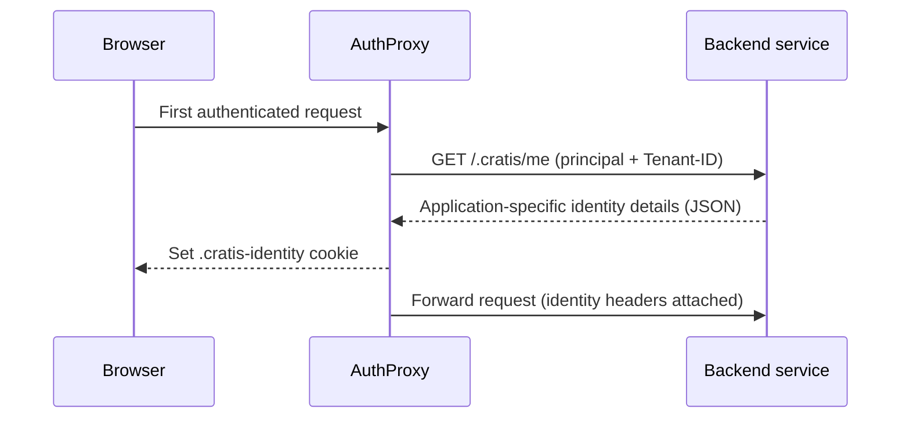

import { Aside } from '@astrojs/starlight/components';

Your backend needs to know who's calling — but you don't want it parsing tokens, talking to identity providers, or fetching user profiles. With [AuthProxy](/authproxy/) in front, it doesn't have to: every forwarded request arrives with the identity already attached as headers. Your service reads them and gets on with the domain.

## The headers your services receive

After [authentication](/authproxy/authentication/), AuthProxy injects four headers into every proxied request:

| Header | Contains |
|---|---|
| `x-ms-client-principal` | The full client principal as base64-encoded JSON |
| `x-ms-client-principal-id` | The user's unique identifier from the identity provider |
| `x-ms-client-principal-name` | The human-readable user name / email |
| `Tenant-ID` | The [resolved tenant](/authproxy/tenancy/) identifier |

The principal headers follow the [Microsoft client principal format](https://learn.microsoft.com/azure/static-web-apps/user-information) used by Azure Static Web Apps, Container Apps, and App Service — so a backend written against that convention works behind AuthProxy unchanged, and vice versa. Decoded, the principal looks like this:

```json
{
  "identityProvider": "aad",
  "userId": "0c1f5595-fcd9-48f5-b95b-0a4c3b91b22e",
  "userDetails": "jane@acme.com",
  "userRoles": ["anonymous", "authenticated"],
  "claims": [
    { "typ": "name", "val": "Jane Doe" }
  ]
}
```

This is also how Arc reads identity: an Arc backend behind AuthProxy resolves the current user from these headers automatically. See [Arc identity](/arc/backend/identity/) for the application side.

## Spoofing is designed out

If your services trust headers, an attacker could send those headers themselves. AuthProxy closes that hole: the very first thing its tenancy middleware does on every inbound request is **strip** `x-ms-client-principal`, `x-ms-client-principal-id`, `x-ms-client-principal-name`, and `Tenant-ID` before anything downstream sees them. The headers your service receives were *always* written by the proxy from the authenticated session — never passed through from the client.

<Aside type="caution">
This guarantee only holds if traffic can't bypass the proxy. Make sure your services are reachable only from AuthProxy (private network, container network, or network policy) — a service exposed directly to the internet will trust headers anyone can forge.
</Aside>

## Enriching identity with `/.cratis/me`

The identity provider knows the user's name and email — but your *application* knows their roles, preferences, and domain-specific profile. AuthProxy bridges the two by calling a `/.cratis/me` endpoint on your services.

For each service with a `Backend` endpoint (and `ResolveIdentityDetails` not explicitly set to `false` — it defaults to `true` when a backend is configured), AuthProxy calls `GET {Backend.BaseUrl}/.cratis/me` with the authenticated principal and resolved tenant attached. When several services resolve identity details, the JSON results are merged into one document.



Two things make this cheap and safe in practice:

- **Caching.** The merged result is written to a `.cratis-identity` cookie (base64-encoded JSON) on the response, and cached briefly in memory on the proxy. Requests that already carry the cookie skip the enrichment call entirely, so `/.cratis/me` is hit on the first authenticated request, not on every request.
- **Authorization gate.** If a service's identity endpoint rejects the user, AuthProxy stops the request and serves the `403` page — an authenticated-but-unauthorized user never reaches your service.

In an Arc application, `/.cratis/me` is the endpoint Arc exposes from its [identity system](/arc/backend/identity/) — you implement an identity details provider once, and both AuthProxy and your frontend consume the result.

## Recap

Your services read identity from headers the proxy alone can write: the Microsoft-format principal headers plus `Tenant-ID`, optionally enriched with application-specific details from `/.cratis/me` and cached in the `.cratis-identity` cookie. The missing piece of that header set is how the tenant gets resolved in the first place — that's [tenancy](/authproxy/tenancy/).
