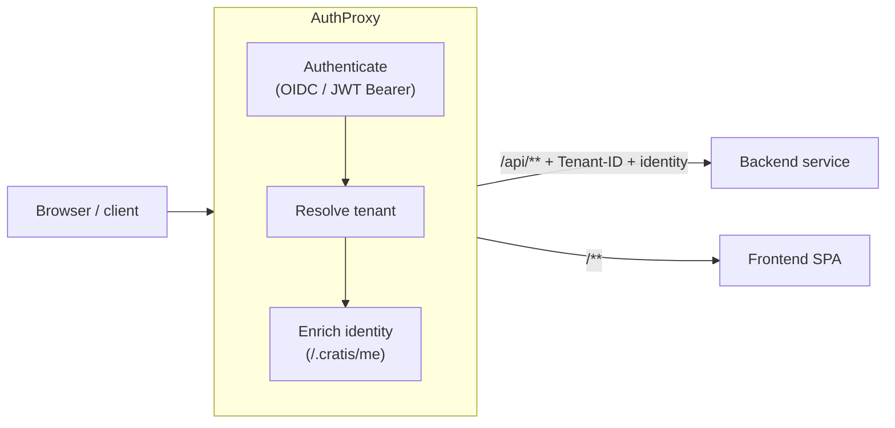

import { CardGrid, Aside } from '@astrojs/starlight/components';
import SimpleCard from '@components/SimpleCard.astro';
import TopicHero from '@components/TopicHero.astro';

<TopicHero icon="seti:lock" eyebrow="The Cratis Stack" title="A gateway for the edges of your app">
Every application eventually grows the same crop of edge concerns: who is this user, which tenant are they in, where does this request route, and how do you onboard someone who has been invited but doesn't have an account yet. **AuthProxy** is a small .NET gateway that owns those edges — so each of your services can assume the request is already authenticated, already scoped to a tenant, and already enriched with identity.
</TopicHero>

## The friction it removes

Without a gateway, every service re-implements the same boilerplate: an OpenID Connect handshake, tenant resolution from the host or a claim, a call to fetch the user's profile, the invite-acceptance flow. It's repetitive, it drifts between services, and it's exactly the kind of code you don't want copy-pasted across a fleet.

AuthProxy is a [reverse proxy](https://microsoft.github.io/reverse-proxy/) (built on YARP) that you put in front of your backend and frontend services. It authenticates the request, resolves the tenant, enriches the identity, and *then* forwards the request to your service — with the tenant and identity attached as headers. Your services trust the proxy and read those headers.

<Aside type="note" title="Standalone — not Cratis-only">
AuthProxy is a plain ASP.NET Core service. It pairs naturally with [Arc](/arc/)'s identity model (it calls a `/.cratis/me` endpoint to enrich identity, which Arc exposes), but it sits in front of *any* backend and frontend you point it at.
</Aside>

## What it handles

<CardGrid>
  <SimpleCard title="Authentication" icon="seti:lock" link="/authproxy/authentication/">
    OpenID Connect and OAuth 2.0 (single or multi-provider), plus JWT Bearer. Unauthenticated requests are challenged or sent to a provider-selection page.
  </SimpleCard>
  <SimpleCard title="Identity enrichment" icon="seti:json" link="/authproxy/identity/">
    Calls a <code>/.cratis/me</code> endpoint on your service and attaches the enriched identity to forwarded requests as trusted headers.
  </SimpleCard>
  <SimpleCard title="Multi-tenancy" icon="seti:db" link="/authproxy/tenancy/">
    Resolve the current tenant per request — from the host, a subdomain, a claim, the route, or a fixed value — with optional remote verification.
  </SimpleCard>
  <SimpleCard title="Invites &amp; lobby" icon="open-book" link="/authproxy/invites-and-lobby/">
    Invite-based onboarding with signed JWT tokens, plus an optional lobby service for users not yet assigned to a tenant.
  </SimpleCard>
</CardGrid>

## How the docs are organized

There's no code to write — AuthProxy is configured entirely through the `Cratis:AuthProxy` section of `appsettings.json` and runs as a container in front of your services. Each page below takes one edge concern and walks through how AuthProxy handles it and how you configure it.

1. **[Get started](/authproxy/get-started/)** — declare your services, pick a provider, and run the container. Routing and custom pages live here too.
2. **[Authentication](/authproxy/authentication/)** — OIDC providers, OAuth 2.0 providers like GitHub, JWT Bearer for APIs, and the provider-selection page.
3. **[Identity](/authproxy/identity/)** — the trusted headers your services receive, the `/.cratis/me` enrichment flow, and how spoofing is prevented.
4. **[Tenancy](/authproxy/tenancy/)** — resolution strategies, the tenant registry, the tenant-selection page, and tenant verification.
5. **[Invites and the lobby](/authproxy/invites-and-lobby/)** — onboarding users with signed invite tokens and parking tenantless users in a lobby.

## Where to go next

Start by putting the proxy in front of a service — the rest of the pages build on that running setup.

<CardGrid>
  <SimpleCard title="Get started with AuthProxy" icon="rocket" link="/authproxy/get-started/">
    Declare a service, configure a provider, and run the container with Docker Compose.
  </SimpleCard>
  <SimpleCard title="Identity & access in Arc" icon="seti:lock" link="/arc/backend/core/authorization/">
    How Arc models identity and authorization on commands and queries — the `/.cratis/me` endpoint AuthProxy enriches from.
  </SimpleCard>
  <SimpleCard title="The Cratis Stack" icon="open-book" link="/cratis-stack/">
    How the gateway, the framework, and the runtime tools fit together end to end.
  </SimpleCard>
</CardGrid>
