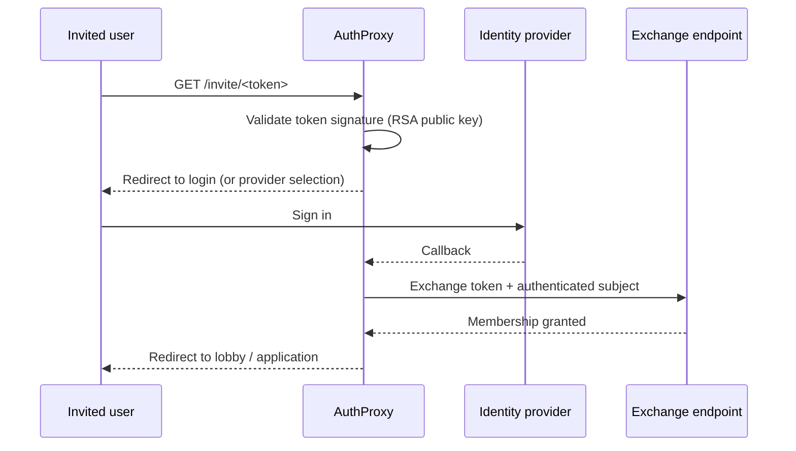

import { Aside } from '@astrojs/starlight/components';

You've invited someone to your application — but they have no account and no tenant yet, so every rule the proxy enforces ([authenticate](/authproxy/authentication/), [resolve a tenant](/authproxy/tenancy/)) would turn them away at the door. Onboarding needs a controlled exception: a link that proves the person was invited, walks them through sign-in, and then grants them membership. That's AuthProxy's invite flow, and the **lobby** is where users wait while they don't belong to a tenant yet.

## How the invite flow works

The flow has two phases — before and after sign-in:



**Phase 1 — the invite link.** The user follows `https://your-authproxy/invite/<token>`. AuthProxy validates the token's signature against the configured RSA public key. A valid token is stored in a short-lived HTTP-only cookie and the user is sent to sign in — directly when one identity provider is configured, or via the `invitation-select-provider.html` page when there are several. An expired token gets `invitation-expired.html`; a malformed or badly-signed one gets `invitation-invalid.html` (both with `401`).

**Phase 2 — the exchange.** After the user signs in, AuthProxy detects the pending invite cookie, calls the configured `ExchangeUrl` with the token and the authenticated user's subject, and deletes the cookie. If the exchange endpoint reports the subject is already registered (`409 Conflict`), the user is redirected to `SubjectAlreadyExistsUrl` — or shown the built-in `invitation-subject-already-exists.html`. On success, the user is redirected into the lobby (or straight into the application).

The invite pages are all [overridable](/authproxy/get-started/#custom-pages) like every other built-in page.

## Configuration

All invite and lobby settings live under `Cratis:AuthProxy:Invite` — setting the section is what enables the flow:

```json
{
  "Cratis": {
    "AuthProxy": {
      "Invite": {
        "PublicKeyPem": "-----BEGIN PUBLIC KEY-----\n...\n-----END PUBLIC KEY-----",
        "Issuer": "https://studio.example.com",
        "Audience": "authproxy",
        "ExchangeUrl": "https://studio.example.com/internal/invites/exchange",
        "RedirectToLobbyWhenTenantUnresolved": true,
        "Lobby": {
          "Frontend": { "BaseUrl": "http://lobby-service:3000/" },
          "Backend":  { "BaseUrl": "http://lobby-service:8080/" }
        }
      }
    }
  }
}
```

Invite tokens are standard JWTs signed with an RSA private key held by the issuing service (Cratis Studio, for example) — the proxy only ever needs the matching **public** key. `Issuer` and `Audience` pin the token's `iss`/`aud` claims when set (leave either empty to skip that check), `exp` is always enforced, and `sub` identifies the invited user for the exchange.

A few optional knobs refine the flow:

- `TenantClaim` — names a claim in the invite token that holds a tenant id. When it matches the [resolved tenant](/authproxy/tenancy/), the invite is recognized as tenant-issued and bypasses the lobby redirect.
- `AppendInvitationIdToQueryString` / `InvitationIdQueryStringKey` — append the token's `jti` to the lobby redirect URL after a successful exchange, so the lobby knows which invitation it is completing.
- `ClaimsToForward` — a list of `{ "FromClaimType": "...", "ToClaimType": "..." }` mappings that copy claims from the invite token into the principal sent to your [`/.cratis/me` identity endpoints](/authproxy/identity/), letting invitation context (who invited them, which organization) flow into identity resolution.

## The lobby

The lobby is a regular service entry (`Frontend` required, `Backend` optional) that hosts your onboarding experience. With `RedirectToLobbyWhenTenantUnresolved` enabled, two things change at the edge:

- An **authenticated** user with no resolvable tenant is redirected to the lobby frontend instead of receiving `401 Unauthorized` — invite paths and pending-invite requests are exempt so the exchange can complete.
- An **unauthenticated** user without an invite is shown `invitation-required.html` instead of a login page — in lobby mode, an invitation is the only way in.

Without a lobby, the [default unresolved-tenant behavior](/authproxy/tenancy/#when-no-tenant-resolves) applies.

<Aside type="note">
Tenancy is resolved *before* the invite system runs — that's why a tenant-issued invite (via `TenantClaim`) can skip the lobby: the user already lands in a resolved tenant.
</Aside>

## Recap

An invite is a signed JWT the proxy can verify offline; the flow validates it, runs the user through sign-in, exchanges it for membership, and uses the lobby to host everyone who isn't in a tenant yet. With authentication, identity, tenancy, and onboarding all handled at the edge, your services only ever see requests that already belong somewhere — which is the whole point of [AuthProxy](/authproxy/).
