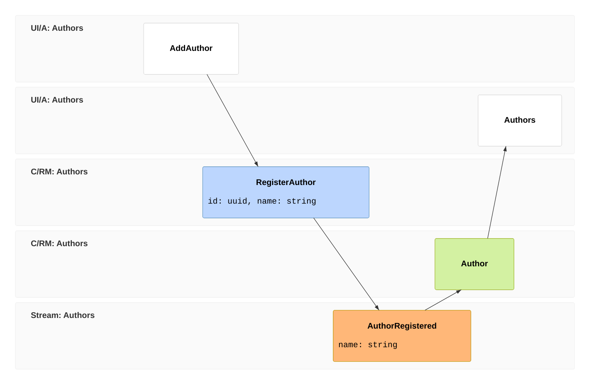

import { Steps } from '@astrojs/starlight/components';

This is where the three products meet. You'll build one **vertical slice** of a library app — registering an author and listing authors — end to end: a command and event on the backend ([Arc](/arc/) + [Chronicle](/chronicle/)), a read model built by a projection, and a React screen ([Components](/components/)) that consumes the **generated, type-safe proxies**. No hand-written API client, no DTO duplication.

Everything for the feature lives in **one folder** — that's the vertical-slice idea: you navigate by feature, not by technical layer.

Here's the slice as an **[event model](/event-modeling/)** — read left to right, the user acts on a screen, a command records a fact, that fact is projected into a read model, and the next screen reads it:



The blocks are the slice, one per product: the `ui` screens are [Components](/components/), the `cmd` and the `rmo`'s query are [Arc](/arc/), the `evt` is [Chronicle](/chronicle/), and the build generates the typed proxies that connect them. Frames 01–03 are the **command pattern** (intent → fact); 03–05 are the **view pattern** (fact → read model → screen).

## Before you start

Scaffold a full-stack app and have it running — `dotnet new cratis -o Library` from the [Chronicle getting started](/chronicle/get-started/). You'll add the slice below into a `Features/Authors/` folder.

## The host

`dotnet new cratis` generates the host for you — the whole stack in two calls. `AddCratis` brings up Arc and Chronicle together; `UseCratis` activates both:

```csharp
var builder = WebApplication.CreateBuilder(args);

builder.AddCratis(
    configureArcBuilder: arc => arc.WithMongoDB(),
    configureChronicleOptions: chronicle => chronicle.EventStore = "Library",
    configureChronicleBuilder: chronicle => chronicle.WithCamelCaseNamingPolicy());

var app = builder.Build();

app.UseCratis();
app.Run();
```

You won't touch this again for the slice below — it's here so you can see where the command, event, read model, and query you're about to write get wired in. The [Cratis package](/arc/backend/chronicle/cratis-package/) reference covers what `AddCratis` configures and how to adjust it.

## 1. Model the slice (backend)

<Steps>

1. **A strongly-typed id.** Never pass a raw `Guid` around — wrap it:

   ```csharp
   public record AuthorId(Guid Value) : ConceptAs<Guid>(Value)
   {
       public static AuthorId New() => new(Guid.NewGuid());
       public static implicit operator EventSourceId(AuthorId id) => new(id.Value.ToString());
   }
   ```

2. **The command and the event, together in one file.** The command is a record with `Handle()` on it — no separate handler class. `Handle()` returns the event that happened:

   ```csharp
   [Command]
   public record RegisterAuthor(AuthorId Id, string Name)
   {
       public AuthorRegistered Handle() => new(Name);
   }

   [EventType]
   public record AuthorRegistered(string Name);
   ```

3. **The read model and its projection.** Declare the shape you want to query and which event feeds it — AutoMap matches `AuthorRegistered.Name` to `Name`. A static method exposes the query as an observable so the UI updates live:

   ```csharp
   [ReadModel]
   [FromEvent<AuthorRegistered>]
   public record Author([property: Key] AuthorId Id, string Name)
   {
       public static ISubject<IEnumerable<Author>> AllAuthors(IMongoCollection<Author> collection) =>
           collection.Observe();
   }
   ```

</Steps>

That's the whole backend for the feature — one file, three records. Run `dotnet build`.

:::note[What the build did]
Building the backend **generates TypeScript proxies** for `RegisterAuthor` and `AllAuthors`. The frontend now has typed clients that match your C# exactly — change a property here and the frontend won't compile until you fix it.
:::

## 2. Build the screen (frontend)

<Steps>

1. **A dialog that executes the command.** `CommandDialog` instantiates and runs the generated command and renders the OK/Cancel footer for you — you just supply the fields:

   ```tsx
   import { CommandDialog } from '@cratis/components/CommandDialog';
   import { InputTextField } from '@cratis/components/CommandForm';
   import { DialogProps } from '@cratis/arc.react/dialogs';
   import { RegisterAuthor } from './RegisterAuthor';
   import { Guid } from '@cratis/fundamentals';

   export const AddAuthor = ({ closeDialog }: DialogProps) => (
       <CommandDialog<RegisterAuthor>
           command={RegisterAuthor}
           title="Add author"
           okLabel="Add"
           onBeforeExecute={(values) => { values.id = Guid.create(); return values; }}>
           <InputTextField<RegisterAuthor> value={i => i.name} title="Name" />
       </CommandDialog>
   );
   ```

2. **A table that reads the observable query.** The generated `AllAuthors` proxy is observable — `.use()` re-renders when the projection changes:

   ```tsx
   import { AllAuthors } from './Author';

   export const Authors = () => {
       const [authors] = AllAuthors.use();
       return (
           <ul>
               {authors.data.map(a => <li key={String(a.id)}>{a.name}</li>)}
           </ul>
       );
   };
   ```

</Steps>

## What you built

- One **vertical slice**: command, event, read model, projection, and UI — all for a single behavior, in one place.
- **Full-stack type safety**: the React code calls proxies generated from your C# types. There is no second source of truth to drift.
- The **CQRS loop**: the command appends a fact, a projection builds the read model, and the observable query streams it to the UI live.

## Go deeper

- Backend: [Commands](/arc/backend/commands/) and [Queries](/arc/backend/queries/) in Arc, [Projections](/chronicle/projections/) in Chronicle.
- Frontend: [Dialogs](/components/) and data tables in Components.
- The reasoning: [Why developers choose Cratis](/why-cratis/) and [Why Arc](/arc/why-arc/).
