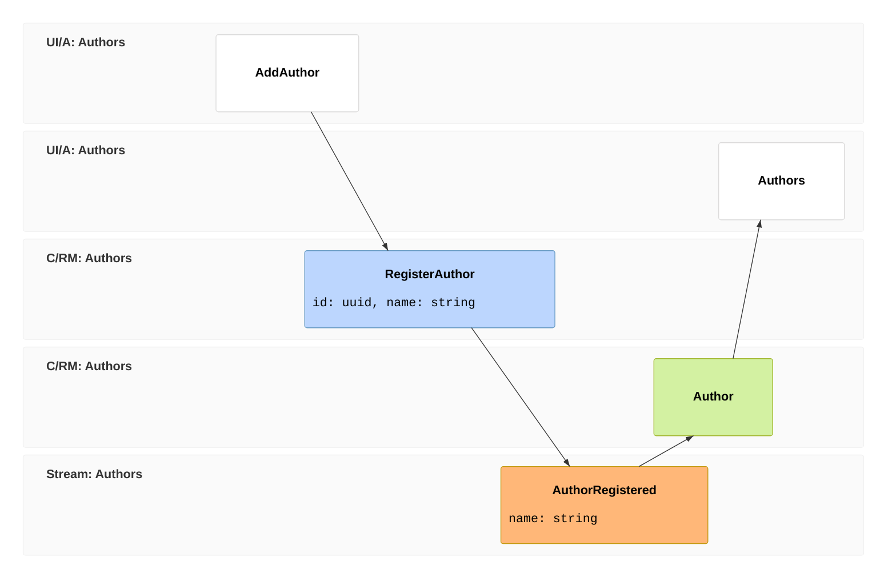

import { Steps } from '@astrojs/starlight/components';

This is where the three products meet. You'll build one **vertical slice** of a library app — registering an author and listing authors — end to end. Choose C#, Kotlin, Java, or TypeScript for the backend. In every version, an [Arc](/arc/) command produces a [Chronicle](/chronicle/) event; a read model turns that event into a list; a React screen ([Components](/components/)) uses generated, type-safe proxies to call the backend. No hand-written API client, no DTO duplication.

Keep the feature under **one module** — that's the vertical-slice idea: you navigate by behavior, not by technical layer.

Here's the slice as an **[event model](/event-modeling/)** — read left to right, the user acts on a screen, a command records a fact, that fact is projected into a read model, and the next screen reads it:


```mermaid
eventmodeling

tf 01 ui  Authors.AddAuthor
tf 02 cmd Authors.RegisterAuthor { id: uuid, name: string }
tf 03 evt Authors.AuthorRegistered { name: string }
tf 04 rmo Authors.Author ->> 03
tf 05 ui  Authors.Authors ->> 04
```

The blocks are the slice, one per product: the `ui` screens are [Components](/components/), the `cmd` and the `rmo`'s query are [Arc](/arc/), the `evt` is [Chronicle](/chronicle/), and the build generates the typed proxies that connect them. Frames 01–03 are the **command pattern** (intent → fact); 03–05 are the **view pattern** (fact → read model → screen). Pick a backend language in the tabs below; your selection follows you through the steps.

## Before you start

Choose one backend to follow:

- **C#:** Install the [.NET 10 template](https://github.com/Cratis/Templates#how-to-use) and run `dotnet new cratis -o Library`. The [buildable Capstone sample](https://github.com/Cratis/Samples/tree/main/Capstone) contains this exact slice. From `Library/`, run `docker compose up -d`, `dotnet build`, then `dotnet run`; start the Vite frontend with the package manager selected by your scaffold (for example, `npm run dev`).
- **Kotlin or Java:** Run `dotnet new cratis --language Kotlin -o Library` or `dotnet new cratis --language Java -o Library`. With JDK 17 active, run `docker compose up -d`, `./gradlew build`, then `./gradlew bootRun` from `Library/`. Start the Vite frontend separately, following the generated [Kotlin](https://github.com/Cratis/Templates/blob/main/Templates/Cratis.Kotlin/README.md) or [Java](https://github.com/Cratis/Templates/blob/main/Templates/Cratis.Java/README.md) README. The Gradle build generates the proxies under `build/generated/arc-proxies/`.
- **TypeScript (source preview):** There is [no TypeScript scaffold yet](https://github.com/Cratis/Templates/issues/61). Start from the [Arc TypeScript Library sample](https://github.com/Cratis/Arc.TypeScript/tree/main/Samples/Library): from the Arc.TypeScript repository root run `yarn install`, `docker compose -f Samples/Library/docker-compose.yml up -d`, then `yarn workspace @cratis/arc.sample.library dev`. The sample builds its proxies beside each feature as `*.proxy.ts`; see its README for setup and the local-only development identity.

The scaffolded C# and JVM Compose configurations start Chronicle with bundled MongoDB, which persists the projected read model. These development Compose files expose ports on all interfaces; bind them to `127.0.0.1` or use a trusted machine. Keep the four backend roles in one feature: host, author id, command/event, and read model/query. The sample layout differs by language; follow its neighboring files for imports and wiring.

## 1. Wire the host (backend)

The host connects Arc to Chronicle and exposes generated command and query endpoints. The scaffolds and Library sample supply this wiring; find it before changing the feature:

<ArcBackendTabs snippet="capstone/host" />

## 2. Identify the event stream (backend)

Chronicle uses the command key to select the author's event stream. Give each author an id in the form used by your backend:

<ArcBackendTabs snippet="capstone/author-id" />

## 3. Register the author (backend)

The command expresses intent; its handler returns the event that happened. Chronicle appends that event to the stream selected by the id:

<ArcBackendTabs snippet="capstone/register-author" />

## 4. Build and query the author list (backend)

The read model describes the list entry; the event feeds it, and a query exposes the list. C# and TypeScript declare a projection from the event. Kotlin and Java use a reducer keyed by the event context's source id, rather than a model-bound event mapping. Choose the live observation when your backend supports it:

<ArcBackendTabs snippet="capstone/author-read-model" />

Build your backend now (`dotnet build`, `./gradlew build`, or the Library sample's `yarn workspace @cratis/arc.sample.library build`). The build generates TypeScript command and query proxies: change a property on the backend and the frontend must compile against the updated shape. Chronicle projects asynchronously, so a successful command can precede the updated list. On Kotlin and Java, the live query doesn't deliver updates yet: the Chronicle kernel's materialized observation fails on MongoDB ([Chronicle#4365](https://github.com/Cratis/Chronicle/issues/4365)). Until that's fixed, use a one-shot `getInstances` query and reload the list after registering an author.

## 5. Build the screen (frontend)

The screen below is the shared React flow from the [compiled C# Capstone sample](https://github.com/Cratis/Samples/tree/main/Capstone): run a generated command in a dialog, read a generated query, mount a route. Use the same Components in the other backends, adjusting only the generated proxy imports and id type:

- **C#:** The snippets below import proxies co-located in `Authors/`; the id in the command proxy is a `Guid`.
- **Kotlin and Java:** Import `RegisterAuthor.ts` and `AllAuthors.ts` under `build/generated/arc-proxies/` via your scaffold's `Api/` alias; the generated id is a string, so seed it with `crypto.randomUUID()` instead of `Guid.create()`.
- **TypeScript:** Import `RegisterAuthor` from `Features/Authors/Registration/RegisterAuthor.proxy.ts` and `AllAuthors` from `Features/Authors/Listing/AllAuthors.proxy.ts`; keep `Guid.create()` for its id. Its [RegisterAuthorForm](https://github.com/Cratis/Arc.TypeScript/blob/main/Samples/Library/Features/Authors/Registration/RegisterAuthorForm.tsx) seeds the id before validation with `initialValues`.

<Steps>

1. **A dialog that executes the command.** [`AddAuthor.tsx`](https://github.com/Cratis/Samples/blob/main/Capstone/Authors/AddAuthor.tsx) uses `CommandDialog` to instantiate and run the generated command and render the OK/Cancel footer — supply the fields:

   ```tsx
   import { CommandDialog } from '@cratis/components/CommandDialog';
   import { InputTextField } from '@cratis/components/CommandForm';
   import { RegisterAuthor } from './RegisterAuthor';
   import { Guid } from '@cratis/fundamentals';

   export const AddAuthor = () => (
       <CommandDialog<RegisterAuthor>
           command={RegisterAuthor}
           title="Add author"
           okLabel="Add"
           initialValues={{ id: Guid.create() }}>
           <InputTextField<RegisterAuthor> value={i => i.name} title="Name" />
       </CommandDialog>
   );
   ```

2. **A screen that reads the observable query.** In [`Authors.tsx`](https://github.com/Cratis/Samples/blob/main/Capstone/Authors/Authors.tsx), the generated `AllAuthors` proxy is observable — `.use()` re-renders when the projection changes. The button opens the dialog above:

   ```tsx
   import { useDialog } from '@cratis/arc.react/dialogs';
   import { AllAuthors } from './Author';
   import { AddAuthor } from './AddAuthor';

   export const Authors = () => {
       const [AddAuthorDialog, showAddAuthor] = useDialog(AddAuthor);
       const [authors] = AllAuthors.use();

       return (
           <main>
               <h1>Authors</h1>
               <button type="button" onClick={() => { void showAddAuthor(); }}>Add author</button>
               <ul>
                   {authors.data.map(a => <li key={String(a.id)}>{a.name}</li>)}
               </ul>
               <AddAuthorDialog />
           </main>
       );
   };
   ```

3. **Mount the screen.** In the scaffold's `App.tsx`, import `Authors` from `./Authors/Authors` and add this route inside the existing `<Routes>` (alongside `/` and `/demo`):

   ```tsx
   <Route path='/authors' element={<Authors />} />
   ```

   Open `/authors` in the browser to see the list and the **Add author** button.

</Steps>

## What the slice illustrates

- One vertical slice in your chosen backend: host, id, command, event, read model, query, and React screen for one behavior.
- **Full-stack type safety:** the screen uses proxies generated from backend types, not a hand-written client.
- **The CQRS loop:** the command returns a fact, Chronicle appends it and builds the read model, and the query delivers the list to the UI. C# and TypeScript update the list live; Kotlin and Java will once Chronicle#4365 is fixed.

## Go deeper

- Backend: [Commands](/arc/backend/csharp/commands/) and [Queries](/arc/backend/csharp/queries/) in Arc, [Projections](/chronicle/projections/) in Chronicle.
- Frontend: [Dialogs](/components/) and data tables in Components.
- The reasoning: [Why developers choose Cratis](/why-cratis/) and [Why Arc](/arc/why-arc/).
