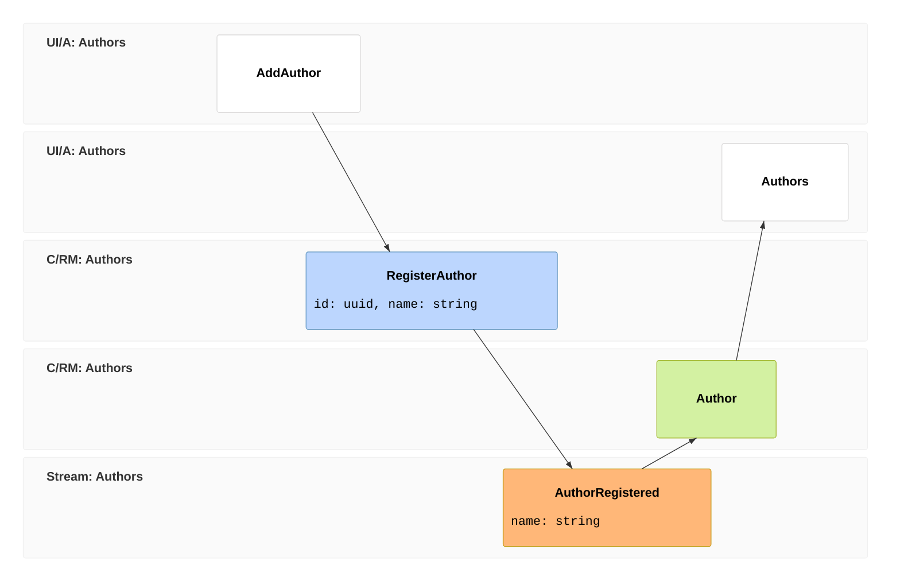

import { Aside, Steps } from '@astrojs/starlight/components';
import Recap from '@components/Recap.astro';
import YouWillLearn from '@components/YouWillLearn.astro';

This is where the three products meet. You'll build one **vertical slice** of a library app — registering an author and listing authors — end to end. Choose C#, Kotlin, Java, or TypeScript for the backend; the TypeScript backend is a source preview with no scaffold yet, so you start it from a sample. In every version, an [Arc](/arc/) command produces a [Chronicle](/chronicle/) event; a read model turns that event into a list; a React screen ([Components](/components/)) uses generated, type-safe proxies to call the backend. No hand-written API client, no DTO duplication.

<YouWillLearn>

- how an Arc command's handler returns a Chronicle event, and how the command's id selects the event stream
- how a read model and a query turn those events into the author list
- how a React screen calls the backend through proxies generated from your backend types

</YouWillLearn>

Keep the feature under **one module** — that's the vertical-slice idea: you navigate by behavior, not by technical layer.

Here's the slice as an **[event model](/event-modeling/)** — read left to right, the user acts on a screen, a command records a fact, that fact is projected into a read model, and the next screen reads it:


```mermaid
eventmodeling

tf 01 ui  Authors.AddAuthor
tf 02 cmd Authors.RegisterAuthor { id: uuid, name: string }
tf 03 evt Authors.AuthorRegistered { name: string }
tf 04 rmo Authors.Author ->> 03
tf 05 ui  Authors.Authors ->> 04
```

The blocks are the slice, one per product: the `ui` screens are [Components](/components/), the `cmd` and the `rmo`'s query are [Arc](/arc/), the `evt` is [Chronicle](/chronicle/), and the build generates the typed proxies that connect them. Frames 01–03 are the **command pattern** (intent → fact); 03–05 are the **view pattern** (fact → read model → screen). Pick a backend language in the tabs below; your selection follows you through the steps.

## Before you start

Choose one backend to follow:

- **C#:** Install the [.NET 10 template](https://github.com/Cratis/Templates#how-to-use) and run `dotnet new cratis -o Library`. The [buildable Capstone sample](https://github.com/Cratis/Samples/tree/main/Capstone) contains this exact slice. From `Library/`, run `docker compose up -d`, `dotnet build`, then `dotnet run`. The development Compose file exposes its ports on all interfaces; bind them to `127.0.0.1` or use a trusted machine. Start the Vite frontend with the package manager selected by your scaffold (for example, `npm run dev`). For brevity, the C# slice keeps its four types (`AuthorId`, `RegisterAuthor`, `AuthorRegistered`, `Author`) in one `Authors/` folder at the project root; the generated proxies land beside them, which is why the screen below imports `./RegisterAuthor` and `./Author`.
- **Kotlin or Java:** Run `dotnet new cratis --language Kotlin -o Library` or `dotnet new cratis --language Java -o Library`. With JDK 17 active, run `docker compose up -d`, `./gradlew build`, then `./gradlew bootRun` from `Library/`. As with C#, the development Compose file exposes its ports on all interfaces; bind them to `127.0.0.1` or use a trusted machine. Start the Vite frontend separately, following the generated [Kotlin](https://github.com/Cratis/Templates/blob/main/Templates/Cratis.Kotlin/README.md) or [Java](https://github.com/Cratis/Templates/blob/main/Templates/Cratis.Java/README.md) README. The Gradle build generates the proxies under `build/generated/arc-proxies/`.
- **TypeScript (source preview):** There is [no TypeScript scaffold yet](https://github.com/Cratis/Templates/issues/61). Start from the [Arc TypeScript Library sample](https://github.com/Cratis/Arc.TypeScript/tree/main/Samples/Library): from the Arc.TypeScript repository root run `yarn install`, `docker compose -f Samples/Library/docker-compose.yml up -d`, then `yarn workspace @cratis/arc.sample.library dev`. The TypeScript tabs mirror the sample's `Features/Authors/AuthorId.ts`, `AuthorName.ts`, `Registration/Registration.ts` and `Listing/Listing.ts`, without its `Librarian` role, unique-name constraint and `authorsPage` query; [`AuthorName.ts`](https://github.com/Cratis/Arc.TypeScript/blob/main/Samples/Library/Features/Authors/AuthorName.ts) adds the name validation. The sample builds its proxies beside each feature as `*.proxy.ts`; see its README for setup and the local-only development identity.

The scaffolded C# and JVM Compose configurations start Chronicle with the default MongoDB choice, which persists the projected read model. Keep the four backend roles in one feature: host, author id, command/event, and read model/query. The sample layout differs by language; follow its neighboring files for imports and wiring.

## How the backends differ in this slice

The steps below are the same for every backend. Where the code differs, this table says how, and each row names the step it applies to:

| Behavior | C# | Kotlin and Java | TypeScript (preview) |
| --- | --- | --- | --- |
| Host change (step 1) | None; the scaffold's `AddCratis` host | Add the author types to `KnownClientArtifacts` | None; the Library sample's host |
| Author id in the generated proxy (step 2) | `Guid`, from `EventSourceId<Guid>` | `Guid`, from a UUID-backed concept | `Guid`, from `ConceptAs<Guid>` |
| Anonymous callers (step 3) | Accepted; the command declares no authorization | Rejected by default; the author types carry `@AllowAnonymous` | Accepted; the command declares no authorization |
| Read model (step 4) | Projection from the event, with AutoMap | Reducer keyed by the event's source id | Projection from the event |
| Author list (step 4) | Live: re-renders when the projection changes | Live: observes the first page of 50 materialized instances; needs Chronicle 19.22.2 or later | Live: re-renders when the projection changes |
| Generated proxies (step 4) | `dotnet build`, beside the types in `Authors/` | `./gradlew build`, under `build/generated/arc-proxies/` | The sample's `build`, as `*.proxy.ts` beside each feature |

## 1. Wire the host (backend)

The host connects Arc to Chronicle and exposes generated command and query endpoints. The scaffolds and Library sample supply this wiring; find it before changing the feature. C# and TypeScript need no change: their tabs show the existing host for orientation. On Kotlin and Java, add the three author types to the scaffold's `KnownClientArtifacts` in `ChronicleConfiguration`, so an executable jar registers them. Keep the scaffold's existing imports and add imports for the author types. Keep its sink fallback too: a non-MongoDB `--Database` generates `WellKnownSinkTypes.SQL` there, not `MONGODB`.

<ArcBackendTabs snippet="capstone/host" />

## 2. Identify the event stream (backend)

Chronicle uses the command key to select the author's event stream. Every backend backs `AuthorId` with a GUID, so the generated command proxy types the id as a `Guid` whichever backend you chose. In C#, `AuthorId` derives from `EventSourceId<Guid>`, which also makes it the read model's key without a `[Key]` attribute:

<ArcBackendTabs snippet="capstone/author-id" />

## 3. Register the author (backend)

The command expresses intent; its handler returns the event that happened. Chronicle appends that event to the stream selected by the id. The Kotlin and Java command and read model carry `@AllowAnonymous`, as the scaffold's own `Register` and `Listing` do, because Arc.Kotlin rejects anonymous callers by default and the JVM scaffolds have no sign-in:

<ArcBackendTabs snippet="capstone/register-author" />

## 4. Build and query the author list (backend)

The read model describes the list entry; the event feeds it, and a query exposes the list. C# and TypeScript declare a projection from the event; in C#, AutoMap matches `AuthorRegistered.Name` to `Name`. Kotlin and Java use a reducer keyed by the event context's source id, rather than a model-bound event mapping:

<ArcBackendTabs snippet="capstone/author-read-model" />

Build your backend now (`dotnet build`, `./gradlew build`, or the Library sample's `yarn workspace @cratis/arc.sample.library build`). The build generates TypeScript command and query proxies: change a property on the backend and the frontend must compile against the updated shape. Chronicle projects asynchronously, so a successful command can precede the updated list. On Kotlin and Java, `allAuthors` observes a page of materialized instances (see *Author list* in the table above).

## 5. Build the screen (frontend)

The screen below is the shared React flow from the [compiled C# Capstone sample](https://github.com/Cratis/Samples/tree/main/Capstone): run a generated command in a dialog, read a generated query, mount a route. Use the same Components with every backend, adjusting the generated proxy imports:

- **C#:** The snippets below import proxies co-located in `Authors/`; the id in the command proxy is a `Guid`.
- **Kotlin and Java:** Import `RegisterAuthor.ts` and `AllAuthors.ts` under `build/generated/arc-proxies/` via your scaffold's `Api/` alias; the id in the command proxy is a `Guid`, as in C#. `AllAuthors` is observable, so `.use()` re-renders when the new author is projected. It can take a moment to appear, because Chronicle projects asynchronously.
- **TypeScript:** Import `RegisterAuthor` from `Features/Authors/Registration/RegisterAuthor.proxy.ts` and `AllAuthors` from `Features/Authors/Listing/AllAuthors.proxy.ts`; keep `Guid.create()` for its id. Its [RegisterAuthorForm](https://github.com/Cratis/Arc.TypeScript/blob/main/Samples/Library/Features/Authors/Registration/RegisterAuthorForm.tsx) seeds the id before validation with `initialValues`.

<Steps>

1. **A dialog that executes the command.** [`AddAuthor.tsx`](https://github.com/Cratis/Samples/blob/main/Capstone/Authors/AddAuthor.tsx) uses `CommandDialog` to instantiate and run the generated command and render the OK/Cancel footer — supply the fields:

   ```tsx
   import { CommandDialog } from '@cratis/components/CommandDialog';
   import { InputTextField } from '@cratis/components/CommandForm';
   import { RegisterAuthor } from './RegisterAuthor';
   import { Guid } from '@cratis/fundamentals';

   export const AddAuthor = () => (
       <CommandDialog<RegisterAuthor>
           command={RegisterAuthor}
           title="Add author"
           okLabel="Add"
           initialValues={{ id: Guid.create() }}>
           <InputTextField<RegisterAuthor> value={i => i.name} title="Name" />
       </CommandDialog>
   );
   ```

2. **A screen that reads the query.** In [`Authors.tsx`](https://github.com/Cratis/Samples/blob/main/Capstone/Authors/Authors.tsx), the generated `AllAuthors` proxy is observable: `.use()` re-renders when the projection changes. Kotlin and Java observe a page of materialized instances (see the table). The button opens the dialog above:

   ```tsx
   import { useDialog } from '@cratis/arc.react/dialogs';
   import { AllAuthors } from './Author';
   import { AddAuthor } from './AddAuthor';

   export const Authors = () => {
       const [AddAuthorDialog, showAddAuthor] = useDialog(AddAuthor);
       const [authors] = AllAuthors.use();

       return (
           <main>
               <h1>Authors</h1>
               <button type="button" onClick={() => { void showAddAuthor(); }}>Add author</button>
               <ul>
                   {authors.data.map(a => <li key={String(a.id)}>{a.name}</li>)}
               </ul>
               <AddAuthorDialog />
           </main>
       );
   };
   ```

3. **Mount the screen.** In the scaffold's `App.tsx`, import `Authors` from `./Authors/Authors` and add this route inside the existing `<Routes>` (alongside `/` and `/demo`):

   ```tsx
   <Route path='/authors' element={<Authors />} />
   ```

   Open `/authors` in the browser to see the list and the **Add author** button.

</Steps>

<Recap>

- You built one vertical slice in your chosen backend: host, id, command, event, read model, query, and React screen for one behavior.
- The screen calls proxies generated from your backend types, not a hand-written client; after a backend change, rebuild so the frontend compiles against the updated shape.
- The command returned a fact; Chronicle appended it and built the read model, and the query delivered the list to the UI. Every backend updates the list live.

Next, the [vertical slices series](/scenarios/vertical-slices/) grows the same Library domain one Event Modeling pattern at a time.

</Recap>

## Go deeper

- C# backend: [Commands](/arc/backend/csharp/commands/) and [Queries](/arc/backend/csharp/queries/) in Arc, and the [Cratis package](/arc/backend/csharp/chronicle/cratis-package/) that `AddCratis` configures.
- Kotlin and Java backend: the [Chronicle guide](/arc/backend/kotlin/guides/chronicle/) for Arc.Kotlin.
- TypeScript backend: the [Arc TypeScript Library sample](https://github.com/Cratis/Arc.TypeScript/tree/main/Samples/Library).
- Every backend: [Projections](/chronicle/projections/) in Chronicle.
- Frontend: [CommandDialog](/components/commanddialog/) and [data tables](/components/datatables/) in Components.
- The reasoning: [Why developers choose Cratis](/why-cratis/) and [Why Arc](/arc/why-arc/).

<Aside type="tip" title="Questions? Ask on Discord">
Ask questions and get help from the Cratis team and other developers on the [Cratis Discord](https://discord.gg/kt4AMpV8WV). See [Community and help](/community/) for where else to go.
</Aside>
