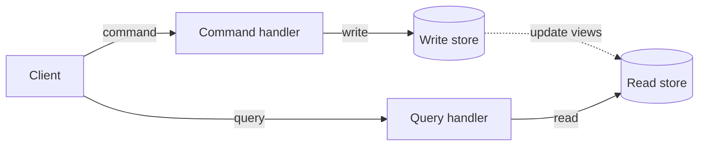
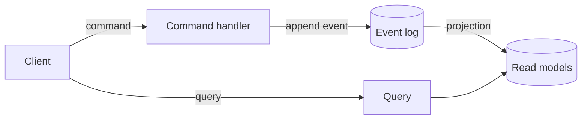

CQRS stands for Command Query Responsibility Segregation. It means you use one model to change data (**commands**) and a separate model to read it (**queries**). A command expresses an intent and changes state. A query returns data and changes nothing.

The idea is older than any framework. Bertrand Meyer described command-query separation: a method either does something or answers something, never both. Greg Young coined the name CQRS for applying that principle at the level of the application model, so the shape you write in can differ from the shape you read in.

CQRS and event sourcing are often mentioned together, but they are independent. You can use CQRS over a plain relational or document database, and you can use event sourcing without a rich read side. This page covers CQRS on its own, then shows how the two combine. For the other half, see [what is event sourcing?](/concepts/event-sourcing/).

## How CQRS works

In a traditional layered application, one model serves everything. The same `Order` class is loaded to display a list, to validate a change and to save. That model drifts toward a compromise that is awkward for all three jobs.

CQRS splits the paths:

- **The command side** receives an intent such as `PlaceOrder`, checks the rules and records the change. Its model is shaped around decisions and invariants.
- **The query side** serves data to screens and APIs. Its models are shaped around what each screen needs, often flat and denormalized.



The dotted line is the part that varies. In the simplest form, both sides use the same database and the command also updates the read models. In a larger system, the stores differ and a process copies changes across, which makes the read side eventually consistent.

### CQRS with event sourcing

When the write store is an event log, the dotted line has a natural implementation. A command appends events. A [projection](/concepts/projections-and-read-models/) folds those events into read models. Queries read the read models.



This is why the two are paired so often. Event sourcing gives CQRS a reliable, ordered source for building read models, and CQRS gives event sourcing a clean place to read from.

### CQRS without event sourcing

CQRS does not require an event log. Arc, the Cratis application framework, treats commands and queries as its core model and lets you back them with MongoDB or Entity Framework Core instead of Chronicle. Chronicle is optional. The page on [CQRS without event sourcing](/arc/arc-without-event-sourcing/) shows the same slice in both forms.

## A concrete example: registering and listing authors

A library application has a screen to register authors and a screen that lists them.

The command is a record. Its properties are its inputs, and the decision lives in `Handle()`. This example writes a document directly to MongoDB:

```csharp
using Cratis.Arc.Commands.ModelBound;
using MongoDB.Driver;

[Command]
public record RegisterAuthor(Guid Id, string Name)
{
    public Task Handle(IMongoCollection<Author> authors) =>
        authors.InsertOneAsync(new Author(Id, Name));
}
```

The query side is a read model with a static method. Arc serves the method over HTTP and generates a typed proxy for the frontend:

```csharp
using Cratis.Arc.Queries.ModelBound;
using MongoDB.Driver;

[ReadModel]
public record Author(Guid Id, string Name)
{
    public static IEnumerable<Author> AllAuthors(IMongoCollection<Author> authors) =>
        authors.Find(_ => true).ToList();
}
```

These are excerpts. A runnable project also needs the host and database configuration from [Arc's .NET getting started guide](/arc/backend/csharp/getting-started/).

Notice what the split gives you. The command never returns the author list, and the query never changes anything. Each can be tested, secured, scaled and changed on its own.

To event-source the same slice, only the command's body and the way the read model is filled change. The command returns a fact, and Chronicle appends it:

```csharp
using Cratis.Arc.Commands.ModelBound;
using Cratis.Chronicle.Events;

[Command]
public record RegisterAuthor(EventSourceId Id, string Name)
{
    public AuthorRegistered Handle() => new(Name);
}

[EventType]
public record AuthorRegistered(string Name);
```

The query keeps its signature. The projection that fills `Author` is described in [projections and read models](/concepts/projections-and-read-models/).

## Benefits

- **Models fit their jobs.** The write model protects invariants. Each read model is shaped for one screen, with no joins at read time.
- **Independent scaling.** Most applications read far more than they write. You can scale or cache the read side without touching the write side.
- **Simpler queries and simpler commands.** Neither carries the other's concerns, so each has fewer branches.
- **Clear intent.** Commands are named after what the user wants, such as `RegisterAuthor`, which makes the code read like the domain.
- **A path to event sourcing.** If the contract between commands and queries is clean, you can move a slice to an event log later without changing the frontend.

## Trade-offs and when not to use it

- **More types.** Separate commands, queries and read models mean more code than one entity with CRUD methods.
- **Eventual consistency when stores differ.** If the read store is updated after the write, a read right after a write can return old data. The user interface has to account for that.
- **Overkill for simple CRUD.** A small admin screen over one table does not benefit from a separate read model.
- **Two models to keep aligned.** When the domain changes, you update both sides.

Use CQRS where reads and writes have different shapes, different load or different rules. For a single form over a single table, a plain CRUD approach is cheaper.

## Common pitfalls

- **A command that returns query data.** A command can report success or failure, and a response where needed, but it should not become a back door for reading. Use a query.
- **A query that changes state.** Queries that update counters or write logs break caching and retries.
- **Applying CQRS to the whole system.** CQRS is a decision per slice. Parts that are plain CRUD can stay plain CRUD.
- **Assuming CQRS means two databases.** One database with separate models is already CQRS. Add stores only when a measured need justifies them.
- **Ignoring consistency.** When reads lag behind writes, design for it: show a pending state, or let the client observe the read model so it updates when the data arrives.
- **Confusing CQRS with event sourcing.** Choosing one does not commit you to the other. See [event store vs. a regular database](/concepts/event-store/) for the storage question.

## Frequently asked questions

### Is CQRS the same as event sourcing?

No. CQRS separates reading from writing. Event sourcing stores changes as events. They combine well, but each works alone.

### Do I need separate databases for CQRS?

No. You need separate models. Separate databases are an optimization, and they bring eventual consistency with them.

### Is CQRS the same as having a repository and a service layer?

No. A repository and service layer usually share one entity model for reads and writes. CQRS gives reads and writes different models and different entry points.

### Does CQRS need a message bus?

No. A command can be an ordinary method call handled in the same process. A bus is one way to deliver commands or to update read models, not a requirement.

### How do commands and queries reach a React or TypeScript frontend?

Arc generates TypeScript proxies from the .NET command and query contracts, so the frontend calls typed methods. See [Why Arc](/arc/why-arc/).

## Next steps

- Read the [Arc overview](/arc/) and its [.NET getting started guide](/arc/backend/csharp/getting-started/).
- See the same slice without Chronicle in [CQRS without event sourcing](/arc/arc-without-event-sourcing/).
- Move a slice to events with [add event sourcing to an Arc slice](/arc/backend/csharp/chronicle/add-event-sourcing/).
- Learn [what is event sourcing?](/concepts/event-sourcing/) and how [projections and read models](/concepts/projections-and-read-models/) work.
- Read [event-driven architecture vs. event sourcing](/concepts/event-driven-architecture/) to place CQRS among related patterns.
