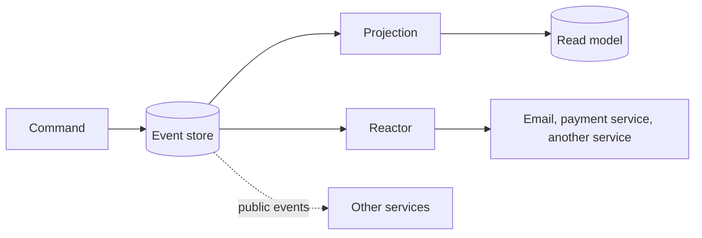

Event-driven architecture (EDA) and event sourcing both revolve around events, so they are often confused. They answer different questions.

**Event-driven architecture** is about communication. Components announce that something happened, and other components react. The events are messages in flight. **Event sourcing** is about storage. The events are the permanent record of what happened, and the current state is derived from them.

You can have either without the other. A system can pass events through a broker and store ordinary tables, which is EDA without event sourcing. A system can store its history as events and never publish them, which is event sourcing without EDA. The two work well together, and this page explains where each begins and ends. For the storage idea in depth, see [what is event sourcing?](/concepts/event-sourcing/).

## How the two differ

| | Event-driven architecture | Event sourcing |
| --- | --- | --- |
| Main question | How do parts of the system learn what happened? | What is the record of truth for this entity? |
| Role of the event | A message that triggers work elsewhere | The stored fact that defines state |
| Lifetime | Often short; a broker may delete it after delivery | Kept, in order, as the system of record |
| Scope | Between components, services or systems | Inside one service's data model |
| Typical tools | Message brokers, queues, streams | An event store |
| Rebuilding state | Not possible from the messages alone | Replay the events |
| Main risk | Hidden coupling and hard-to-trace flows | Modelling effort and eventual consistency |

An event in EDA can be thin: a notification that an order was placed, with an ID to look up the rest. An event in event sourcing must be complete: it carries every fact needed to rebuild state.

## How they combine

An event-sourced service naturally produces events. Every append is a candidate for notification. The event log becomes a reliable source for the events that drive the rest of the system, without the dual-write problem of updating a database and publishing a message in two separate steps.

Three roles appear:

- **The event store** is event sourcing. It holds the events permanently.
- **Projections** are event sourcing's read side. They fold events into read models.
- **Reactors** are the event-driven part. They run side effects or issue follow-up commands when an event is appended.

In Chronicle, **public events** are the contract between services. A private event stays inside the service that owns it, and a public event is published for others. See [public events](/chronicle/events/public-events/). Other services should rely on that deliberate contract, not on your internal events.

## A concrete example: a library loan

When a member borrows a book, three things happen:

1. The loan is recorded. That is event sourcing: a `BookBorrowed` event is appended to the book's stream.
2. A confirmation email is sent. That is event-driven: a reactor reacts to the event.
3. The member's loan list is updated. That is a projection, the read side of event sourcing.

The event and the reactor in Chronicle look like this:

<ArcBackendTabs snippet="site-concepts/event-driven-architecture/loan-confirmation-reactor" variants="csharp,kotlin,java" />

This is an excerpt: the email sending is a placeholder, and it assumes a registered Chronicle client. Chronicle discovers the reactor and calls `Borrowed` when the event is appended. See [Reactors](/chronicle/reactors/).

The command that records the fact in Arc returns the event, and Chronicle appends it:

<ArcBackendTabs snippet="site-concepts/event-driven-architecture/borrow-book" variants="csharp,kotlin,java" />

The command knows nothing about email or the loan list. It records the fact, and the rest follows from the event.

Replaying a reactor repeats side effects, so decide what a replay should do. A confirmation that should go out once must not go out again when you rebuild a read model. Chronicle offers `[OnceOnly]` for this. On a handler method, it skips that handler during replay. On the reactor class, it makes the whole reactor non-replayable, so a replay of its observer never starts. It does not give exactly-once delivery, so make the side effect safe to repeat. See [Reactors](/chronicle/reactors/) for replay and delivery rules.

## Benefits of combining them

- **No dual write.** The event is stored first. Notifications derive from the stored event, so the database and the message cannot disagree.
- **Loose coupling.** The command side does not know who reacts.
- **Late additions.** A new reactor or projection can start from the existing history.
- **One source for everything.** Audit, read models and integration all draw from the same facts.
- **Traceable flows.** Each reaction is tied to a stored event with an order and a timestamp.

## Trade-offs and when to use which

Use **EDA without event sourcing** when services need to react to each other, but the state of each service is fine as ordinary tables. This is common and simpler to adopt.

Use **event sourcing without EDA** when one service needs a full history, for audit or analysis, but no one else needs to react in real time.

Use **both** when you need a permanent history and want other parts of the system to act on it.

Use **neither** when the application is a plain CRUD system with no process worth tracking.

Costs to weigh:

- **Eventual consistency.** Reactors and projections run after the append. Parts of the system see changes at slightly different times.
- **Harder tracing.** A chain of reactions is harder to follow than a call stack. Keep chains short and name events precisely.
- **Contract management.** Events that other services depend on need versioning. Treat public events as an API.
- **Operational work.** Brokers and event stores both need monitoring and capacity planning.

## Common pitfalls

- **Treating a broker as the system of record.** Messages can be deleted after delivery. If you need to rebuild state, you need a store.
- **Publishing internal events as the public API.** Consumers couple to your internal model. Publish a smaller, deliberate set.
- **Thin events when you need rebuilds.** A notification with only an ID is fine in EDA. In event sourcing, the event must carry the facts.
- **Side effects in projections.** A projection builds state and must be safe to replay. Sending an email belongs in a reactor.
- **Assuming exactly-once delivery.** Most delivery is at least once. Make reactions safe to repeat.
- **Long reaction chains.** Event A causes B causes C causes D. Debugging becomes archaeology. Model the flow first; [event modeling](/concepts/event-modeling/) helps.

## Frequently asked questions

### Is event sourcing a type of event-driven architecture?

No. They are related but different. Event sourcing is a way to store state. Event-driven architecture is a way to connect components. An event-sourced service often takes part in an event-driven system, but neither requires the other.

### Do I need Kafka or another broker for event sourcing?

No. An event store keeps the events and lets projections and reactors observe them in order. You may add a broker to connect to other systems, but event sourcing does not need one.

### Is event streaming the same as event sourcing?

No. Streaming platforms move and retain events for consumers, and some treat the log as long-lived. Event sourcing is a modelling choice: the events are the facts of your domain, and your state derives from them.

### What is the dual-write problem?

Writing to a database and publishing a message are two operations, and one can fail after the other succeeds. With event sourcing, the stored event is the one write. Reactions are driven from it.

### How does CQRS relate?

CQRS separates the write and read models. It often appears alongside both patterns. See [CQRS explained](/concepts/cqrs/).

## Next steps

- Read about [Reactors](/chronicle/reactors/) and [public events](/chronicle/events/public-events/) in Chronicle.
- See how events become views in [projections and read models](/concepts/projections-and-read-models/).
- Find where the events are stored in [event store vs. a regular database](/concepts/event-store/).
- Learn the basics in [what is event sourcing?](/concepts/event-sourcing/).
- Follow [React to an event](/arc/backend/csharp/chronicle/react-to-an-event/) to wire a reactor into an Arc application.
