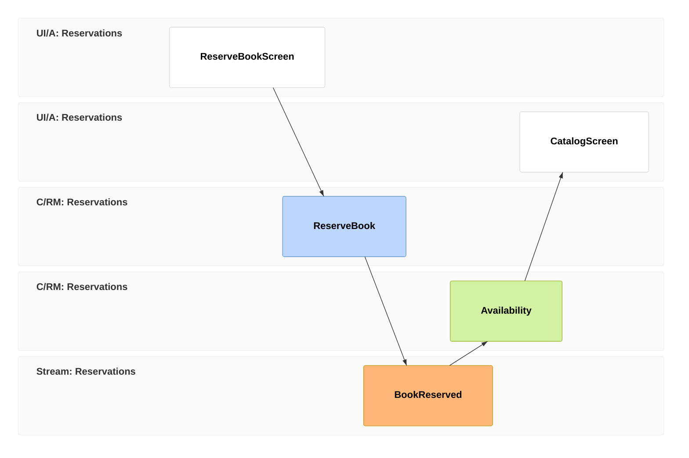

Event modeling is a method for designing an information system by drawing how information flows through it over time. You lay out a timeline from left to right. On it you place the screens people use, the commands they issue, the events those commands record and the read models the next screens display. The result is one picture that a domain expert, a designer and a developer can read in the same way.

Adam Dymitruk created the method, and its seven steps are described below. It suits event-sourced systems because its building blocks are the same ones an event-sourced system is made of. This page is a practical guide to doing it. For how the blocks map onto Cratis, read [Event modeling in Cratis](/event-modeling/).

## How event modeling works

An event model has a small vocabulary. You read it like a comic strip, one frame after another.

| Block | Meaning | Example |
| --- | --- | --- |
| Screen (wireframe) | What a person sees and does | Reserve book form |
| Command | An intent to change something | `ReserveBook` |
| Event | A fact that happened, in the past tense | `BookReserved` |
| Read model (also called a view) | The information a screen needs | `Availability` |
| Processor | Automation that reacts to events | Update stock when a book is reserved |

These blocks combine into four patterns: **command** (screen, command, event), **view** (events into a read model into a screen), **automation** (an event triggers a processor that issues a command) and **translation** (an event from another system is adapted into a command). A command is never stored. An event is the record of the fact. A read model is derived from events. Those rules give the diagram its discipline: every screen must read something a read model provides, every read model must be fed by events, and every event must come from a command or from another system.



Read the model as a story. A reader reserves a book on a screen. That issues `ReserveBook`. The system records `BookReserved`. The `Availability` read model is updated from that event. The catalog screen shows it.

## The steps

Dymitruk describes seven steps. You can run them in a workshop with sticky notes, on a whiteboard, or in a tool.

1. **Brainstorming.** Ask what happens in the business. Write each answer as a past-tense event on a sticky note: `BookAdded`, `BookReserved`, `BookBorrowed`, `BookReturned`. Do not worry about order yet.
2. **The plot.** Arrange the events on a timeline so the story reads from start to finish. Remove duplicates and merge near-synonyms. Gaps show up as missing steps in the story.
3. **The storyboard.** Add the wireframes that people use along the timeline, from the first screen to the last. This keeps the model tied to real use.
4. **Identify inputs.** These are the commands. For each event that a person causes, add the command that triggers it, placed between the screen and the event.
5. **Identify outputs.** These are the read models, or views. For each screen that shows information, add the read model that supplies it, and draw which events feed it.
6. **Apply Conway's Law.** Separate the model into swimlanes, one per system, team or bounded context, so each team owns its own part of the timeline. Then cut each swimlane into vertical slices, each one small enough to build and test on its own.
7. **Elaborate scenarios.** Write the rules as examples. For each command or read model, write a few given/when/then examples. Given these past events, when this command arrives, then this event is recorded, or a rejection.
Throughout, check for completeness: walk the timeline. Every screen shows data that exists, and every field in a read model comes from an event that carries it.

That check is where the method pays for itself. You find that a screen has no source for a number it displays, or that an event is missing the field a later screen needs, while the fix is still a sticky note.

## A concrete example: reserving a book

Brainstorming a library gives you the events `BookAdded`, `BookReserved`, `ReservationExpired` and `BookBorrowed`. When you add commands and a read model, you notice something. The catalog needs to show how many copies are available, but `BookReserved` carries only the book and the member. Where does the number of copies come from? The event `BookAdded` has to record the number of copies. You found the gap before writing code.

The slice for reserving a book then turns directly into code. In Arc and Chronicle, the command is a record whose `Handle()` returns the event:

```csharp
using Cratis.Arc.Commands.ModelBound;
using Cratis.Chronicle.Events;

[Command]
public record ReserveBook(EventSourceId BookId, string Member)
{
    public BookReserved Handle() => new(Member);
}

[EventType]
public record BookReserved(string Member);
```

The read model that the catalog screen reads is described by the events that feed it. A model-bound projection uses attributes on the type itself:

```csharp
using Cratis.Chronicle.Events;
using Cratis.Chronicle.Keys;
using Cratis.Chronicle.Projections.ModelBound;

[EventType]
public record BookAdded(string Title, int Copies);

[FromEvent<BookAdded>]
public record BookAvailability(
    [Key] Guid Id,
    string Title,
    [SetFrom<BookAdded>(nameof(BookAdded.Copies))]
    [Decrement<BookReserved>]
    int AvailableCopies);
```

Both are excerpts. `[Decrement<BookReserved>]` lowers `AvailableCopies` by one each time a `BookReserved` event is projected. See [projections and read models](/concepts/projections-and-read-models/) for how projections work.

The model tells you which processors you need as well. If a separate inventory slice must act when a book is reserved, for example a `StockKeeper` processor that issues a `DecreaseStock` command, that is an automation: a processor that reacts to `BookReserved`. In Chronicle that is a reactor class implementing `IReactor`.

## Benefits

- **A shared language.** A domain expert can point at an event and say it only happens after payment. That correction would otherwise show up as a bug.
- **Early detection of gaps.** Missing data and missing events appear on the timeline.
- **Small, buildable slices.** Each slice has a clear input and output, so work divides cleanly between people.
- **Examples that become tests.** The given/when/then examples are specifications you can run. See [Testing with Cratis](/testing-with-cratis/).
- **Less architecture debate.** The model names the pieces; the code follows the shape.

## Trade-offs and when not to use it

- **It needs the right people in the room.** If domain experts do not take part, you model your assumptions.
- **It takes time up front.** For a one-screen settings page the modelling costs more than the build.
- **It is a design method, not a specification of everything.** It does not describe look and feel, performance targets or infrastructure.
- **Large models need discipline.** Without clear swimlanes per context, a big board becomes hard to read.

Use it when behaviour is interesting: facts accumulate, screens derive their data from history, and work flows between parts of the system. Skip it for plain CRUD over a single record.

## Common pitfalls

- **Naming events like commands.** `ReserveBook` is a command. `BookReserved` is the event. If you cannot use the past tense, you probably have a command.
- **Starting with the database.** Model the flow of information first. Tables come last, or not at all.
- **Skipping screens.** Without wireframes, you invent read models no one needs.
- **Putting decisions in read models.** A read model shows data. Rules belong in the command side.
- **Modelling in isolation.** A model one developer drew alone is a design, not a shared understanding.
- **Treating the model as finished.** It changes as you learn. Keep it where the team will update it.

## Frequently asked questions

### Is event modeling the same as event storming?

No. Event storming is a workshop format for discovering the events in a domain, which maps to the first steps above. Event modeling goes further. It adds screens, commands and read models on a single timeline and produces a blueprint you can build from.

### Do I need event sourcing to use event modeling?

Not strictly. The method describes information flow and works for any system. It fits event sourcing most naturally, because events are first-class in both.

### What tool should I use?

A whiteboard or sticky notes work. Cratis Studio, at [cratis.studio](https://cratis.studio), is a collaborative environment for designing and editing event models. It is live in beta at [app.cratis.studio](https://app.cratis.studio); see [Studio](/studio/) for what it does today.

### How big should a model be?

Model one capability or one bounded context at a time. Use swimlanes for contexts and slices for features.

### How does a model become code?

Each block has a counterpart in code. [Event modeling in Cratis](/event-modeling/) lists the mapping and the vertical slices that follow from it.

## Next steps

- Read [Event modeling in Cratis](/event-modeling/) for the block-by-block mapping.
- Read about [Cratis Studio](/studio/), the beta modeling tool at [app.cratis.studio](https://app.cratis.studio), to model with your team.
- Build a slice end to end with [Build a full-stack feature](/build-a-full-app/).
- Understand the events behind the model in [what is event sourcing?](/concepts/event-sourcing/).
- Learn how read models are built in [projections and read models](/concepts/projections-and-read-models/).
