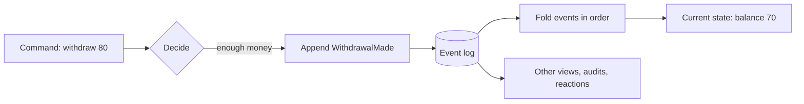

Event sourcing is a way of storing data. Instead of keeping only the current state of a record and overwriting it on every change, you append each change as an immutable **event** to an append-only log. The current state is not stored as the truth; you derive it by replaying the events.

A bank account is the classic example. A traditional table stores `Balance = 70`. An event-sourced account stores that it was opened with 100, that 50 was deposited and that 80 was withdrawn, and the balance of 70 follows from those facts. You can answer "what is the balance?" and also "how did we get here?"

This page explains the idea, shows it in code, and is honest about where it costs more than it gives. It is the first of six concept pages: [CQRS](/concepts/cqrs/), [event store vs. a regular database](/concepts/event-store/), [event modeling](/concepts/event-modeling/), [projections and read models](/concepts/projections-and-read-models/), and [event-driven architecture vs. event sourcing](/concepts/event-driven-architecture/).

## How event sourcing works

Four ideas carry the whole pattern:

- **An event is a fact in the past tense.** `DepositMade`, not `MakeDeposit`. It records something that happened and is never edited or deleted.
- **Events are grouped by the thing they are about.** Every event belongs to one **event source**, such as one account or one order. The ordered events of one event source are its history.
- **Appending is the only write.** To change something you decide what happened and append the event. You never update a row.
- **State is a fold over events.** To get the current state, you read the events for one event source in order and apply each to a running value. The result is a **read model**.



The decision step matters. A command such as "withdraw 30" is a request. The system checks the rules against the current state and, if they hold, records the event. A rejected command appends nothing.

Replaying every event on every read gets slow for long histories, so real systems keep the derived state up to date as events arrive. Those derived views are [projections and read models](/concepts/projections-and-read-models/).

## A concrete example: a bank account

Three events describe the life of an account. In Chronicle, an event is a C# record marked `[EventType]`:

<ChronicleClientTabs snippet="site-concepts/event-sourcing/events" variants="csharp,kotlin,java" />

You write by appending to the event log. `IEventLog` is the default event sequence in a Chronicle event store, and the event source id identifies the account:

<ChronicleClientTabs snippet="site-concepts/event-sourcing/account-service" variants="csharp,kotlin,java" />

This is an excerpt: it assumes the Chronicle client is registered in your host. [Get started with Chronicle](/chronicle/get-started/) covers setup.

Appending returns an `AppendResult`. It reports a schema error, a constraint violation or a concurrency conflict, and in each of those cases the event was not stored.

To read state, you fold the events. Chronicle can do this for you with a projection, but the underlying idea is a plain function. The balance after the three events above is:

```text
AccountOpened(Owner: "Ada", InitialBalance: 100)  -> balance 100
DepositMade(Amount: 50)                           -> balance 150
WithdrawalMade(Amount: 80)                        -> balance 70
```

Nothing was overwritten. If a customer disputes the 80, you can show the exact event, when it happened and what came before it.

## Benefits

- **A complete history.** Auditing is part of the storage model, not a second system you bolt on. This matters for finance, health and other regulated domains.
- **Events carry intent.** `AddressChangedAfterMove` tells you more than a changed `Address` column. Developers, support staff and auditors read the same story.
- **New views without migrations of the past.** When a new screen needs data shaped differently, you build a new projection and replay the history into it. You do not have to guess what used to be true.
- **Debugging by replay.** You can reproduce a bug by replaying the exact events that led to it.
- **Natural integration points.** Other parts of the system can react to events as they happen. See [event-driven architecture vs. event sourcing](/concepts/event-driven-architecture/) for how those two ideas relate.
- **A fit for process-heavy domains.** Orders, claims and onboarding flows move through steps, and the steps are the events.

## Trade-offs and when not to use it

Event sourcing is not free. Be sceptical when:

- **The domain is plain CRUD.** A settings table or a reference list where nobody will ask what changed is simpler in a regular database.
- **Every change overwrites a field.** If you cannot name a meaningful business fact, you are modelling state, and events add ceremony.
- **You need read-after-write everywhere.** Views built from events are usually updated shortly after the append, not in the same instant. That is eventual consistency, and screens and APIs must be designed for it.
- **The team has no appetite for the model.** Events, projections and eventual consistency are a real learning curve.
- **You must erase data.** Immutable history and the right to erasure pull against each other. You need a deliberate strategy, such as encrypting personal data per subject. Chronicle's [compliance documentation](/chronicle/compliance/) covers one.

You do not have to choose for the whole system. Event-source the core domain and keep ordinary tables for data that is only current state. Cratis's own position and its limits are in [Why event sourcing](/chronicle/why-event-sourcing/) and [When to use event sourcing](/chronicle/concepts/when-to-use-event-sourcing/).

## Common pitfalls

- **Modelling events as CRUD.** Events such as `CustomerUpdated` with a bag of nullable fields lose the intent. Name the business fact: `CustomerMoved`, `CustomerEmailChanged`.
- **Editing the past.** Never change a stored event. When your understanding of the domain changes, add a new event type or a version of the old one with a migration. Chronicle documents [event type migrations](/chronicle/concepts/event-type-migrations/).
- **Putting everything in one stream.** One event source per entity keeps histories small and decisions local. Pick the event source id deliberately.
- **Reading the event log for every query.** Use projections for queries. Replay is for rebuilding, not for serving screens.
- **Retrying an append blindly.** After a timeout the outcome of an append can be unknown. Use a concurrency expectation or a constraint to make retries safe, as described in [Appending events](/chronicle/events/appending/).
- **Treating events as a public API too early.** Events are internal facts until you decide to publish some of them. Keep the contract small and intentional.

## Frequently asked questions

### Is event sourcing the same as an audit log?

No. An audit log is a side record of changes to state that is stored somewhere else. In event sourcing the events are the state of record, and the current values are derived from them. An audit log can be edited or lost without breaking the application. Events cannot, because the application depends on them.

### Do I need CQRS to do event sourcing?

In practice you will end up with it. Writes append events and reads come from projections, so the two sides separate on their own. The reverse is not true: you can use CQRS without event sourcing. See [CQRS explained](/concepts/cqrs/).

### Does event sourcing make everything slower?

Appends are cheap because they only add to a log. Reads are served from projections that are already built, so they can be as fast as any read from a document or table. The cost shows up as eventual consistency and extra moving parts, not raw speed.

### Can I add event sourcing to an existing application?

Yes, one slice at a time. Existing rows do not become events by themselves, so you need to decide how to import initial facts or start the new model from a cut-over point. Arc's guide to [adding event sourcing to a slice](/arc/backend/csharp/chronicle/add-event-sourcing/) walks through it.

### What do I need to run event sourcing in .NET?

An event store. Chronicle is an open-source (MIT) event store with a .NET client. See [event sourcing in .NET](/event-sourcing/dotnet/).

## Next steps

- Read [Why event sourcing](/chronicle/why-event-sourcing/) for the case Cratis makes for it as a default.
- Start a project with [Get started with Chronicle](/chronicle/get-started/) or follow the [Chronicle tutorial](/chronicle/tutorial/).
- Learn how events become queryable state in [projections and read models](/concepts/projections-and-read-models/).
- Design the events before you write code with [event modeling](/concepts/event-modeling/).
- Compare libraries in [event sourcing for .NET](/compare-event-sourcing-dotnet/).
