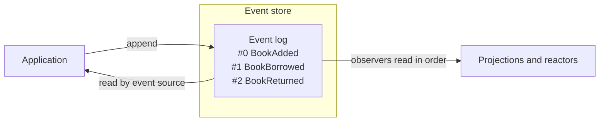

An event store is a database designed for one job: appending immutable events in order and reading them back, either for one entity or across the whole log. It does not update or delete rows. It records what happened and keeps it.

A regular database, relational or document, stores the current state of your data and lets you change it in place. An event store stores the history of changes, and the current state is derived from it. Both are databases. They answer different questions and make different promises.

This page compares the two, shows how an event store such as Cratis Chronicle is used, and covers when an ordinary database is the better choice. It builds on [what is event sourcing?](/concepts/event-sourcing/).

## How an event store works

An event store keeps one or more ordered logs of events. In Chronicle these are **event sequences**, and the main one is the **event log**. Each event gets a sequence number that never changes. Each event also belongs to an **event source**, such as one account or one order, so you can read the history of a single entity.



The store offers a small set of operations:

- **Append** an event to an event source, with checks at append time.
- **Read** the events of one event source, or from a sequence number onward.
- **Observe** the log: projections, reducers and reactors read new events in order and remember how far they have read.

Chronicle also tracks event types, observers and projections in the event store, and it can partition data into namespaces, for example per tenant. It stores everything in a database you provide: MongoDB (the default), PostgreSQL, SQL Server or SQLite. Read the [event store concept](/chronicle/concepts/event-store/) for the details.

## Event store vs. a regular database

| | Regular database | Event store |
| --- | --- | --- |
| What is stored | Current state of each record | Every change, as an immutable event |
| Write operation | Insert, update, delete | Append only |
| History | Lost unless you add audit tables or change capture | The data itself |
| Typical read | Query the table or collection you wrote to | Query a read model built from events |
| Ad hoc queries | Rich, built in (SQL, aggregation) | Limited on the log; use read models |
| Consistency of reads | Read-after-write in one place | Writes are validated at once; read models usually catch up shortly after |
| Fit | General purpose | Domains where change over time is the point |

The last row is the real decision. Neither is better in general.

An event store does not replace querying. You almost never run business queries against the raw log. You build read models from it, and those can live in a document or relational database. An event-sourced system therefore often uses an event store and a regular database together. See [projections and read models](/concepts/projections-and-read-models/).

## A concrete example: a library

In a relational design, a `Loans` table has a row per book with a `BorrowedBy` column and a `DueDate` column. When a book comes back, you clear them. The row now says the book is on the shelf, and nothing says it was ever on loan.

In an event store, the same book's history looks like this:

```text
#0  BookAdded(Title: "Dune")
#1  BookBorrowed(Member: "Ada", DueDate: 2025-03-01)
#2  BookReturned()
#3  BookBorrowed(Member: "Grace", DueDate: 2025-03-22)
```

You can still answer "who has the book now?" by folding the events. You can also answer "how often is it borrowed?" and "how long do members keep it?", which the table cannot say.

In Chronicle you define the events as records and append them to the event log:

<ChronicleClientTabs snippet="site-concepts/event-store/lending-service" variants="csharp,kotlin,java" />

This excerpt ignores the `AppendResult` for brevity. In real code, check `IsSuccess` as shown in [Appending events](/chronicle/events/appending/). It also assumes a registered Chronicle client; [Get started with Chronicle](/chronicle/get-started/) covers setup.

To read the history of one book back, ask the event log for the events of that event source and the event types you care about:

<ChronicleClientTabs snippet="site-concepts/event-store/book-history-reader" variants="csharp,kotlin,java" />

## What an event store gives you that a regular database does not

- **Append-only guarantees.** Events are not updated or deleted, and each has a fixed place in the order. That is a stronger audit story than a table that anyone with write access can alter.
- **Checks at append time.** Chronicle validates each event against its schema and can reject an append that breaks a [constraint](/chronicle/constraints/) such as uniqueness, or one that conflicts with a concurrent write.
- **Ordered observation.** Projections, reducers and reactors read events in order and resume from where they stopped. Building this on top of an ordinary table, with change data capture and offsets, is possible but you own the work.
- **Replay.** A new read model is built by replaying the history. You do not need a special migration for the past.

## What it does not give you

- **A query language over your business data.** Use read models for that.
- **Joins and aggregates on the log.** Do them in projections.
- **Instant read models.** Views are built from events after the append, so they can lag briefly.
- **Free-form updates.** Fixing a wrong record means appending a corrective event, not editing a row.

## When not to use an event store

Choose a regular database when:

- The data is reference data or settings that nobody audits.
- The current state is all that matters and no process hangs on the changes.
- The team needs read-after-write everywhere and cannot design for lagging views.
- You need ad hoc reporting over arbitrary fields and have no appetite for building read models first.

You can mix both. Chronicle sits happily beside a relational or document store for the parts that are only current state. See [when to use event sourcing](/chronicle/concepts/when-to-use-event-sourcing/).

## Common pitfalls

- **Using the event store as a general-purpose database.** Store facts about your domain, not arbitrary documents.
- **Querying the log for screens.** Serve screens from read models.
- **Making events too generic.** An event named `RecordChanged` is an update statement with a new name. Name the business fact.
- **Forgetting storage planning.** The log only grows. Plan retention, backups and the underlying database like any other production datastore.
- **Assuming a message broker is an event store.** A broker delivers messages and may discard them after delivery. An event store keeps events as the system of record. See [event-driven architecture vs. event sourcing](/concepts/event-driven-architecture/).
- **Skipping idempotency.** After a timeout, an append may or may not have been stored. Use concurrency checks or constraints so a retry cannot duplicate it.

## Frequently asked questions

### Is an event store a NoSQL database?

It is a specialised database. Some event stores run on top of NoSQL or SQL databases. Chronicle stores its data in MongoDB, PostgreSQL, SQL Server or SQLite, and adds sequence numbers, event types, constraints and observers on top.

### Can I use PostgreSQL or SQL Server as an event store?

You can build an event log in any relational database with an append-only table, and many teams do. You then own sequencing, concurrency checks, subscriptions and replay. A dedicated event store provides those. Chronicle can also use PostgreSQL or SQL Server as its storage.

### Where do my queries run?

On read models. A projection folds events into a read model that is stored in a database, and your queries run there.

### Does an event store replace my main database?

Not usually. It is the system of record for events. Read models in a regular database serve queries.

### How do I try one?

Follow the [Chronicle tutorial](/chronicle/tutorial/), or read about [event sourcing in .NET](/event-sourcing/dotnet/).

## Next steps

- Read the [event store concept](/chronicle/concepts/event-store/) in the Chronicle docs.
- Choose where to run it with [Get started with Chronicle](/chronicle/get-started/).
- Learn how [projections and read models](/concepts/projections-and-read-models/) answer queries.
- Understand [CQRS](/concepts/cqrs/), the read/write split that goes with it.
- Compare [event sourcing for .NET](/compare-event-sourcing-dotnet/) options.
