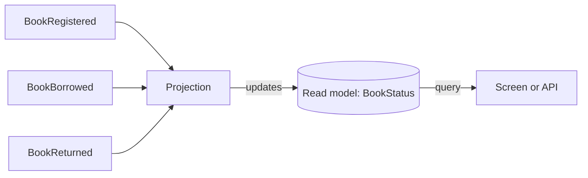

A **read model** is a view of your data shaped for reading: one screen, one report or one API response. A **projection** is the rule that builds it. It watches events as they are appended and keeps the read model up to date.

In an event-sourced system the events are the truth, but they are a poor thing to query. Showing a balance by replaying every deposit and withdrawal on each request would be slow and wasteful. Projections do that folding once, as events arrive, and store the result so reads are cheap. This page covers both terms together because they are two halves of the same job. It follows from [what is event sourcing?](/concepts/event-sourcing/) and is the read side of [CQRS](/concepts/cqrs/).

## How projections and read models work

A projection subscribes to one or more event types. For each event it receives, it changes the read model for the matching entity. The read model is stored in a database, and queries read from there.



Four properties define the model:

- **Specialised.** Build one read model per question. The same events can feed a balance, a transaction list and a monthly summary, each with its own shape.
- **Derived.** You never write to a read model directly. If it is wrong, fix the projection and replay the events.
- **Rebuildable.** Because the events are kept, you can create a new read model later by replaying the history into it.
- **Eventually consistent.** A read model is usually updated shortly after the event is appended, not inside the same operation.

Projections join events, not other read models. A projection reads from the event log and writes to its own read model.

## Projections, reducers and read models

The terms overlap, so here is how Chronicle uses them.

| Term | What it is |
| --- | --- |
| Read model | The shaped, queryable result |
| Projection | A declarative rule that maps events onto a read model |
| Reducer | Code that folds each event into the current state, one event at a time |

Chronicle offers three ways to define how events build a read model:

| Style | What it looks like | Use it when |
| --- | --- | --- |
| Model-bound projection | Attributes on the read model type | The default; most mappings fit |
| Declarative projection | A fluent `IProjectionFor<T>` class | The mapping needs more explicit control |
| Reducer | An `IReducerFor<T>` class | State transitions are easier to write as code |

Chronicle's [choose a read-model style](/chronicle/projections/choosing-a-read-model-style/) page builds the same read model all three ways.

## A concrete example: a library book

A library tracks whether each book is on the shelf or on loan. Three events carry the story:

```csharp
using Cratis.Chronicle.Events;

[EventType]
public record BookRegistered(string Title, string Isbn);

[EventType]
public record BookBorrowed(string MemberName);

[EventType]
public record BookReturned;
```

The screen needs a small read model: the title, whether the book is on loan and who has it. In a model-bound projection, the read model describes how events fill it:

```csharp
using Cratis.Chronicle.Keys;
using Cratis.Chronicle.Projections.ModelBound;

public record BookStatus(
    [Key] string Id,

    [SetFrom<BookRegistered>] string Title,
    [SetFrom<BookRegistered>] string Isbn,

    [SetValue<BookBorrowed>(true)]
    [SetValue<BookReturned>(false)]
    bool IsBorrowed,

    [SetFrom<BookBorrowed>(nameof(BookBorrowed.MemberName))]
    [ClearWith<BookReturned>]
    string? BorrowedBy);
```

Chronicle finds the projection from the attributes. There is no registration code and no separate class. `Title` and `Isbn` map from the event property of the same name. `IsBorrowed` is set to a constant by each event. `BorrowedBy` is set from the borrow event and cleared by `[ClearWith<BookReturned>]` on the return event.

When the mapping needs more control, the same read model can be defined as a projection class. AutoMap, the default for declarative projections, fills `Title` and `Isbn` from the event properties of the same name, so only the other members are mapped explicitly:

```csharp
using Cratis.Chronicle.Projections;

public class BookStatusProjection : IProjectionFor<BookStatus>
{
    public void Define(IProjectionBuilderFor<BookStatus> builder) => builder
        .From<BookRegistered>(_ => _
            .Set(m => m.Id).ToEventSourceId()
            .Set(m => m.IsBorrowed).ToValue(false)
            .Clear(m => m.BorrowedBy))
        .From<BookBorrowed>(_ => _
            .Set(m => m.IsBorrowed).ToValue(true)
            .Set(m => m.BorrowedBy).To(e => e.MemberName))
        .From<BookReturned>(_ => _
            .Set(m => m.IsBorrowed).ToValue(false)
            .Clear(m => m.BorrowedBy));
}
```

Use one style per read model, not both. Both examples above are excerpts and assume a registered Chronicle client.

When you want to fold state with ordinary code, a reducer receives the event, the current state and the event context, and returns the new state. A running balance is a good fit:

```csharp
using Cratis.Chronicle.Events;
using Cratis.Chronicle.Reducers;

[EventType]
public record DepositMade(decimal Amount);

[EventType]
public record WithdrawalMade(decimal Amount);

public record AccountBalance(decimal Balance, DateTimeOffset LastUpdated);

public class AccountBalanceReducer : IReducerFor<AccountBalance>
{
    public AccountBalance Deposited(DepositMade @event, AccountBalance? current, EventContext context) =>
        new((current?.Balance ?? 0m) + @event.Amount, context.Occurred);

    public AccountBalance WithdrawalMade(WithdrawalMade @event, AccountBalance? current, EventContext context) =>
        new((current?.Balance ?? 0m) - @event.Amount, context.Occurred);
}
```

To read the result, ask for the instance by key:

```csharp
BookStatus? status = await eventStore.ReadModels.GetInstanceById<BookStatus>(bookId);

if (status is not null)
{
    Console.WriteLine($"{status.Title}: {(status.IsBorrowed ? status.BorrowedBy : "on the shelf")}");
}
```

In an Arc application, the same read model carries a `[ReadModel]` attribute and a static query method, and the frontend gets a typed proxy. See [read models in Arc with Chronicle](/arc/backend/csharp/chronicle/read-models/).

## Consistency: materialized or on demand

By default, a projection is **materialized**: the read model is stored and updated after the append. Reads are cheap and scale well. Occasionally a workflow cannot tolerate a read model that is a moment behind. Chronicle then offers a **passive** read model, which is not stored but computed from its events each time you read it. It always includes the latest append, at the price of replaying that instance's history.

Start with materialized. Switch to passive only where you must read your own write at once. Neither option enforces a rule such as uniqueness; use a [constraint](/chronicle/constraints/) for that. The details are in [read model consistency](/chronicle/read-models/consistency/).

## Benefits

- **Fast reads.** The work is done at write time, so queries read a ready-made view.
- **Focused models.** Each screen gets exactly the fields it needs, with no joins at read time.
- **Freedom to change.** You can add, change or drop a read model without touching the history.
- **Rebuilds instead of migrations.** A new view is created by replay.
- **Isolation.** A slow or broken projection does not block appends.

## Trade-offs and when not to use them

- **Eventual consistency.** A read right after a write may show old data. Design screens for it, or use a passive read model where needed.
- **More artefacts.** Every view is a projection to maintain.
- **Replay cost.** Rebuilding a large history takes time.
- **Not for decisions that must see the latest state.** Do not enforce rules by reading a read model and then appending. Two concurrent commands can both pass the check. Use a constraint or a concurrency check on the write side.
- **Not needed for trivial reads.** A CRUD application with no history does not need projections at all.

## Common pitfalls

- **One giant read model for every screen.** It brings back the coupling you set out to avoid. Build specialised models.
- **Treating a read model as the source of truth.** It can be dropped and rebuilt. The events are the record.
- **Putting business rules in a projection.** A projection mirrors facts. Decisions belong where commands are handled.
- **Forgetting that a replay reruns side effects.** A projection only builds a read model, so replaying it is safe. A reactor that sends an email is different; see [event-driven architecture vs. event sourcing](/concepts/event-driven-architecture/).
- **Unbounded child collections.** A read model that collects every event of a busy entity grows without limit. Keep child lists bounded or split the view.
- **Querying the event log directly for screens.** Use a read model.

## Frequently asked questions

### What is the difference between a projection and a read model?

The read model is the result, and the projection is the rule that produces it. People often say "projection" for both.

### Is a read model the same as a materialized view?

They are close. Both store a precomputed result. A read model is built from events by an observer rather than from a SQL query, and it can live in a document or relational store.

### How do I rebuild a read model?

Replay the events through the projection. Chronicle can replay an observer from the start of the event log. Because projections only build state, replay does not repeat side effects.

### Can a projection use data from another read model?

No. Projections join events. If a view needs data from two entities, join the events from both.

### Where is a read model stored?

In a sink, which is MongoDB by default. See [Chronicle's projections documentation](/chronicle/projections/) for what is configurable.

## Next steps

- Read [Chronicle projections](/chronicle/projections/) and [Chronicle read models](/chronicle/read-models/).
- Pick a style with [choose a read-model style](/chronicle/projections/choosing-a-read-model-style/).
- Serve a read model to React with an [Arc query](/arc/backend/csharp/queries/).
- See where read models sit in [CQRS explained](/concepts/cqrs/).
- Design them up front with [event modeling](/concepts/event-modeling/).
