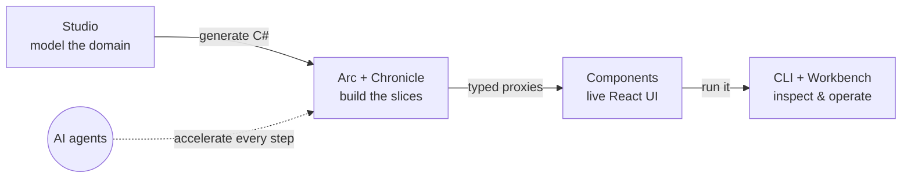

import { CardGrid } from '@astrojs/starlight/components';
import SimpleCard from '@components/SimpleCard.astro';
import TopicHero from '@components/TopicHero.astro';
import StackDiagram from '@components/StackDiagram.astro';

<TopicHero icon="rocket" eyebrow="The Cratis Stack" title="From a sticky note to a running, typed, full-stack app">
Most stacks are a bag of libraries you bolt together and then spend the whole project keeping in sync. The Cratis Stack is designed as **one thing** — every layer fits the next, so a domain you model on Monday becomes typed C#, a live React screen, and an inspectable event log by Friday, with the seams between them *generated* instead of hand-written. [Start building →](/chronicle/get-started/) · [Why Cratis? →](/why-cratis/)
</TopicHero>

## One idea, all the way down

Each product is strong on its own — you can [use them separately](/why-cratis/). The reason to reach for the *whole* stack is that the seams disappear: everywhere you'd normally hand-write glue, Cratis generates it.

- You **model** the domain, and [Studio](/studio/) will generate the C# for it.
- You **write a command**, and [Arc](/arc/) generates the [typed TypeScript proxy](/arc/understanding-the-proxy-boundary/) for it.
- You **append an event**, and a [Chronicle](/chronicle/) projection builds the read model from it.
- You **render a screen**, and [Components](/components/) consumes the proxy with no API client to write.
- You **run it**, and the [CLI](/cli/) and Workbench let you watch every event flow through.

Nothing in that list is a thing *you* keep in sync. The build does.

<StackDiagram />

## The journey, end to end

Read this left to right and it's the whole lifecycle of a feature — design, build, operate — with AI able to accelerate every step:

1. **Design it.** In [Studio](/studio/) you and your team model the domain on a shared canvas — the commands, events, and read models — and generate type-safe C# straight from the model. (Studio is *coming soon*; until then you model the same shapes in code, guided by [vertical slices](/arc/vertical-slices/).)
2. **Build it.** [Arc](/arc/) turns commands and queries into a CQRS app, [Chronicle](/chronicle/) stores every change as an event and projects it into read models, and the build generates the typed proxies — so [Components](/components/) renders a live screen with [no glue across the boundary](/arc/understanding-the-proxy-boundary/).
3. **Operate it.** The [CLI](/cli/) and Workbench give you an event-sourcing-aware window into the running store — browse events, watch observers, replay a projection, diagnose a stuck partition.

## Build it with AI

Cratis ships first-class tooling so an AI agent can build *and* operate the stack alongside you:

- **`cratis init`** drops the Cratis AI configuration into your repo — agents and skills (like *new vertical slice* and *add projection*) that already know the Cratis conventions, so an assistant scaffolds correct slices instead of guessing at the framework.
- The **Chronicle MCP server** lets an agent connect to a running store and inspect events, observers, and read models — the same window the CLI gives you, handed to your assistant.

Model in Studio, generate the slices, build them, inspect the result — an agent can take part at every step. [AI-native development](/ai-native-development/) covers the setup and exactly what an agent can do.

## Each layer, on its own and together

<CardGrid>
  <SimpleCard title="Studio — design" icon="open-book" link="/studio/">
    Model the domain on a collaborative event-modeling canvas and generate type-safe C# from it. *(Coming soon.)*
  </SimpleCard>
  <SimpleCard title="Chronicle — events" icon="seti:db" link="/chronicle/">
    The event-sourcing engine: store every change as an immutable event, project it into read models, react to it.
  </SimpleCard>
  <SimpleCard title="Arc — CQRS + proxies" icon="puzzle" link="/arc/">
    Full-stack CQRS with generated, typed C# → TypeScript proxies. Runs over Chronicle, MongoDB, or EF Core.
  </SimpleCard>
  <SimpleCard title="Components — React" icon="laptop" link="/components/">
    Command dialogs, forms, and live data tables that consume Arc's proxies — a screen is a few lines.
  </SimpleCard>
  <SimpleCard title="CLI + Workbench — operate" icon="rocket" link="/cli/">
    Inspect and interact with a running store: events, observers, read models, replay, and diagnostics.
  </SimpleCard>
  <SimpleCard title="Fundamentals — foundation" icon="seti:folder" link="/fundamentals/">
    The shared .NET and TypeScript building blocks the rest of the stack is built on.
  </SimpleCard>
</CardGrid>

## Where to start

<CardGrid>
  <SimpleCard title="Get started" icon="rocket" link="/chronicle/get-started/">
    Scaffold a project and watch one event flow through a projection and a reactor — in minutes.
  </SimpleCard>
  <SimpleCard title="Build a full-stack feature" icon="open-book" link="/build-a-full-app/">
    Put Chronicle, Arc, and Components together — backend to React, type-safe throughout.
  </SimpleCard>
  <SimpleCard title="Choosing where to start" icon="right-arrow" link="/adopting-cratis/">
    Greenfield or brownfield — pick an entry point and adopt one piece at a time.
  </SimpleCard>
  <SimpleCard title="Why Cratis" icon="approve-check" link="/why-cratis/">
    How the products stand alone and compose, and when the stack is — and isn't — the right fit.
  </SimpleCard>
</CardGrid>
