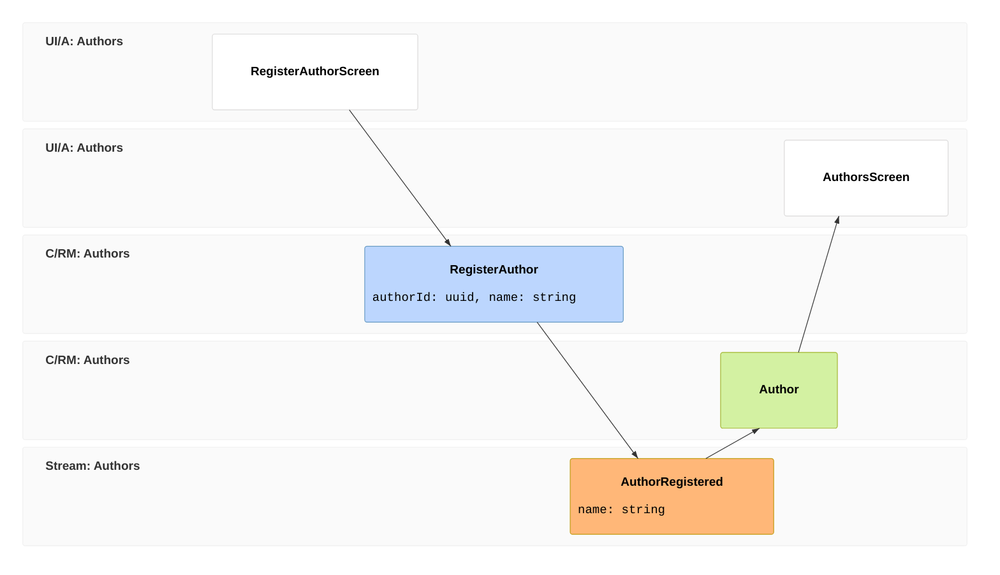

import { CardGrid } from '@astrojs/starlight/components';
import SimpleCard from '@components/SimpleCard.astro';
import TopicHero from '@components/TopicHero.astro';
import StackJourney from '@components/StackJourney.astro';

<TopicHero icon="rocket" eyebrow="The Cratis Stack" title="From a sticky note to a running, typed, full-stack app">
Most stacks are a bag of libraries you bolt together and then spend the whole project keeping in sync. Developers choose Cratis because the layers are designed as **one thing** — the domain you sketch at the top of the hour is typed C#, authenticated tenant-aware requests, a live React screen, and an inspectable event log before the hour is out. Not because you typed faster — because event sourcing is the default backbone for information systems and every handoff you'd normally hand-write is covered by conventions, generation, and open runtime boundaries. [Start building →](/chronicle/get-started/) · [Why developers choose Cratis →](/why-cratis/)
</TopicHero>

## One idea, all the way down

Each product is strong on its own — you can [use them separately](/why-cratis/). The reason to reach for the *whole* stack is that the seams disappear: CQRS shapes information going in and out, event sourcing keeps the facts underneath, and everywhere you'd normally hand-write glue, Cratis generates it.

- You **model** the domain, and with access to [Studio](/studio/) that model is how you manage the entire lifecycle of the project — from generated C# to the running system.
- You **secure the edge**, and [AuthProxy](/authproxy/) authenticates, resolves the tenant, enriches identity, and routes requests.
- You **write a command**, and [Arc](/arc/) generates the [typed TypeScript proxy](/arc/understanding-the-proxy-boundary/) for it.
- You **append an event**, and [Chronicle](/chronicle/) accepts it through a gRPC/protobuf boundary, stores it in MongoDB, PostgreSQL, Microsoft SQL Server, or SQLite, and projects the read model from it.
- You **render a screen**, and [Components](/components/) consumes the proxy with no API client to write.
- You **press F5**, and the [Aspire integration](/chronicle/hosting/aspire/) starts Chronicle next to your services — development image, embedded MongoDB, no compose file.
- You **run it**, and the [CLI](/cli/), Workbench, OpenTelemetry, jobs, recommendations, and replay tools let you watch and operate the event store.

Nothing in that list is a thing *you* keep in sync. The build does.

Wiring the stack into one host is itself a single call: the [`Cratis` package](/arc/backend/chronicle/cratis-package/) brings Arc and Chronicle up together with `AddCratis`/`UseCratis`, sharing storage, identity, and hosting.

<StackJourney
  eyebrow="Design, build, operate"
  title="The journey, end to end"
  intro="Read it left to right: a domain idea becomes a secured tenant-aware request, a generated slice, a durable event, a live typed React screen, and an inspectable running system. AI can accelerate the same path because the conventions are explicit."
/>

## Run the whole stack from one AppHost

Before any of this renders, Chronicle and a database have to be running — and "clone the repo, then fix the
compose file" is where most first hours go to die. Chronicle ships a first-class .NET Aspire resource instead,
so the event store is one line in your AppHost:

```csharp
var builder = DistributedApplication.CreateBuilder(args);

var chronicle = builder.AddCratisChronicle();

builder.AddProject<Projects.MyApi>("api")
    .WithReference(chronicle);

builder.Build().Run();
```

With no arguments, `AddCratisChronicle()` registers a resource named `chronicle` running the development
image — embedded MongoDB included — so F5 brings the store up with zero external infrastructure, and
`WithReference(chronicle)` hands your API the connection string. When you graduate to real storage, the same
call takes a configure callback after the name — `builder.AddCratisChronicle("chronicle", c => c.WithMongoDB(mongo))`,
or `WithPostgreSql`, `WithMsSql`, `WithSqlite` — and compliance encryption keys can live in HashiCorp Vault or
Azure Key Vault via `WithHashiCorpVault` and `WithAzureKeyVault`.

[Chronicle's Aspire integration](/chronicle/hosting/aspire/) walks through development versus production
images, every storage option, ports, and connecting .NET clients.

## Security and compliance end to end

Authentication, authorization, tenancy, and compliance are separate concerns, but they travel through the
same request. AuthProxy authenticates and resolves tenant context. Arc authorizes the command or query.
The Arc + Chronicle integration writes events into the tenant's Chronicle namespace. Chronicle encrypts
PII by compliance subject, and Arc releases protected read models before serving query responses.

[Auth and compliance end to end](/auth-and-compliance/) shows that flow across the stack: where identity
is enriched, where access decisions happen, how subjects differ from event source ids, and what erasure
requires after protected data has reached read models.

## Test the same flow

The same column you draw in an event model is also the shape of the test:



That becomes a BDD-style specification:

| Given | When | Then |
|---|---|---|
| no author exists for this id | `RegisterAuthor` runs through Arc | the command succeeds |
| no author exists for this id | `RegisterAuthor` runs through Arc | Chronicle records `AuthorRegistered` |
| `AuthorRegistered` exists | the read model projection handles it | the `Authors` screen can read the author |

Cratis Specifications gives that shape a light wrapper over xUnit: `Establish()` is the given, `Because()` is the when, and each `[Fact]` is one then. Arc adds `CommandScenario<TCommand>` so the command runs through the real pipeline. Chronicle adds in-process scenarios for events, projections, and reactors. Together, you test the slice in the same language you designed it: facts in, command happens, facts and read models out.

[Testing with Cratis](/testing-with-cratis/) walks through the packages and the full stack-slice example.

## Build it with AI

Cratis ships first-class tooling so an AI agent can build *and* operate the stack alongside you. That works because the stack is intentionally conventional: the same feature shape, naming, generated boundary, Chronicle diagnostics, and CLI command catalog show up across products.

- **`cratis init`** drops the Cratis AI configuration into your repo — agents and skills (like *new vertical slice* and *add projection*) that already know the Cratis conventions, so an assistant scaffolds correct slices instead of guessing at the framework.
- The **Chronicle MCP server** lets an agent connect to a running store and inspect events, observers, and read models — the same window the CLI gives you, handed to your assistant.

Model in Studio, generate the slices, build them, inspect the result — an agent can take part at every step. [AI-native development](/ai-native-development/) covers the setup and exactly what an agent can do.

## Each layer, on its own and together

<CardGrid>
  <SimpleCard title="Studio — design" icon="open-book" link="/studio/">
    Model the domain on a collaborative event-modeling canvas and generate type-safe C# from it. *(Coming soon.)*
  </SimpleCard>
  <SimpleCard title="Chronicle — events" icon="seti:db" link="/chronicle/">
    The event-sourcing engine: gRPC/protobuf boundary, .NET-first client, TypeScript and Elixir clients/contracts, MongoDB/PostgreSQL/SQL Server/SQLite storage, Orleans inside.
  </SimpleCard>
  <SimpleCard title="AuthProxy — edge" icon="seti:lock" link="/authproxy/">
    Authentication, tenant resolution, identity enrichment, routing, and invite-based onboarding in front of your services.
  </SimpleCard>
  <SimpleCard title="Auth and compliance — end to end" icon="seti:lock" link="/auth-and-compliance/">
    How authenticated tenant-aware requests become authorized operations, protected events, and released read models.
  </SimpleCard>
  <SimpleCard title="Arc — CQRS + proxies" icon="puzzle" link="/arc/">
    Full-stack CQRS with generated, typed C# → TypeScript proxies. It pairs naturally with Chronicle, and can also run over MongoDB or EF Core.
  </SimpleCard>
  <SimpleCard title="Components — React" icon="laptop" link="/components/">
    Command dialogs, forms, and live data tables that consume Arc's proxies — a screen is a few lines.
  </SimpleCard>
  <SimpleCard title="CLI + Workbench — operate" icon="rocket" link="/cli/">
    Inspect and interact with a running store: events, observers, read models, recommendations, jobs, replay, failed partitions, and diagnostics.
  </SimpleCard>
  <SimpleCard title="Specifications — test" icon="approve-check" link="/testing-with-cratis/">
    BDD-style specs over xUnit, with Arc command scenarios and Chronicle in-process event, read-model, and reactor scenarios.
  </SimpleCard>
  <SimpleCard title="Fundamentals — foundation" icon="seti:folder" link="/fundamentals/">
    The shared .NET and TypeScript building blocks the rest of the stack is built on.
  </SimpleCard>
</CardGrid>

## Where to start

<CardGrid>
  <SimpleCard title="Get started" icon="rocket" link="/chronicle/get-started/">
    Scaffold a project and watch one event flow through a projection and a reactor — in minutes.
  </SimpleCard>
  <SimpleCard title="Build a full-stack feature" icon="open-book" link="/build-a-full-app/">
    Put Chronicle, Arc, and Components together — backend to React, type-safe throughout.
  </SimpleCard>
  <SimpleCard title="Test a full-stack slice" icon="approve-check" link="/testing-with-cratis/">
    Turn an event-model column into given/when/then specs.
  </SimpleCard>
  <SimpleCard title="Choosing where to start" icon="right-arrow" link="/adopting-cratis/">
    Greenfield or brownfield — pick an entry point and adopt one piece at a time.
  </SimpleCard>
  <SimpleCard title="Why developers choose Cratis" icon="approve-check" link="/why-cratis/">
    How the products stand alone and compose, and when the stack is — and isn't — the right fit.
  </SimpleCard>
</CardGrid>
