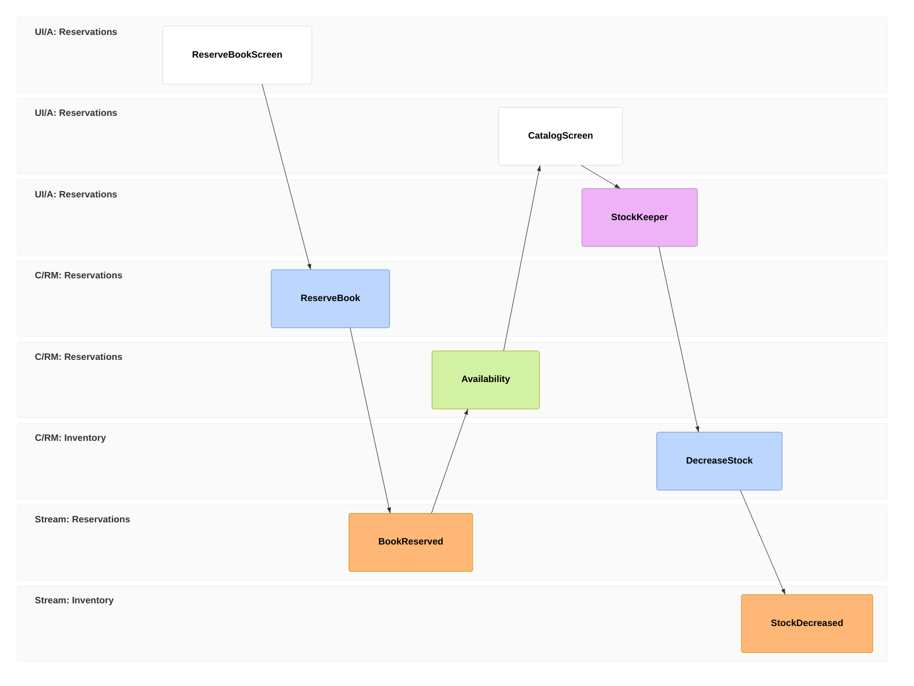
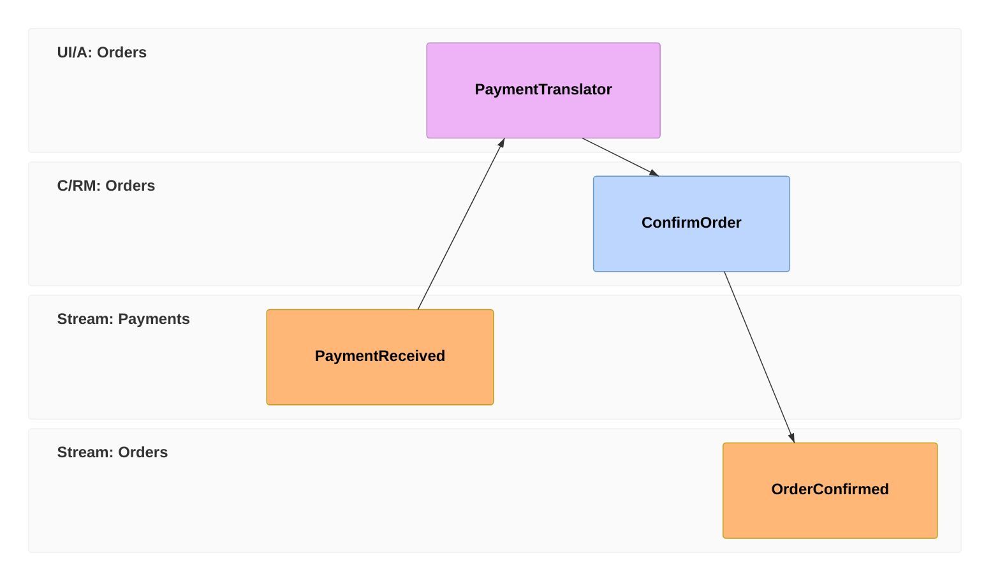

import { CardGrid, Aside } from '@astrojs/starlight/components';
import SimpleCard from '@components/SimpleCard.astro';
import TopicHero from '@components/TopicHero.astro';

<TopicHero icon="list-format" eyebrow="The Cratis Stack" title="Design the flow before you write the code">
The hard part of an event-sourced system isn't the plumbing — it's deciding *what the events are*, where commands come from, and which read model each screen needs. Get that wrong and you find out late, in code. **Event modeling** is a way to lay the whole flow out on a single timeline first. And because that timeline's pieces are exactly Cratis's building blocks, the model you draw *is* the blueprint for your slices.
</TopicHero>

## What it is

[Event modeling](https://eventmodeling.org/) describes a system as a **timeline of information moving between people and machines** — you read it left to right, like a comic strip. A user does something on a **screen**, that issues a **command**, the command records an **event**, and events are projected into **read models** that feed the next screen. Nothing else. The whole notation is five kinds of sticky note:

Read it as a story. A reader reserves a book on a **screen** (`ui`); that fires the `ReserveBook` **command** (`cmd`), which records the `BookReserved` **event** (`evt`) — an immutable fact. That fact is projected into an `Availability` **read model** (`rmo`) that the catalog screen reads. And a **processor** (`pcr`) watching reservations quietly issues a follow-up command to decrease stock. The rows are **swimlanes** — one per bounded context (`Reservations`, `Inventory`).

That's the entire vocabulary: **wireframe, command, event, read model, processor.** No class diagrams, no database schemas — just the flow of facts.

<Aside type="tip" title="Why past tense matters">
Events are named in the **past tense** — `BookReserved`, not `ReserveBook` — because they are facts that already happened and can never be un-happened. If you catch yourself wanting a nullable field on an event ("reserved-or-maybe-cancelled"), that's the model telling you it's really *two* events.
</Aside>

## Why it's useful

A timeline this plain does three things a box-and-arrows architecture diagram can't:

- **It's a shared language.** A domain expert and an engineer read the *same* picture. The expert can point at `BookReserved` and say "no, that only happens after payment" — a correction that would otherwise surface as a bug three sprints later.
- **It forces completeness.** Every event must trace back to a command; every command to a screen or a processor; every screen must read a real read model. Walk the timeline and the gaps light up — a screen with no data behind it, an event nothing produces. You find the holes on a whiteboard, not in production.
- **There are only four shapes.** Every connection in a correct model is one of four repeating patterns. Once you can see them, you can see *any* feature as a handful of small, known pieces.

## The four patterns

These four shapes are the whole grammar. Every slice of every system is built from them:

| Pattern | Shape | What it does |
|---|---|---|
| **Command** | `ui ➜ cmd ➜ evt` | A user acts; a command validates and records a fact. *The write side.* |
| **View** | `evt ➜ rmo ➜ ui` | Facts are projected into the state a screen reads. *The read side.* |
| **Automation** | `evt ➜ pcr ➜ cmd` | A processor reacts to a fact and issues a command on its own. |
| **Translation** | external `evt ➜ pcr ➜ cmd` | A fact from another context is adapted into this one's commands. |

The first two are the everyday CQRS loop. The last two are how work flows *between* contexts without anything being directly coupled — a processor watches for a fact and acts. A translation begins on a **reset frame** (`rf`) because its triggering event comes from somewhere else:

## Why it fits Cratis almost one-to-one

Here's the part that makes event modeling more than a whiteboard exercise for Cratis: **every block is a real Cratis primitive,** and the four patterns are *literally* the four kinds of [vertical slice](/arc/vertical-slices/) Cratis already organizes code around. The model isn't a sketch you translate — it's the slice, drawn.

| Event-model block | What it means | In Cratis |
|---|---|---|
| Wireframe (`ui`) | a screen the user sees | a React screen — [Components](/components/) + Arc.React |
| Command (`cmd`) | an intent to change state | a `[Command]` record with `Handle()` — [Arc](/arc/) |
| Event (`evt`) | a fact that happened | an `[EventType]` record in [Chronicle](/chronicle/) |
| Read model (`rmo`) | state a screen reads | a `[ReadModel]` built by a [projection](/chronicle/projections/) |
| Processor (`pcr`) | automation that reacts to facts | an `IReactor` in Chronicle |
| Swimlane | a bounded context | a vertical slice / feature folder |

And the patterns line up exactly with how a Cratis slice is classified:

| Event-modeling pattern | Cratis slice type |
|---|---|
| Command | **State Change** — command + events |
| View | **State View** — read model + projection |
| Automation | **Automation** — a reactor that decides and acts |
| Translation | **Translation** — a reactor that adapts events across slices |

This is not a coincidence — both come from the same idea, that **events are the source of truth and everything else is derived from them.** A `[Command]`'s `Handle()` returns the event it records; a `[ReadModel]` declares the events it's built from; an `IReactor` reacts to a fact and issues the next command. Draw the timeline and you've named your commands, your events, your read models, and your reactors — in the order they happen.

<Aside type="note" title="The model is the column, the slice is the code">
Read a single vertical column of an event model — one screen, its command, the event, the read model behind the next screen — and you're looking at one [vertical slice](/arc/vertical-slices/): one feature folder with the command, event, projection, and React component that implement it. The [full-stack walkthrough](/build-a-full-app/) builds exactly that column, block by block.
</Aside>

## The model is also the test

Event modeling already has the given/when/then shape baked in. The left side of the column is the context, the command is the behavior under test, and the event/read-model blocks are the expected outcome:

| Event-model block | Specification role |
|---|---|
| Existing events before the command | **Given** |
| Command or reactor in the column | **When** |
| New event, projected read model, or side effect | **Then** |

That is why Cratis uses BDD-style specifications so heavily. `Cratis.Specifications.XUnit` gives xUnit the `Establish()` / `Because()` / `[Fact]` lifecycle, while Arc and Chronicle add scenarios that speak the same language: `CommandScenario<TCommand>` for the command, `EventScenario.Given` for past facts, `ReadModelScenario<TReadModel>` for projections, and `ReactorScenario<TReactor>` for automation.

[Testing with Cratis](/testing-with-cratis/) shows a concrete event-model column translated into an executable stack spec.

## When it's the wrong fit

Event modeling earns its keep when behavior is interesting — when facts accumulate, screens derive state from history, and work flows between contexts. It's overkill when there isn't much of a story to tell: a settings form that reads and writes a single row, a static lookup table, a pure request/response with no meaningful event worth keeping. If a feature is honestly just CRUD over one record, model it as CRUD. Reach for event modeling when the *flow* — not the storage — is where the complexity lives.

## Go deeper

<CardGrid>
  <SimpleCard title="Build the slice it describes" icon="add-document" link="/build-a-full-app/" />
  <SimpleCard title="Test the slice it describes" icon="approve-check" link="/testing-with-cratis/" />
  <SimpleCard title="Events &amp; projections in Chronicle" icon="seti:db" link="/chronicle/" />
  <SimpleCard title="Vertical slices in Arc" icon="seti:folder" link="/arc/vertical-slices/" />
</CardGrid>
