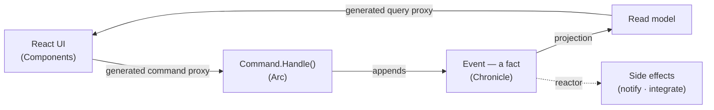

import { Card, CardGrid, LinkCard, Tabs, TabItem } from '@astrojs/starlight/components';
import SimpleCard from '../../components/SimpleCard.astro';

## Why developers choose Cratis

<CardGrid>
  <SimpleCard title="Events are facts" icon="approve-check" link="/chronicle/why-event-sourcing/">
    Immutable, past-tense records of what happened. Your audit trail, time-travel, and analytics come for free.
  </SimpleCard>
  <SimpleCard title="Full-stack type safety" icon="seti:typescript" link="/arc/understanding-the-proxy-boundary/">
    Models flow from C# through generated proxies to React — no manual sync, no DTO drift, no hand-written API client.
  </SimpleCard>
  <SimpleCard title="Vertical slices" icon="seti:folder" link="/arc/vertical-slices/">
    Everything for one behavior — command, events, projection, UI, specs — lives in one folder. Navigate by feature, not by layer.
  </SimpleCard>
  <SimpleCard title="No update code" icon="seti:db" link="/chronicle/projections/">
    Declare the read model you want and which events feed it. A projection keeps it in sync — you never write an `UPDATE`.
  </SimpleCard>
  <SimpleCard title="Lovable, convention-first APIs" icon="heart" link="/chronicle/get-started/">
    Discovery by naming, sane defaults, minimal boilerplate. The easy thing to do is the right thing.
  </SimpleCard>
  <SimpleCard title="Inspect it live" icon="rocket" link="/cli/">
    The CLI is your window into a running store — browse events, watch observers, replay, and diagnose.
  </SimpleCard>
</CardGrid>

## One feature, one slice — typed end to end

You write the behavior once in C#. Arc generates the TypeScript proxies. The React side can't drift — rename a property in C#, rebuild, and the frontend stops compiling until you fix it.

<Tabs>
<TabItem label="C# — the slice" icon="seti:c-sharp">
```csharp
// Command, event, and read model for one feature — in one file.
[Command]
public record RegisterAuthor(AuthorId Id, AuthorName Name)
{
    public AuthorRegistered Handle() => new(Name);   // returns the fact that happened
}

[EventType]
public record AuthorRegistered(AuthorName Name);

[ReadModel, FromEvent<AuthorRegistered>]
public record Author([property: Key] AuthorId Id, AuthorName Name)
{
    // This static method *is* the query — exposed over HTTP automatically.
    public static ISubject<IEnumerable<Author>> AllAuthors(IMongoCollection<Author> c) => c.Observe();
}
```
</TabItem>
<TabItem label="React — the screen" icon="seti:react">
```tsx
// Proxies are generated from the C# above — fully typed, always in sync.
const [authors] = AllAuthors.use();           // live, updates as events arrive

<CommandDialog command={RegisterAuthor} title="Add author">
    <InputTextField value={i => i.name} title="Name" />
</CommandDialog>
```
</TabItem>
</Tabs>

## The whole loop, in one place

Every Cratis application is the same loop: a command appends a **fact**, a **projection** folds facts into a read model you can query, and a **reactor** acts when something happens. You model *what happened* once — the read side and the react side both derive from it.



## The three products, one platform

<CardGrid>
  <SimpleCard title="Chronicle" icon="seti:db" link="/chronicle/">
    The event sourcing engine — events, projections, reducers, and reactors over a durable event log.
  </SimpleCard>
  <SimpleCard title="Arc" icon="puzzle" link="/arc/">
    The full-stack CQRS framework — commands, queries, and the generated proxies that keep React in sync.
  </SimpleCard>
  <SimpleCard title="Components" icon="laptop" link="/components/">
    The React component library — command dialogs, forms, and data tables wired to your proxies.
  </SimpleCard>
  <SimpleCard title="CLI" icon="rocket" link="/cli/">
    A terminal window into a running store — inspect events, watch observers, and diagnose issues.
  </SimpleCard>
</CardGrid>

## Coming from another stack?

Marten, Wolverine, and Kurrent are excellent tools. The short version of how Cratis differs: it's the only one that's **full-stack** — typed all the way to React.

| | Cratis | Marten | Wolverine | Kurrent |
|---|:---:|:---:|:---:|:---:|
| Event sourcing | ✓ | ✓ | with Marten | ✓ |
| CQRS commands & queries | ✓ | — | ✓ | — |
| Built-in read-model projections | ✓ | ✓ | — | server-side JS |
| **Full-stack typed proxies (C# → React)** | **✓** | — | — | — |
| Primary store | MongoDB (+extensible) | PostgreSQL | any | own engine |

Honest, per-tool **[comparisons and migration guides](/comparisons/)** (Marten · Wolverine · Kurrent), plus bridges from [CRUD / EF Core](/chronicle/coming-from-crud/) and [MediatR / MVC](/arc/coming-from-mediatr-and-mvc/).

## Ready to build?

<CardGrid>
  <LinkCard title="Get started" description="Scaffold a project, run it, and watch one event flow through a projection and a reactor — in minutes." href="/chronicle/get-started/" />
  <LinkCard title="Build the library, step by step" description="Learn the model by building a small event-sourced system one concept at a time." href="/chronicle/tutorial/" />
  <LinkCard title="Build a full-stack feature" description="Put Chronicle, Arc, and Components together — backend to React, type-safe throughout." href="/build-a-full-app/" />
  <LinkCard title="New to event sourcing?" description="Start with the why: what facts buy you, and when not to reach for them." href="/chronicle/why-event-sourcing/" />
</CardGrid>
