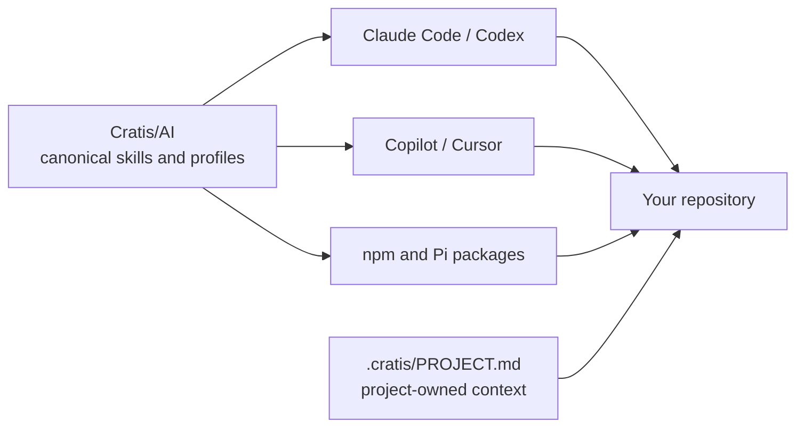

import { CardGrid, Aside } from '@astrojs/starlight/components';
import SimpleCard from '@components/SimpleCard.astro';
import TopicHero from '@components/TopicHero.astro';

<TopicHero icon="puzzle" eyebrow="The Cratis Stack" title="Teach your assistant the Cratis way">
A general-purpose assistant knows C# and TypeScript, but it does not automatically know why a Cratis command lives beside its fact, why a projection consumes events instead of another read model, or why generated proxies should never be hand-edited. Cratis skills provide that missing framework context as reviewed workflows instead of another prompt you have to remember.
</TopicHero>

## One behavior, several native packages

Cratis authors canonical skills in [`Cratis/AI`](https://github.com/Cratis/AI).
Four committed marketplace manifests — for Claude Code, Codex, GitHub Copilot,
and Cursor — point hosts straight at the `skills/` and `engineering/`
directories on the repository's default branch, so what a host installs is
exactly what a reviewer reads there.

This avoids behavior forks. A projection skill should not teach one architecture
in Claude and another in Copilot merely because their package manifests differ.

<Aside type="note" title="Evaluation status">
Marketplace installation and the published npm package are real, but Cratis AI
remains an unsupported `0.x` evaluation distribution. Marketplace availability
does not imply behavior support or a stable-support claim.
</Aside>

## Public packages stay passive

The planned public package contains portable Agent Skills and their static
references, assets, and licenses. It excludes executable extensions, lifecycle
scripts, credentials, project facts, authoring evals, engineering hooks, agents,
prompts, and repository tooling.

Executable Chronicle operations belong to the documented CLI and Chronicle MCP
surfaces, with their own authorization and confirmation boundaries. They are not
smuggled into a passive coding-skills package.

## Skills guide complete workflows

Skills are the high-value pieces: your assistant invokes one when a request
matches and follows a Cratis workflow instead of improvising.

- **`event-modeling`** — settle commands, facts, streams, state views, reactions,
  compliance, and scenarios before implementation.
- **`new-vertical-slice`** — build an application behavior end to end through
  backend, specs, frontend, documentation, and gates.
- **`add-concept`**, **`add-projection`**, **`add-reactor`**,
  **`add-business-rule`**, **`add-ef-migration`** — implement one focused Cratis
  artifact by convention.
- **`write-specs`**, **`write-documentation`** — preserve behavior or explain the
  product through the repository's preferred structure.
- **`review-code`**, **`review-security`**, **`review-performance`** — review
  against Cratis architecture and quality boundaries.
- **`diagnose-slice`** and **`inspect-running-chronicle`** — separate source-code
  diagnosis from authorized running-store inspection.

Framework and client repositories select a different profile from Cratis
applications. A skill reads the repository profile before applying application
vertical-slice conventions.

## Internal engineering behavior is separate

Cratis maintainers currently have repository-local rules, agents, prompts, and
hooks in Cratis-owned repositories. Those engineering artifacts can coordinate
specialists, enforce repository gates, and carry contribution conventions, but
they are not part of the planned public passive package.

See [Using AI as a Cratis maintainer](/ai/cratis-maintainers/) for that workflow.

## Do not copy configuration between repositories

The old all-to-all propagation model is frozen. Copying `.ai`, `.claude`,
`.github`, `.agents`, or `.pi` trees creates mixed versions and lets a consuming
repository become an accidental distributor.

The replacement is ordinary versioned distribution: hosts install the plugin
from the `Cratis/AI` marketplace, or repositories subscribe to profiles at exact
versions. A consuming repository owns only its project context and minimal host
bootstraps. Updating or rolling back changes the shared version without
overwriting project facts.

[Profiles](/ai/profiles/) explains how to select a narrower scope than the whole
bundle, and [Trust and distribution](/ai/trust-and-distribution/) explains the
approval, release, and rollback gates in detail.

## Get the skills and the operating tools today

Everything is installable now, in two halves:

1. **Coding skills** — add `Cratis/AI` as a marketplace and install the `cratis`
   plugin ([commands per host](/ai/getting-started/)), or pin the published
   [`@cratis/ai-fundamentals`](/ai/profiles/) package through Pi.
2. **Operating tools** — run `cratis init` in your project to generate the
   supported CLI context, then connect [Chronicle MCP](/chronicle-mcp/) when your
   host and authorization policy allow it.

Read [Start using AI with Cratis](/ai/getting-started/) for the guided setup and
[AI ecosystem support](/ai/ecosystems/) for host-by-host status.

## Where to go next

<CardGrid>
  <SimpleCard title="Start using AI" icon="rocket" link="/ai/getting-started/">
    Install the skills through your host's marketplace and set up the operating tools.
  </SimpleCard>
  <SimpleCard title="Profiles" icon="seti:checkbox" link="/ai/profiles/">
    Subscribe a repository to exactly the products, languages, and architectures it needs.
  </SimpleCard>
  <SimpleCard title="Ecosystem support" icon="puzzle" link="/ai/ecosystems/">
    Compare host-by-host installation status and the gates behind support claims.
  </SimpleCard>
  <SimpleCard title="Cratis maintainers" icon="seti:folder" link="/ai/cratis-maintainers/">
    Use repository-local skills and gates without restarting propagation.
  </SimpleCard>
  <SimpleCard title="Code analysis" icon="seti:json" link="/code-analysis/">
    See the compiler and lint gates that verify contracts independently of the assistant.
  </SimpleCard>
</CardGrid>
