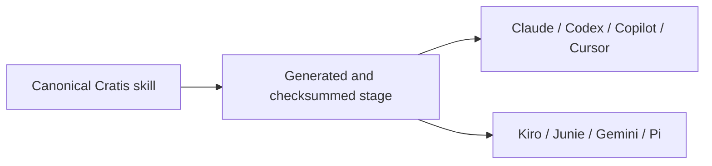

import { CardGrid, Aside } from '@astrojs/starlight/components';
import SimpleCard from '@components/SimpleCard.astro';
import TopicHero from '@components/TopicHero.astro';

<TopicHero icon="puzzle" eyebrow="The Cratis Stack" title="Teach your assistant the Cratis way">
A general-purpose assistant knows C# and TypeScript, but it does not automatically know why a Cratis command lives beside its fact, why a projection consumes events instead of another read model, or why generated proxies should never be hand-edited. Cratis skills provide that missing framework context as reviewed workflows instead of another prompt you have to remember.
</TopicHero>

## One behavior, several native packages

Cratis authors canonical skills in [`Cratis/AI`](https://github.com/Cratis/AI).
Approved exact bytes are projected into the generated
[`Cratis/AI.Distribution`](https://github.com/Cratis/AI.Distribution) repository.
Each target receives the manifest and discovery layout it expects, while the
skill instructions, references, assets, and licenses remain byte-identical.

This avoids behavior forks. A projection skill should not teach one architecture
in Claude and another in Copilot merely because their package manifests differ.

<Aside type="caution" title="Fixture-only distribution">
The generated repository currently proves packaging, byte parity, lifecycle
smoke, canary/rollback, and protected generation with a sanitized fixture. It is
not a supported installation target and contains no approved real public skill.
Do not install its `main` branch.
</Aside>

## Public packages stay passive

The planned public package contains portable Agent Skills and their static
references, assets, and licenses. It excludes executable extensions, lifecycle
scripts, credentials, project facts, authoring evals, engineering hooks, agents,
prompts, and repository tooling.

Executable Chronicle operations belong to the documented CLI and Chronicle MCP
surfaces, with their own authorization and confirmation boundaries. They are not
smuggled into a passive coding-skills package.

## Skills guide complete workflows

Skills are the high-value pieces: your assistant invokes one when a request
matches and follows a Cratis workflow instead of improvising.

- **`event-modeling`** — settle commands, facts, streams, state views, reactions,
  compliance, and scenarios before implementation.
- **`new-vertical-slice`** — build an application behavior end to end through
  backend, specs, frontend, documentation, and gates.
- **`add-concept`**, **`add-projection`**, **`add-reactor`**,
  **`add-business-rule`**, **`add-ef-migration`** — implement one focused Cratis
  artifact by convention.
- **`write-specs`**, **`write-documentation`** — preserve behavior or explain the
  product through the repository's preferred structure.
- **`review-code`**, **`review-security`**, **`review-performance`** — review
  against Cratis architecture and quality boundaries.
- **`diagnose-slice`** and **`inspect-running-chronicle`** — separate source-code
  diagnosis from authorized running-store inspection.

Framework and client repositories select a different profile from Cratis
applications. A skill reads the repository profile before applying application
vertical-slice conventions.

## Internal engineering behavior is separate

Cratis maintainers currently have repository-local rules, agents, prompts, and
hooks in Cratis-owned repositories. Those engineering artifacts can coordinate
specialists, enforce repository gates, and carry contribution conventions, but
they are not part of the planned public passive package.

See [Using AI as a Cratis maintainer](/ai/cratis-maintainers/) for that workflow.

## Do not copy configuration between repositories

The old all-to-all propagation model is frozen. Copying `.ai`, `.claude`,
`.github`, `.agents`, or `.pi` trees creates mixed versions and lets a consuming
repository become an accidental distributor.

The replacement uses immutable generated releases and version pins. A consuming
repository owns only its project context and minimal host bootstraps. Updating or
rolling back changes the shared version without overwriting project facts.

[Trust and distribution](/ai/trust-and-distribution/) explains the approval,
generation, canary, rollback, and retirement gates in detail.

## Get the operating tools today

Portable coding skills remain gated, but the documented operating workflow is
available now:

1. follow the [CLI getting-started guide](/cli/getting-started/);
2. run `cratis init` in your project to generate the supported CLI context;
3. connect [Chronicle MCP](/chronicle-mcp/) when your host and authorization
   policy allow it.

Read [Start using AI with Cratis](/ai/getting-started/) for the guided setup and
[AI ecosystem support](/ai/ecosystems/) for host-by-host status.

## Where to go next

<CardGrid>
  <SimpleCard title="Start using AI" icon="rocket" link="/ai/getting-started/">
    Set up the available operating tools and choose the right coding-skills path.
  </SimpleCard>
  <SimpleCard title="Ecosystem support" icon="puzzle" link="/ai/ecosystems/">
    Compare generated formats and release gates across supported hosts.
  </SimpleCard>
  <SimpleCard title="Cratis maintainers" icon="seti:folder" link="/ai/cratis-maintainers/">
    Use repository-local skills and gates without restarting propagation.
  </SimpleCard>
  <SimpleCard title="Code analysis" icon="seti:json" link="/code-analysis/">
    See the compiler and lint gates that verify contracts independently of the assistant.
  </SimpleCard>
</CardGrid>
