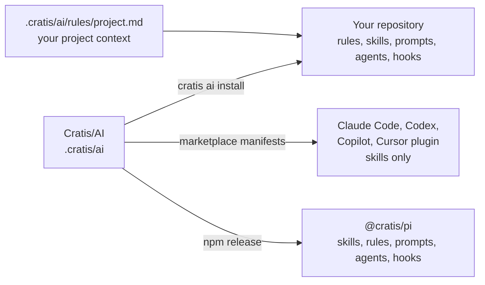

import { CardGrid, Aside } from '@astrojs/starlight/components';
import SimpleCard from '@components/SimpleCard.astro';
import TopicHero from '@components/TopicHero.astro';

<TopicHero icon="puzzle" eyebrow="The Cratis Stack" title="Teach your assistant the Cratis way">
A general-purpose assistant knows C# and TypeScript. It does not know why a Cratis command returns its event from `Handle()`, why a projection consumes events instead of another read model, or why generated proxies are never hand-edited. Cratis AI supplies that framework context as reviewed guidance, so you do not have to repeat it in every prompt.
</TopicHero>

## What the corpus contains

Cratis authors everything in one place, [Cratis/AI](https://github.com/Cratis/AI),
under `.cratis/ai`. It holds five kinds of content:

| Kind | What it does | Example |
| --- | --- | --- |
| **Rules** | Standing guidance the harness loads without being asked; some apply to every file, some only to matching paths | C# and TypeScript conventions, the vertical-slice rules for applications |
| **Skills** | A focused workflow the agent loads when a task matches | `cratis-chronicle-projection` |
| **Prompts** | A slash command that starts a workflow | `new-vertical-slice` |
| **Agents** | Subagent definitions a harness can delegate to | `spec-writer`, `security-reviewer` |
| **Hooks** | Scripts that run the repository's quality gates at points in an agent session | The Cratis quality gate |

Skills are Markdown instructions and references. They contain no executable
code. Hooks run commands, so they only arrive through channels that install
them into your repository or Pi.

## Which channel delivers what

```mermaid
flowchart LR
    A[Cratis/AI<br/>.cratis/ai] -->|cratis ai install| R[Your repository<br/>rules, skills, prompts, agents, hooks]
    A -->|marketplace manifests| M[Claude Code, Codex,<br/>Copilot, Cursor plugin<br/>skills only]
    A -->|npm release| P["@cratis/pi<br/>skills, rules, prompts, agents, hooks"]
    X[.cratis/ai/rules/project.md<br/>your project context] --> R
```

| Channel | Rules | Skills | Prompts | Agents | Hooks | Version |
| --- | --- | --- | --- | --- | --- | --- |
| `cratis ai install` | Yes, by profile and language | Yes, by profile | Yes | Yes | Yes | Current `main`, or a `--source` checkout |
| Marketplace plugin (`cratis@cratis`) | No | All | No | No | No | Default branch, unpinned |
| `@cratis/pi` | Yes | Yes, by `.cratis/ai.json` if present | Yes | Yes | Yes | npm version |

Every channel reads the same skill files, so a projection skill teaches the
same thing in Claude Code as in Copilot. The
[agent harness guide](/ai/harnesses/) has the install command for each tool, and
[Cratis AI distribution](/ai/trust-and-distribution/) explains the versioning.

## Skills guide complete workflows

A skill is used when a request matches it; the agent then follows a Cratis
workflow instead of improvising. The skill names start with `cratis-`:

- **Model before you build**: `cratis-chronicle-event-modeling`,
  `cratis-event-model-diagram`, and the `cratis-screenplay-*` skills for
  Screenplay models.
- **Build one artifact by convention**: `cratis-arc-command`,
  `cratis-arc-command-validation`, `cratis-chronicle-read-model`,
  `cratis-chronicle-projection`, `cratis-chronicle-reducer`,
  `cratis-chronicle-reactor`, `cratis-chronicle-event-constraints`,
  `cratis-fundamentals-concept`, `cratis-arc-react-page`.
- **Change what already exists**: `cratis-chronicle-event-type-migration`,
  `cratis-arc-ef-core-migration`.
- **Compliance and tenancy**: `cratis-chronicle-compliance`,
  `cratis-chronicle-multi-tenancy`,
  `cratis-arc-authentication-authorization-and-identity`.
- **Specs**: `cratis-application-slice-specifications`,
  `cratis-chronicle-event-specifications`,
  `cratis-chronicle-read-model-specifications`, `cratis-specifications-csharp`,
  `cratis-specifications-typescript`.
- **Review**: `cratis-code-review`, `cratis-security-review`,
  `cratis-performance-review`.
- **Operate a running store**: `cratis-chronicle-cli-operations`,
  `cratis-chronicle-mcp-inspection`, `cratis-cli-terminal-workbench`,
  `cratis-chronicle-web-workbench`.
- **Client languages**: `cratis-chronicle-client-dotnet`,
  `cratis-chronicle-client-typescript`, `cratis-chronicle-client-kotlin`,
  `cratis-chronicle-client-elixir`, and the Kotlin Arc skills.

Prompts start larger workflows: `new-vertical-slice`, `scaffold-feature`,
`add-concept`, `add-projection`, `add-reactor`, `add-reducer`,
`add-business-rule`, `add-ef-migration`, `write-specs`, `write-documentation`,
`code-review`, and `review-pr`. They come with the managed install and
`@cratis/pi`, not with the marketplace plugin.

A Cratis framework repository selects an engineering profile instead of an
application profile, so the application vertical-slice rules are not installed
there. [Profiles](/ai/profiles/) explains the choice.

## Operating a live store is a separate surface

Executable Chronicle operations live in the documented [CLI](/cli/) and the
[Chronicle MCP server](/chronicle-mcp/), each with its own authentication and
confirmation boundaries. The skills describe how to use those tools; they do
not carry their own way into your store.

## Do not copy configuration between repositories

Do not copy `.cratis/ai`, `.claude`, `.github`, `.agents`, or `.pi` trees from one
repository to another. A copy goes stale without anyone noticing, and a
consuming repository must not become an accidental distributor of the corpus.
Install through a channel instead, and keep only your project's own context in
the repository.

<Aside type="note" title="Maintaining Cratis itself?">
Cratis-owned repositories use the same managed install with an engineering
profile. See [Use AI as a Cratis maintainer](/ai/cratis-maintainers/).
</Aside>

## Get the skills and the operating tools today

1. **Coding guidance**: run `cratis ai install` in the repository
   ([Start using Cratis AI](/ai/getting-started/)), or install a
   [plugin for one tool](/ai/harnesses/).
2. **Operating tools**: run `cratis init` in your project to give the assistant
   the CLI catalog, then connect [Chronicle MCP](/chronicle-mcp/) when your host
   and authorization policy allow it.

## Where to go next

<CardGrid>
  <SimpleCard title="Start using AI" icon="rocket" link="/ai/getting-started/">
    Install Cratis AI into a repository and confirm your agent sees it.
  </SimpleCard>
  <SimpleCard title="Profiles" icon="list-format" link="/ai/profiles/">
    Choose application, engineering, or documentation guidance for a repository.
  </SimpleCard>
  <SimpleCard title="Ecosystem support" icon="puzzle" link="/ai/ecosystems/">
    What each coding tool receives through each channel.
  </SimpleCard>
  <SimpleCard title="Cratis maintainers" icon="seti:folder" link="/ai/cratis-maintainers/">
    Work on Cratis repositories with an agent, without copying the corpus.
  </SimpleCard>
  <SimpleCard title="Code analysis" icon="seti:json" link="/code-analysis/">
    The compiler and lint rules that check contracts whether or not an agent wrote the code.
  </SimpleCard>
</CardGrid>
