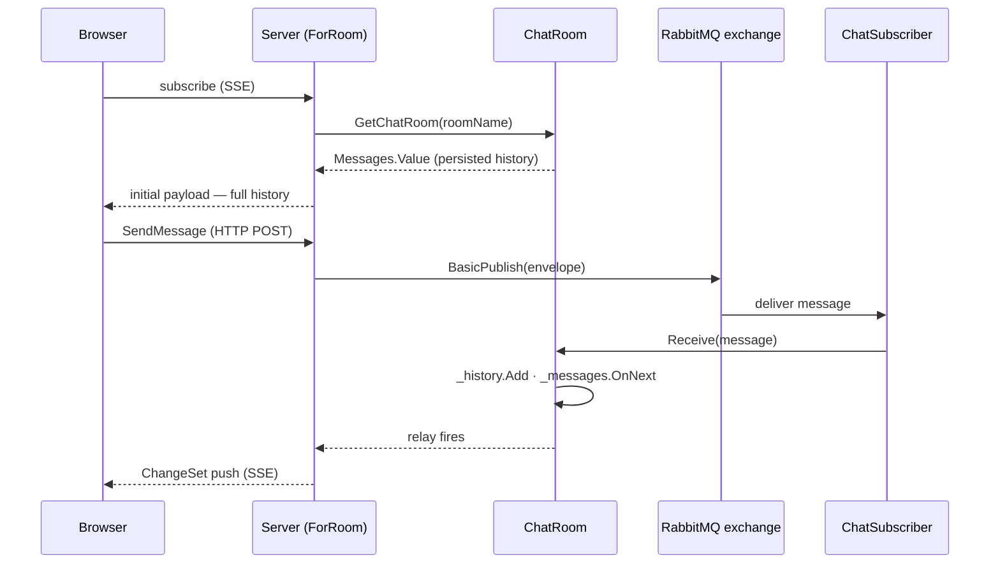

# Real-Time Chat — With RabbitMQ

This guide extends the chat pattern from the [in-memory guide](../in-memory) by replacing the in-process state with two external systems: a **persistence layer** that loads message history on startup, and **RabbitMQ** that delivers new messages to all connected server instances in real time.

The observable query and the React component are unchanged from the in-memory version. All the differences are in how the backend populates and pushes the `BehaviorSubject`.

By the end you will have:

- A `ChatRoom` that loads its initial history from a persistence layer
- A `ChatSubscriber` background service that consumes messages from a RabbitMQ exchange and routes them to the appropriate room
- A `SendMessage` command that publishes to RabbitMQ rather than writing directly to the room
- The same observable query and React component from the in-memory guide, unchanged

---

## Architecture



`SendMessage` publishes to RabbitMQ and returns. The `ChatSubscriber` background service, running on every server instance, receives the message from the queue and routes it to the correct `ChatRoom`. Because `ChatRoom` updates its `BehaviorSubject`, every active relay subscription fires and pushes the updated history to connected clients.

---

## Folder Structure

```
Features/
└── Chat/
    ├── ChatRoom.cs              ← ChatRoom + ChatService (persistence-backed)
    ├── ChatSubscriber.cs        ← BackgroundService — RabbitMQ consumer
    ├── IChatPersistence.cs      ← Persistence abstraction
    ├── ChatRoomPage.cs          ← ChatMessage [ReadModel] + SendMessage [Command]
    └── ChatRoomPage.tsx         ← React component (unchanged from in-memory guide)
```

---

## Step 1 — Persistence Abstraction

Define the persistence contract. The concrete implementation depends on your storage choice (SQL, MongoDB, Chronicle read model — any will do).

```csharp
// Features/Chat/IChatPersistence.cs
namespace MyApp.Chat;

/// <summary>
/// Loads and saves chat message history.
/// </summary>
public interface IChatPersistence
{
    /// <summary>
    /// Loads all messages for the given room, ordered oldest first.
    /// </summary>
    /// <param name="roomName">The room to load history for.</param>
    /// <returns>The persisted message history.</returns>
    Task<IEnumerable<ChatMessage>> GetHistoryAsync(string roomName);
}
```

---

## Step 2 — ChatRoom and ChatService

`ChatRoom` is initialized with a pre-loaded history and exposes a `Receive()` method that the `ChatSubscriber` calls when a new message arrives from RabbitMQ.

```csharp
// Features/Chat/ChatRoom.cs
using System.Collections.Concurrent;
using System.Reactive.Subjects;

namespace MyApp.Chat;

/// <summary>
/// Holds the message history and live subject for a single chat room,
/// pre-populated from the persistence layer on creation.
/// </summary>
public class ChatRoom
{
    readonly List<ChatMessage> _history;
    readonly BehaviorSubject<IEnumerable<ChatMessage>> _messages;

    /// <summary>
    /// Initializes a new instance of the <see cref="ChatRoom"/> class
    /// with history loaded from the persistence layer.
    /// </summary>
    /// <param name="history">The persisted message history, oldest first.</param>
    public ChatRoom(IEnumerable<ChatMessage> history)
    {
        _history = history.ToList();
        _messages = new BehaviorSubject<IEnumerable<ChatMessage>>(_history);
    }

    /// <summary>
    /// Gets the reactive subject that always holds the full current message list.
    /// New subscribers receive the current history immediately via BehaviorSubject semantics.
    /// </summary>
    public BehaviorSubject<IEnumerable<ChatMessage>> Messages => _messages;

    /// <summary>
    /// Appends an incoming message and pushes the updated history to all subscribers.
    /// Called by <see cref="ChatSubscriber"/> when a message arrives from RabbitMQ.
    /// </summary>
    /// <param name="message">The received message.</param>
    public void Receive(ChatMessage message)
    {
        _history.Add(message);
        _messages.OnNext([.._history]);
    }
}

/// <summary>
/// Singleton that creates and tracks chat rooms, loading history from the persistence layer
/// on first access.
/// </summary>
public class ChatService(IChatPersistence persistence)
{
    readonly ConcurrentDictionary<string, ChatRoom> _rooms = new();

    /// <summary>
    /// Gets or creates the <see cref="ChatRoom"/> with the given name.
    /// History is loaded from the persistence layer on first access.
    /// </summary>
    /// <param name="name">The room name.</param>
    /// <returns>The existing or newly created room.</returns>
    public ChatRoom GetChatRoom(string name) =>
        _rooms.GetOrAdd(name, roomName =>
        {
            // Block on first creation only. For production, consider pre-warming
            // rooms on application startup via a hosted service.
            var history = persistence.GetHistoryAsync(roomName).GetAwaiter().GetResult();
            return new ChatRoom(history);
        });
}
```

---

## Step 3 — The ChatSubscriber Background Service

`ChatSubscriber` runs for the lifetime of the application. It declares a transient queue bound to the `chat.messages` fanout exchange, consumes every published message, and routes it to the correct `ChatRoom`.

Using a fanout exchange with an exclusive, auto-delete queue means every server instance receives every message — the right behaviour for a live chat system where clients may be connected to any instance.

```csharp
// Features/Chat/ChatSubscriber.cs
using System.Text.Json;
using Microsoft.Extensions.Hosting;
using RabbitMQ.Client;
using RabbitMQ.Client.Events;

namespace MyApp.Chat;

/// <summary>
/// Background service that consumes chat messages from RabbitMQ and routes them
/// to the appropriate <see cref="ChatRoom"/>.
/// </summary>
public class ChatSubscriber(
    IConnectionFactory connectionFactory,
    ChatService chatService) : BackgroundService
{
    /// <inheritdoc/>
    protected override async Task ExecuteAsync(CancellationToken stoppingToken)
    {
        await using var connection = await connectionFactory.CreateConnectionAsync(stoppingToken);
        await using var channel = await connection.CreateChannelAsync(cancellationToken: stoppingToken);

        // Fanout exchange — every bound queue receives every published message.
        await channel.ExchangeDeclareAsync(
            exchange: "chat.messages",
            type: ExchangeType.Fanout,
            durable: true,
            cancellationToken: stoppingToken);

        // Exclusive, auto-delete queue — scoped to this server instance.
        var queue = await channel.QueueDeclareAsync(
            exclusive: true,
            autoDelete: true,
            cancellationToken: stoppingToken);

        await channel.QueueBindAsync(
            queue: queue.QueueName,
            exchange: "chat.messages",
            routingKey: string.Empty,
            cancellationToken: stoppingToken);

        var consumer = new AsyncEventingBasicConsumer(channel);
        consumer.ReceivedAsync += async (_, ea) =>
        {
            var envelope = JsonSerializer.Deserialize<ChatMessageEnvelope>(ea.Body.ToArray())!;
            var message = new ChatMessage(envelope.User, envelope.SentAt, envelope.Message);
            chatService.GetChatRoom(envelope.RoomName).Receive(message);
            await channel.BasicAckAsync(ea.DeliveryTag, multiple: false, cancellationToken: stoppingToken);
        };

        await channel.BasicConsumeAsync(
            queue: queue.QueueName,
            autoAck: false,
            consumer: consumer,
            cancellationToken: stoppingToken);

        await Task.Delay(Timeout.Infinite, stoppingToken);
    }
}

/// <summary>
/// Wire format for a chat message published to RabbitMQ.
/// Includes the room name so the subscriber can route without inspecting headers.
/// </summary>
public record ChatMessageEnvelope(string RoomName, string User, DateTimeOffset SentAt, string Message);
```

---

## Step 4 — The Read Model and Command

The observable query is structurally identical to the in-memory version. The only change is that `SendMessage` now publishes to RabbitMQ rather than calling `ChatService` directly. The `ChatSubscriber` will receive the message and call `ChatRoom.Receive()`, which fires the `BehaviorSubject`.

```csharp
// Features/Chat/ChatRoomPage.cs
using Cratis.Arc.Commands.ModelBound;
using Cratis.Arc.Queries.ModelBound;
using System.Reactive.Subjects;
using System.Text.Json;
using RabbitMQ.Client;

namespace MyApp.Chat;

// ─── Read Model ───────────────────────────────────────────────────────────────

/// <summary>
/// Represents a single chat message.
/// </summary>
/// <param name="User">The display name of the sender.</param>
/// <param name="SentAt">The UTC time the message was sent.</param>
/// <param name="Message">The message text.</param>
[ReadModel]
public record ChatMessage(string User, DateTimeOffset SentAt, string Message)
{
    /// <summary>
    /// Observes the live message feed for the given room.
    /// The initial emission contains all persisted history for the room.
    /// Subsequent emissions are triggered when <see cref="ChatSubscriber"/> routes a RabbitMQ message.
    /// </summary>
    /// <param name="roomName">The name of the room to observe.</param>
    /// <param name="chatService">The chat service, injected by the framework.</param>
    /// <returns>An observable that emits the full message list on each change.</returns>
    public static ISubject<IEnumerable<ChatMessage>> ForRoom(
        string roomName,
        ChatService chatService)
    {
        var room = chatService.GetChatRoom(roomName);
        var relay = new BehaviorSubject<IEnumerable<ChatMessage>>(room.Messages.Value);
        room.Messages.Subscribe(relay);
        return relay;
    }
}

// ─── Command ──────────────────────────────────────────────────────────────────

/// <summary>
/// Sends a chat message to a room by publishing to RabbitMQ.
/// The <see cref="ChatSubscriber"/> delivers the message to all server instances.
/// </summary>
/// <param name="RoomName">The name of the room to post to.</param>
/// <param name="User">The display name of the sender.</param>
/// <param name="Message">The message text.</param>
[Command]
public record SendMessage(string RoomName, string User, string Message)
{
    /// <summary>
    /// Publishes the message to the RabbitMQ exchange.
    /// </summary>
    /// <param name="channel">The RabbitMQ channel, injected by the framework.</param>
    public async Task Handle(IChannel channel)
    {
        var envelope = new ChatMessageEnvelope(RoomName, User, DateTimeOffset.UtcNow, Message);
        var body = JsonSerializer.SerializeToUtf8Bytes(envelope);
        await channel.BasicPublishAsync(
            exchange: "chat.messages",
            routingKey: string.Empty,
            body: body);
    }
}
```

> **Register dependencies** in your `Program.cs`:
>
> ```csharp
> builder.Services.AddSingleton<ChatService>();
> builder.Services.AddHostedService<ChatSubscriber>();
> builder.Services.AddSingleton<IChatPersistence, YourChatPersistenceImplementation>();
>
> // Register IConnectionFactory pointing at your RabbitMQ instance.
> builder.Services.AddSingleton<IConnectionFactory>(_ =>
>     new ConnectionFactory { HostName = "localhost" });
>
> // Register a singleton IChannel for SendMessage to inject.
> builder.Services.AddSingleton<IConnection>(sp =>
>     sp.GetRequiredService<IConnectionFactory>()
>       .CreateConnectionAsync().GetAwaiter().GetResult());
> builder.Services.AddSingleton<IChannel>(sp =>
>     sp.GetRequiredService<IConnection>()
>       .CreateChannelAsync().GetAwaiter().GetResult());
> ```

> **Run `dotnet build`** after saving. The proxy generator produces the same `ForRoom.ts`, `SendMessage.ts`, and `ChatMessage.ts` as the in-memory version — the frontend does not change.

---

## Step 5 — Delta Mode

Delta mode works identically here. The server still emits the full list on each `OnNext()` call, but Arc only sends the difference to each client:

- **First connection** — the client receives the full persisted history as the initial payload.
- **Each new message** — Arc computes the `ChangeSet` (one item in `added`, everything else unchanged) and sends only that diff.

The `use()` hook applies each `ChangeSet` transparently, so `messagesResult.data` always holds the complete current collection.

See [Delta Mode](/arc/backend/queries/change-stream/) and the [in-memory guide](../in-memory#step-3--delta-mode) for a full explanation of how the ChangeSet is computed and when to consider adding a `ChatMessageId` property.

---

## Step 6 — The React Component

The React component is **identical** to the one in the [in-memory guide](../in-memory#step-4--the-react-component). The observable query contract — `ForRoom.use({ roomName })` returning `messagesResult.data` — does not change regardless of how the backend sources its data.

---

## What Changed from the In-Memory Version

| Aspect | In-Memory | RabbitMQ |
| ------ | --------- | -------- |
| Initial history | Empty `[]` | Loaded from persistence layer |
| New messages enter via | `ChatRoom.Send()` directly | `ChatSubscriber` ← RabbitMQ |
| `SendMessage.Handle()` | Calls `chatService.GetChatRoom().Send()` | Publishes to `chat.messages` exchange |
| Scales across instances | No — state is process-local | Yes — every instance consumes from the exchange |
| Observable query | Unchanged | Unchanged |
| React component | Unchanged | Unchanged |

The observable query and the frontend are unaffected by the backend data source. That is the point: `ISubject<IEnumerable<ChatMessage>>` is a contract between the query method and the framework, not between the query method and any specific storage technology.
