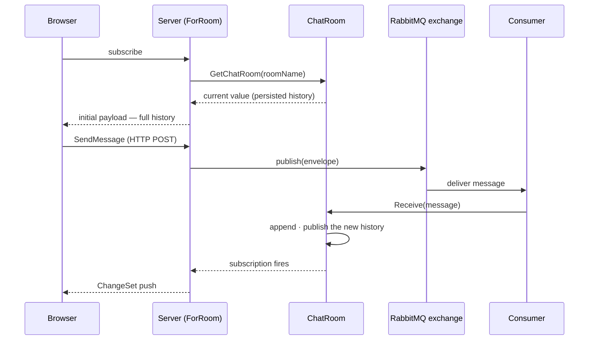

# Real-Time Chat — With RabbitMQ

This guide extends the chat pattern from the [in-memory guide](../in-memory) by replacing the in-process state with two external systems: a **persistence layer** that loads message history on startup, and **RabbitMQ** that delivers new messages to all connected server instances in real time.

The observable query and the React component are unchanged from the in-memory version. All the differences are in how the backend fills the room's history and publishes new messages to it.

By the end you will have:

- A `ChatRoom` that loads its initial history from a persistence layer
- A `SendMessage` command that publishes through a publishing contract rather than writing directly to the room
- A RabbitMQ publisher and a consumer that routes each message to the appropriate room (shown for C#)
- The same observable query and React component from the in-memory guide, unchanged

---

## Architecture



`SendMessage` publishes to RabbitMQ and returns. The consumer, running on every server instance, receives the message from the queue and routes it to the correct `ChatRoom`. The room publishes its updated history, and every subscriber of the room's query receives the new message.

---

## Folder Structure

```text
Chat/
├── IChatPersistence.cs        ← Persistence abstraction
├── ChatRoom.cs                ← ChatRoom + ChatService (persistence-backed)
├── IChatPublisher.cs          ← Publishing abstraction
├── ChatRoomPage.cs            ← ChatMessage read model + SendMessage command
├── RabbitMqChatPublisher.cs   ← IChatPublisher over RabbitMQ
├── ChatSubscriber.cs          ← BackgroundService — RabbitMQ consumer
└── ChatRoomPage.tsx           ← React component (unchanged from in-memory guide)
```

This is the C# layout. Kotlin and TypeScript keep the same backend files as `.kt` or `.ts`, and Java puts each public type in its own file. The RabbitMQ publisher and consumer are shown for C# only (Step 2).

---

## Step 1 — The Backend

The backend keeps the shape of the in-memory guide and changes where messages come from and go to:

- **The persistence contract** loads a room's history, oldest first. The implementation depends on your storage choice (SQL, MongoDB, a Chronicle read model — any will do).
- **The room** starts from that history and exposes `Receive`, which the broker consumer calls for every message that arrives.
- **The chat service** is still one instance for the application. It loads a room's history the first time the room is asked for.
- **The publishing contract** hides the broker from the command. The message's `Id` is created when it is sent and travels in the envelope, so every server instance stores the same message under the same `Id`.
- **The read model and its query** are the same as in the in-memory guide, except in TypeScript, where the query awaits the room because its history loads asynchronously.
- **The command** publishes an envelope instead of writing to the room. The room changes when the message comes back from the broker.

<ArcBackendTabs snippet="scenarios/chat/rabbitmq/backend" />

Per backend:

- **C#** blocks on the first load of a room's history and loads each room once, even when two requests ask for it at the same time. A `Lazy` keeps a failed load's exception, so the service removes a failed room and the next subscriber tries again. For production, consider warming the rooms when the application starts, with a hosted service.
- **Kotlin and Java** load the history inside `computeIfAbsent`, so a room is loaded once. The persistence contract is a blocking call, as with JDBC.
- **TypeScript** loads the history asynchronously, so `getChatRoom` and the query are `async`. The service caches the pending load, so concurrent subscribers share one load, and forgets a failed load so the next subscriber tries again. `ChatPersistence` and `ChatPublisher` are abstract classes because a TypeScript interface does not exist at runtime to be a service token.

Register your implementations of the two contracts with the application's services:

- **C#**: see the registrations after Step 2.
- **Kotlin and Java**: make each implementation a Spring bean, for example with `@Component`.
- **TypeScript**: `builder.services.addSingleton(ChatPersistence, YourChatPersistence)` and `builder.services.addSingleton(ChatPublisher, YourChatPublisher)`.

---

## Step 2 — RabbitMQ

RabbitMQ is plain application code, not an Arc integration. This step shows it for C# with the [RabbitMQ .NET client](https://www.rabbitmq.com/client-libraries/dotnet); with Kotlin, Java or TypeScript, use your platform's AMQP client in the same roles.

The publisher implements `IChatPublisher` by publishing the envelope to the `chat.messages` fanout exchange:

```csharp
// Chat/RabbitMqChatPublisher.cs
using System.Text.Json;
using RabbitMQ.Client;

namespace MyApp.Chat;

public class RabbitMqChatPublisher(IChannel channel) : IChatPublisher
{
    public async Task Publish(ChatMessageEnvelope envelope) =>
        await channel.BasicPublishAsync(
            exchange: "chat.messages",
            routingKey: string.Empty,
            body: JsonSerializer.SerializeToUtf8Bytes(envelope));
}
```

`ChatSubscriber` runs for the lifetime of the application. It declares a transient queue bound to the exchange, consumes every published message, and routes it to the correct `ChatRoom`.

Using a fanout exchange with an exclusive, auto-delete queue means every server instance receives every message — the right behaviour for a live chat system where clients may be connected to any instance.

```csharp
// Chat/ChatSubscriber.cs
using System.Text.Json;
using Microsoft.Extensions.Hosting;
using RabbitMQ.Client;
using RabbitMQ.Client.Events;

namespace MyApp.Chat;

/// <summary>
/// Background service that consumes chat messages from RabbitMQ and routes them
/// to the appropriate <see cref="ChatRoom"/>.
/// </summary>
public class ChatSubscriber(
    IConnectionFactory connectionFactory,
    ChatService chatService) : BackgroundService
{
    /// <inheritdoc/>
    protected override async Task ExecuteAsync(CancellationToken stoppingToken)
    {
        await using var connection = await connectionFactory.CreateConnectionAsync(stoppingToken);
        await using var channel = await connection.CreateChannelAsync(cancellationToken: stoppingToken);

        // Fanout exchange — every bound queue receives every published message.
        await channel.ExchangeDeclareAsync(
            exchange: "chat.messages",
            type: ExchangeType.Fanout,
            durable: true,
            cancellationToken: stoppingToken);

        // Exclusive, auto-delete queue — scoped to this server instance.
        var queue = await channel.QueueDeclareAsync(
            exclusive: true,
            autoDelete: true,
            cancellationToken: stoppingToken);

        await channel.QueueBindAsync(
            queue: queue.QueueName,
            exchange: "chat.messages",
            routingKey: string.Empty,
            cancellationToken: stoppingToken);

        var consumer = new AsyncEventingBasicConsumer(channel);
        consumer.ReceivedAsync += async (_, ea) =>
        {
            var envelope = JsonSerializer.Deserialize<ChatMessageEnvelope>(ea.Body.Span)!;
            var message = new ChatMessage(envelope.Id, envelope.User, envelope.SentAt, envelope.Message);
            chatService.GetChatRoom(envelope.RoomName).Receive(message);
            await channel.BasicAckAsync(ea.DeliveryTag, multiple: false, cancellationToken: stoppingToken);
        };

        await channel.BasicConsumeAsync(
            queue: queue.QueueName,
            autoAck: false,
            consumer: consumer,
            cancellationToken: stoppingToken);

        await Task.Delay(Timeout.Infinite, stoppingToken);
    }
}
```

> **Register dependencies** in your `Program.cs`:
>
> ```csharp
> builder.Services.AddSingleton<ChatService>();
> builder.Services.AddHostedService<ChatSubscriber>();
> builder.Services.AddSingleton<IChatPersistence, YourChatPersistenceImplementation>();
> builder.Services.AddSingleton<IChatPublisher, RabbitMqChatPublisher>();
>
> // Register IConnectionFactory pointing at your RabbitMQ instance.
> builder.Services.AddSingleton<IConnectionFactory>(_ =>
>     new ConnectionFactory { HostName = "localhost" });
>
> // Register a singleton IChannel for the publisher.
> builder.Services.AddSingleton<IConnection>(sp =>
>     sp.GetRequiredService<IConnectionFactory>()
>       .CreateConnectionAsync().GetAwaiter().GetResult());
> builder.Services.AddSingleton<IChannel>(sp =>
>     sp.GetRequiredService<IConnection>()
>       .CreateChannelAsync().GetAwaiter().GetResult());
> ```

Build the backend to generate the proxies. They are the same `ForRoom.ts`, `SendMessage.ts`, and `ChatMessage.ts` as in the in-memory version — the frontend does not change.

---

<a id="step-5--delta-mode"></a>

## Step 3 — Delta Mode

Delta mode works identically here. The room still publishes the full list on each message, but Arc only sends the difference to each client:

- **First connection** — the client receives the full persisted history as the initial payload.
- **Each new message** — Arc matches messages by `Id`, so the `ChangeSet` holds one item in `added` and nothing else.

The `use()` hook applies each `ChangeSet` transparently, so `messagesResult.data` always holds the complete current collection.

See [Delta Mode](/arc/backend/csharp/queries/change-stream/) and the [in-memory guide](../in-memory#step-3--delta-mode) for how the ChangeSet is computed and why `ChatMessage` has an `Id`.

---

<a id="step-6--the-react-component"></a>

## Step 4 — The React Component

The React component is **identical** to the one in the [in-memory guide](../in-memory#step-4--the-react-component). The observable query contract — `ForRoom.use({ roomName })` returning `messagesResult.data` — does not change regardless of how the backend sources its data.

---

## What Changed from the In-Memory Version

| Aspect | In-Memory | RabbitMQ |
| ------ | --------- | -------- |
| Initial history | Empty `[]` | Loaded from persistence layer |
| New messages enter via | The room's `Send` | The broker consumer, through the room's `Receive` |
| `SendMessage` handler | Sends to the room through the chat service | Publishes an envelope through the publishing contract |
| Scales across instances | No — state is process-local | Yes — every instance consumes from the exchange |
| Observable query | Unchanged | Unchanged |
| React component | Unchanged | Unchanged |

The observable query and the frontend are unaffected by the backend data source. That is the point: the query returns an observable source of the room's messages — a subject in C# and TypeScript, a `Flow` in Kotlin, a `Flow.Publisher` in Java — and that is a contract between the query and Arc, not between the query and any specific storage or messaging technology.
