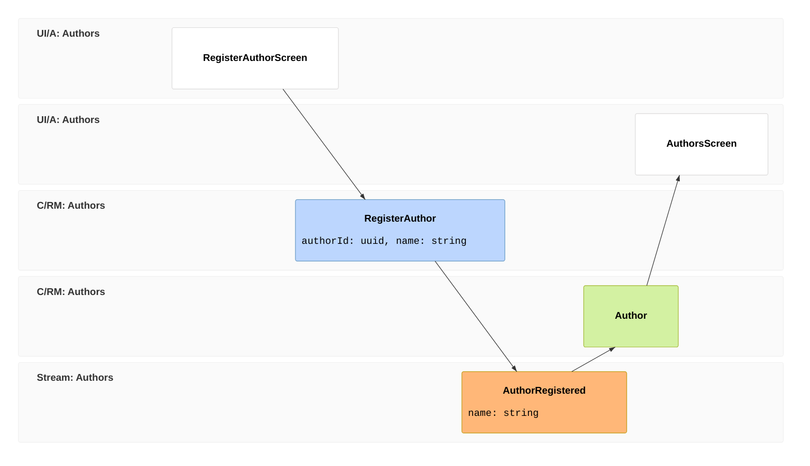

import { CardGrid, Aside } from '@astrojs/starlight/components';
import SimpleCard from '@components/SimpleCard.astro';
import TopicHero from '@components/TopicHero.astro';

<TopicHero icon="approve-check" eyebrow="Testing" title="Turn the model into executable examples">
Cratis applications already describe behavior as a timeline: a screen sends a command, the command records an event, projections build read models, and reactors act on facts. The testing story follows the same shape. You write a small specification for the behavior, seed the facts that already happened, perform the command or event, and assert the new facts, read models, or side effects.
</TopicHero>

## The testing stack

The packages are layered the same way the runtime is layered:

| Package | Use it for |
|---|---|
| `Cratis.Specifications.XUnit` | BDD-style specifications on top of xUnit: `Establish()` for given, `Because()` for when, `[Fact]` methods for then, plus `Should*` assertions and `Catch.Exception`. |
| `Cratis.Specifications.NUnit` | The same specification style for NUnit projects. |
| `Cratis.Arc.Testing` | `CommandScenario<TCommand>` for running Arc commands through the real command pipeline without HTTP. |
| `Cratis.Chronicle.Testing` | `EventScenario`, `ReadModelScenario<TReadModel>`, and `ReactorScenario<TReactor>` for in-process Chronicle tests without a server or database. |
| `Cratis.Arc.Chronicle.Testing` | Automatically extends `CommandScenario<TCommand>` with an in-memory Chronicle event log when the package is referenced. |
| `Cratis.Testing` | Convenience package for Arc + Chronicle application tests. Use it with `Cratis.Specifications.XUnit`. |

For most Cratis stack slices, reference:

```xml
<PackageReference Include="Cratis.Specifications.XUnit" />
<PackageReference Include="Cratis.Testing" />
```

Use `Cratis.Chronicle.Testing` directly for Chronicle-only libraries, and `Cratis.Arc.Testing` directly when a slice deliberately has no event-sourced write side.

## Why BDD fits event sourcing

The given/when/then shape is not an arbitrary testing style here. It is the same grammar as event sourcing:

| Specification word | Event-sourced meaning | Cratis test API |
|---|---|---|
| **Given** | Facts that already happened, or read model state that already exists | `EventScenario.Given`, `ReadModelScenario.Given`, reusable `given` base contexts |
| **When** | The command, append, projection input, or reactor trigger under test | `CommandScenario.Execute`, `EventLog.Append`, `ReactorScenario.Given.ForEventSource(...).Events(...)` |
| **Then** | The observable result: appended events, command result, projected read model, or side effect | `[Fact]` methods with `ShouldBeSuccessful`, `ShouldHaveAppendedEvent`, `ShouldEqual`, or mock assertions |

That makes specs readable in the same language as the event model. A domain expert can read "given an author already exists, when registering the same name, then it should not append another event" and understand the rule without knowing the implementation.

<Aside type="tip" title="One act, many facts">
`Specification` runs `Establish()` and `Because()` before each `[Fact]`. Put the behavior under test in `Because()` once, store the result in fields, and let each fact assert one thing about the same behavior.
</Aside>

## The event model becomes the spec

Start with one column from an event model:



Read it as a testable behavior:

| Given | When | Then |
|---|---|---|
| no author exists for this id | `RegisterAuthor` is executed | the command succeeds |
| no author exists for this id | `RegisterAuthor` is executed | `AuthorRegistered` is appended for the author id |
| `AuthorRegistered` exists | the projection handles it | the `Author` read model contains the name the screen needs |

The slice can stay small:

```csharp
using Cratis.Arc.Commands;
using Cratis.Chronicle.Events;
using Cratis.Chronicle.Keys;
using Cratis.Chronicle.Projections;
using Cratis.Chronicle.ReadModels;

[Command]
public record RegisterAuthor([property: Key] EventSourceId AuthorId, string Name)
{
    public AuthorRegistered Handle() => new(Name);
}

[EventType]
public record AuthorRegistered(string Name);

[ReadModel]
[FromEvent<AuthorRegistered>]
public record Author([property: Key] EventSourceId Id, string Name);
```

And the stack spec follows the same order:

```csharp
using Cratis.Arc.Chronicle.Testing.Commands;
using Cratis.Arc.Commands;
using Cratis.Arc.Testing.Commands;
using Cratis.Chronicle.Events;
using Cratis.Chronicle.Testing.ReadModels;
using Cratis.Specifications;
using Xunit;

public class when_registering_a_new_author : Specification
{
    readonly EventSourceId _authorId = EventSourceId.New();
    readonly CommandScenario<RegisterAuthor> _command = new();
    readonly ReadModelScenario<Author> _projection = new();
    CommandResult _result = default!;

    async Task Because()
    {
        _result = await _command.Execute(new RegisterAuthor(_authorId, "Jane Austen"));

        await _projection.Given
            .ForEventSource(_authorId)
            .Events(_command.AppendedEvents.Select(_ => _.Event.Content).ToArray());
    }

    [Fact] void should_accept_the_command() =>
        _result.ShouldBeSuccessful();

    [Fact] Task should_record_the_fact() =>
        _command.ShouldHaveAppendedEvent<RegisterAuthor, AuthorRegistered>(
            _authorId,
            e => e.Name == "Jane Austen");

    [Fact] void should_project_the_author_for_the_screen() =>
        _projection.Instance!.Name.ShouldEqual("Jane Austen");
}
```

There is no HTTP server in that spec and no Chronicle server to start. Arc runs the command through the real command pipeline. The Chronicle extension captures the events appended by the command. The read model scenario then feeds those event contents through the projection in-process, so the final assertion checks the same state the React query would read.

## How to test Arc

Use Arc tests for command behavior: validation, authorization, injected services, and whether the command succeeds. `CommandScenario<TCommand>` builds the real Arc command pipeline lazily, so you register services before `Because()` calls `Execute()` or `Validate()`.

```csharp
public class when_adding_item_to_cart : Specification
{
    readonly IInventoryService _inventory = Substitute.For<IInventoryService>();
    readonly CommandScenario<AddItemToCart> _scenario = new();
    CommandResult _result = default!;

    void Establish()
    {
        _inventory.IsInStock("SKU-123").Returns(true);
        _scenario.Services.AddSingleton(_inventory);
    }

    async Task Because() =>
        _result = await _scenario.Execute(new AddItemToCart("SKU-123", 2));

    [Fact] void should_succeed() =>
        _result.ShouldBeSuccessful();
}
```

Use `Validate()` when you want validation and authorization without running the handler. Use the Chronicle extension when the command returns events and you want to assert which facts were recorded.

## How to test Chronicle

Chronicle tests are fastest when you test the part of the event pipeline you own:

| You need to prove | Use |
|---|---|
| Code appends the right event, or rejects an append because of constraints | `EventScenario` |
| A projection or reducer builds the read model correctly | `ReadModelScenario<TReadModel>` |
| A reactor performs the right side effect when an event arrives | `ReactorScenario<TReactor>` |

For example, a projection spec is just given events, then read model state:

```csharp
public class when_projecting_a_registered_author : Specification
{
    readonly EventSourceId _authorId = EventSourceId.New();
    readonly ReadModelScenario<Author> _scenario = new();

    Task Because() =>
        _scenario.Given
            .ForEventSource(_authorId)
            .Events(new AuthorRegistered("Jane Austen"));

    [Fact] void should_set_the_author_name() =>
        _scenario.Instance!.Name.ShouldEqual("Jane Austen");
}
```

Use a real Chronicle integration test when you are testing hosting, storage, subscriptions, observer recovery, or the boundary between processes. Keep the bulk of slice behavior in the in-process scenarios so the suite stays fast.

## How to test a Cratis stack slice

A full slice usually has three useful spec levels:

| Level | What it proves | Typical tool |
|---|---|---|
| Command spec | The command validates, authorizes, and records the right facts | `CommandScenario<TCommand>` + `Cratis.Arc.Chronicle.Testing` |
| Read side spec | The event history builds the read model the screen needs | `ReadModelScenario<TReadModel>` |
| Workflow spec | The app boundary, identity, tenant routing, real Chronicle host, and projections work together | xUnit fixture + `Cratis.Specifications.XUnit` + HTTP/client helpers |

Start with command and read-side specs for every meaningful event-model column. Add workflow specs around the edges where the wiring matters: AuthProxy headers, tenant isolation, a real Chronicle server, or browser-visible behavior.

## Where to go next

<CardGrid>
  <SimpleCard title="Specifications" icon="approve-check" link="/specifications/">
    Understand the BDD package itself: lifecycle methods, xUnit and NUnit packages, exception capture, assertions, and spec folder structure.
  </SimpleCard>
  <SimpleCard title="Arc testing" icon="puzzle" link="/arc/backend/testing/">
    Test commands through the Arc command pipeline, with or without Chronicle.
  </SimpleCard>
  <SimpleCard title="Chronicle testing" icon="seti:db" link="/chronicle/testing/">
    Test events, read models, and reactors in-process.
  </SimpleCard>
  <SimpleCard title="Event modeling" icon="list-format" link="/event-modeling/">
    Draw the flow that becomes the specification.
  </SimpleCard>
  <SimpleCard title="Build the full slice" icon="rocket" link="/build-a-full-app/">
    See the command, event, read model, and React screen together.
  </SimpleCard>
</CardGrid>
