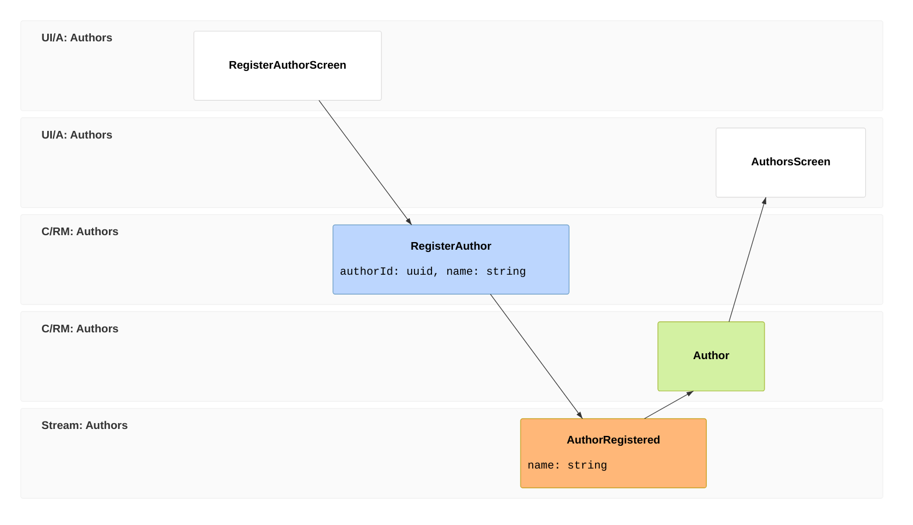

import { CardGrid, Aside } from '@astrojs/starlight/components';
import SimpleCard from '@components/SimpleCard.astro';
import TopicHero from '@components/TopicHero.astro';

<TopicHero icon="approve-check" eyebrow="Testing" title="Turn the model into executable examples">
Cratis applications already describe behavior as a timeline: a screen sends a command, the command records an event, projections build read models, and reactors act on facts. The testing story follows the same shape. You write a small specification for the behavior, seed the facts that already happened, perform the command or event, and assert the new facts, read models, or side effects.
</TopicHero>

<Aside type="caution" title="Arc for TypeScript is a source preview">
No Arc for TypeScript package is published to npm, and it does not have full parity with Arc on .NET. Its package names and APIs can still change. The TypeScript tabs on this page use it.
</Aside>

## Test packages by backend

Each backend tests a command through the real Arc command pipeline and a read model without a Chronicle server. The packages differ:

| Backend | Command specs | Read-model specs |
|---|---|---|
| C# | `Cratis.Arc.Testing` (`CommandScenario<TCommand>`), with `Cratis.Arc.Chronicle.Testing` for the events a command appends | `Cratis.Chronicle.Testing` (`ReadModelScenario<TReadModel>`) |
| Kotlin | `io.cratis:arc-testing` (`CommandScenario`), with `io.cratis:arc-chronicle-spring-boot-starter` for the events a command appends | `io.cratis:chronicle-testing` (`ReadModelScenario`) |
| Java | `io.cratis:arc-testing`, driven through `BlockingCommandScenario`, with the same Chronicle starter | The examples call the reducer directly |
| TypeScript (source preview) | `@cratis/arc.testing` (`CommandScenario`), with `@cratis/arc.chronicle/testing` (`ChronicleCommandScenario`) for the events a command appends | `@cratis/chronicle/testing` (`ReadModelScenario`) |

The [Arc for Kotlin and Java testing guide](/arc/backend/kotlin/guides/testing/) and the [Arc for TypeScript testing guide](/arc/backend/typescript/testing/) cover the JVM and TypeScript harnesses in depth. The rest of this section lists the .NET packages.

### The .NET packages

For .NET, the packages are layered the same way the runtime is layered:

| Package | Use it for |
|---|---|
| `Cratis.Specifications.XUnit` | BDD-style specifications on top of xUnit: `Establish()` for given, `Because()` for when, `[Fact]` methods for then, plus `Should*` assertions and `Catch.Exception`. |
| `Cratis.Specifications.NUnit` | The same specification style for NUnit projects. |
| `Cratis.Arc.Testing` | `CommandScenario<TCommand>` for running Arc commands through the real command pipeline without HTTP. |
| `Cratis.Chronicle.Testing` | `EventScenario`, `ReadModelScenario<TReadModel>`, and `ReactorScenario<TReactor>` for in-process Chronicle tests without a server or database. |
| `Cratis.Arc.Chronicle.Testing` | Automatically extends `CommandScenario<TCommand>` with an in-memory Chronicle event log when the package is referenced. |
| `Cratis.Testing` | Convenience package for Arc + Chronicle application tests. Use it with `Cratis.Specifications.XUnit`. |

For most .NET Cratis stack slices, reference:

```xml
<PackageReference Include="Cratis.Specifications.XUnit" />
<PackageReference Include="Cratis.Testing" />
```

Use `Cratis.Chronicle.Testing` directly for Chronicle-only libraries, and `Cratis.Arc.Testing` directly when a slice deliberately has no event-sourced write side.

## Why BDD fits event sourcing

Given/when/then maps one to one onto event sourcing: the given is the facts that already happened, the when is the command or event under test, and the then is the facts, read models, or side effects that result. The .NET specification APIs line up like this:

| Specification word | Event-sourced meaning | Cratis test API |
|---|---|---|
| **Given** | Facts that already happened, or read model state that already exists | `EventScenario.Given`, `ReadModelScenario.Given`, reusable `given` base contexts |
| **When** | The command, append, projection input, or reactor trigger under test | `CommandScenario.Execute`, `EventLog.Append`, `ReactorScenario.Given.ForEventSource(...).Events(...)` |
| **Then** | The observable result: appended events, command result, projected read model, or side effect | `[Fact]` methods with `ShouldBeSuccessful`, `ShouldHaveAppendedEvent`, `ShouldEqual`, or mock assertions |

That makes specs readable in the same language as the event model. A domain expert can read "given an author already exists, when registering the same name, then it should not append another event" and understand the rule without knowing the implementation.

<Aside type="tip" title="One act, many facts">
In .NET, `Specification` runs `Establish()` and `Because()` before each `[Fact]`. Put the behavior under test in `Because()` once, store the result in fields, and let each fact assert one thing about the same behavior.
</Aside>

## The event model becomes the spec

Start with one column from an event model:


```mermaid
eventmodeling

tf 01 ui  Authors.RegisterAuthorScreen
tf 02 cmd Authors.RegisterAuthor { authorId: uuid, name: string }
tf 03 evt Authors.AuthorRegistered { name: string }
tf 04 rmo Authors.Author ->> 03
tf 05 ui  Authors.AuthorsScreen ->> 04
```

Read it as a testable behavior:

| Given | When | Then |
|---|---|---|
| no author exists for this id | `RegisterAuthor` is executed | the command succeeds |
| no author exists for this id | `RegisterAuthor` is executed | `AuthorRegistered` is appended for the author id |
| `AuthorRegistered` exists | the projection handles it | the `Author` read model contains the name the screen needs |

### The slice

The command's handler returns the event, and Arc appends it to the event source the command identifies. The slice stays small:

<ArcBackendTabs snippet="testing-with-cratis/register-author" />

### Spec the command

The command spec covers the first two rows: the command succeeds, and `AuthorRegistered` is recorded for the author id.

<ArcBackendTabs snippet="testing-with-cratis/register-author-spec" />

There is no HTTP server in that spec and no Chronicle server to start. Arc runs the command through the real command pipeline, and each backend's Chronicle test support captures the events the command appends in memory. TypeScript's `ChronicleCommandScenario` does not enforce constraints; the [Arc for TypeScript testing guide](/arc/backend/typescript/testing/) lists what it does not cover.

### Spec the read side

The read-side spec covers the last row: given `AuthorRegistered`, the `Author` read model contains the name the screen needs. C#, Kotlin, and TypeScript run the read model in process with a read-model scenario; Java calls its reducer directly. Elixir does not support this test yet. Each example declares the event again so it compiles on its own; in your application, reuse the event from the slice.

<ChronicleClientTabs snippet="testing/index/example-spec" />

In C#, one spec can cover both sides: pass the contents of the command scenario's `AppendedEvents` to `ReadModelScenario<TReadModel>.Given.ForEventSource(...).Events(...)`, and the last assertion checks the same state the React query reads.

## How to test Arc

Use Arc tests for command behavior: validation, authorization, injected services, and whether the command succeeds. These examples register a service before executing a command that calls it through the Arc pipeline:

<ArcBackendTabs snippet="scenarios/test-a-command/spec" />

In .NET, use `Validate()` when you want validation and authorization without running the handler. Use the Chronicle extension when the command returns events and you want to assert which facts were recorded.

## How to test Chronicle

In .NET, Chronicle tests are fastest when you test the part of the event pipeline you own:

| You need to prove | Use |
|---|---|
| Code appends the right event, or rejects an append because of constraints | `EventScenario` |
| A projection or reducer builds the read model correctly | `ReadModelScenario<TReadModel>` |
| A reactor performs the right side effect when an event arrives | `ReactorScenario<TReactor>` |

Use a real Chronicle integration test when you are testing hosting, storage, subscriptions, observer recovery, or the boundary between processes. In .NET, Kotlin, and TypeScript, keep supported read-model behavior in the in-process scenarios so the suite stays fast.

## How to test a Cratis stack slice

A full .NET slice usually has three useful spec levels:

| Level | What it proves | Typical tool |
|---|---|---|
| Command spec | The command validates, authorizes, and records the right facts | `CommandScenario<TCommand>` + `Cratis.Arc.Chronicle.Testing` |
| Read side spec | The event history builds the read model the screen needs | `ReadModelScenario<TReadModel>` |
| Workflow spec | The app boundary, identity, tenant routing, real Chronicle host, and projections work together | xUnit fixture + `Cratis.Specifications.XUnit` + HTTP/client helpers |

Start with command and read-side specs for every meaningful event-model column. Add workflow specs around the edges where the wiring matters: AuthProxy headers, tenant isolation, a real Chronicle server, or browser-visible behavior.

## Where to go next

<CardGrid>
  <SimpleCard title="Specifications" icon="approve-check" link="/specifications/">
    Understand the BDD package itself: lifecycle methods, xUnit and NUnit packages, exception capture, assertions, and spec folder structure.
  </SimpleCard>
  <SimpleCard title="Arc testing" icon="puzzle" link="/arc/backend/csharp/testing/">
    Test commands through the Arc command pipeline, with or without Chronicle.
  </SimpleCard>
  <SimpleCard title="Chronicle testing" icon="seti:db" link="/chronicle/testing/">
    Test events, read models, and reactors in-process.
  </SimpleCard>
  <SimpleCard title="Event modeling" icon="list-format" link="/event-modeling/">
    Draw the flow that becomes the specification.
  </SimpleCard>
  <SimpleCard title="Build the full slice" icon="rocket" link="/build-a-full-app/">
    See the command, event, read model, and React screen together.
  </SimpleCard>
</CardGrid>
