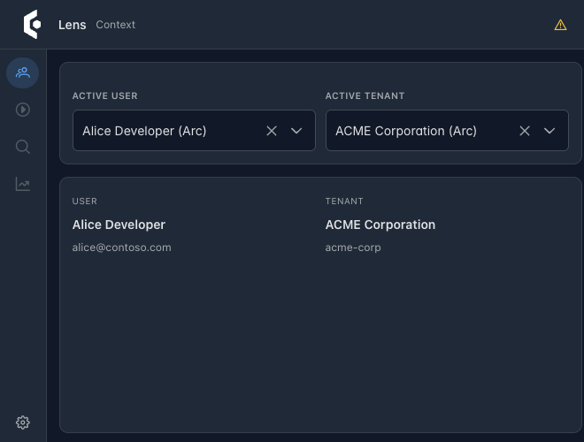
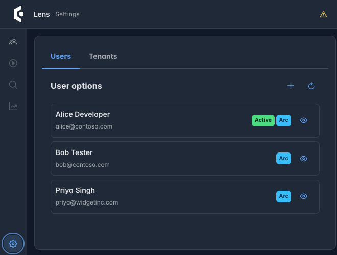
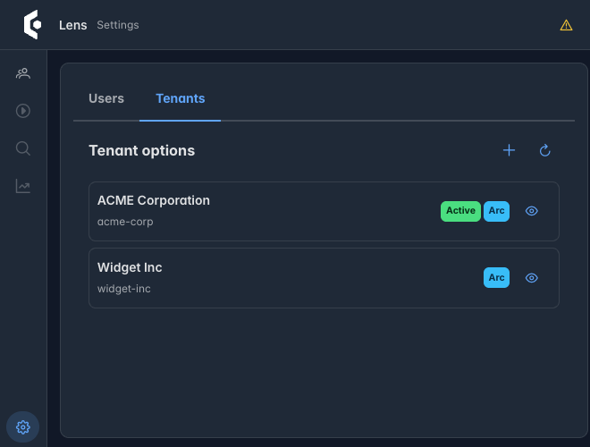

import { CardGrid, Steps } from '@astrojs/starlight/components';
import SimpleCard from '@components/SimpleCard.astro';
import TopicHero from '@components/TopicHero.astro';

<TopicHero icon="seti:html" eyebrow="Tools" title="Your Arc app, inspectable in the browser">
You're testing an Arc app in the browser and you want to fire a command with a specific payload, or check what a query returns for a different tenant — without writing a throwaway page. **Lens** is a browser extension that does exactly that: it detects the running Arc app in your current tab, lets you browse its commands and queries by namespace, run them with a structured form, and switch the active user and tenant on the fly.
</TopicHero>

## What it does

Lens opens as a popup with four tabs. When the current tab is a running Arc application, it detects it automatically and lights up the command and query browsers.

<CardGrid>
  <SimpleCard title="Commands" icon="rocket">
    Browse the app's commands by namespace and execute them with a schema-driven form; see the formatted result or validation errors.
  </SimpleCard>
  <SimpleCard title="Queries" icon="list-format">
    Browse queries by namespace and perform them, with results shown in a data table — no scratch UI needed.
  </SimpleCard>
  <SimpleCard title="Context" icon="seti:lock">
    Choose the active user and tenant for this browser profile; Lens applies them as request headers when it calls the app.
  </SimpleCard>
  <SimpleCard title="Settings" icon="right-arrow">
    Manage users and tenants by hand, or sync them straight from the connected Arc app, and set the tenant header name.
  </SimpleCard>
</CardGrid>

Under the hood it's a Manifest V3 extension built with React, Vite, and PrimeReact — the same UI stack as [Components](/components/) — and it talks to the Arc backend's introspection endpoints to discover the command and query catalog.

## Where the tenant and user roster comes from

The **Settings** tab's "sync straight from the connected Arc app" roster is not
configuration Lens invents on its own — it reads two anonymous, development-only
endpoints every Arc application already exposes: `GET /.cratis/tenants` and
`GET /.cratis/users`. A backend answers them by implementing `ICanProvideTenants`
and `ICanProvideUsers` in C#, or the equivalent `TenantsProvider`/`UsersProvider`
in Kotlin and Java. Multiple providers can be registered at once; Arc merges
their results. Without a provider registered, both endpoints return an empty
array — Lens simply shows no `Arc`-tagged entries until you add one or switch
on a custom entry of your own.

When you open the Lens popup on a page it recognizes as a running Arc
application, it fetches both endpoints and merges the result into its own
roster (each entry tagged `Arc`). You can also add entries by hand from Lens
itself — those are tagged `Custom` and survive even when the backend's own
list changes or is temporarily unreachable.

The screenshots below are the real extension, popped open against demo data:
three users and two tenants, sourced from an Arc backend's providers exactly
as `/.cratis/users` and `/.cratis/tenants` returned them.

### Context — the active user and tenant



The **Context** tab is what you land on. It shows the currently active user
and tenant for this browser profile, and lets you switch either one from a
dropdown built from the merged roster. Selecting a different user or tenant
takes effect immediately: every subsequent request the inspected page makes
carries the matching tenant header and identity headers, so the backend's
tenant resolution and identity provider see the switch exactly as they would
from a real caller.

### Settings — the roster, tagged by source





The **Settings** tab lists every known user and tenant, each carrying an
`Arc` or `Custom` badge so you can tell at a glance whether an entry came
from the backend's providers or was added locally. The green `Active` badge
marks the selection currently in effect. Use the eye icon to inspect the
full identity or tenant payload the backend returned, the `+` to add a
custom entry, and the refresh icon to re-fetch from the backend without
reopening the popup.

See [Development users and tenants (C#)](/arc/backend/csharp/identity/development-and-topologies/)
or [Development users and tenants (Kotlin and Java)](/arc/backend/kotlin/guides/development-users-and-tenants/)
for how to implement a provider, and [Tenancy in Arc](/arc/backend/csharp/tenancy/)
for how this development-only discovery seam relates to actual tenant
resolution at request time.

## Install from the Chrome Web Store

The easiest way to install Lens is directly from the [Chrome Web Store](https://chromewebstore.google.com/detail/cratis-lens/hfdpoljbaknodcgejjohafbfjejijklj). Click **Add to Chrome** and the extension is ready to use.

## Install it (side-load)

You can also build Lens from source and load it unpacked — useful for development or trying unreleased changes. The source is at [github.com/Cratis/Lens](https://github.com/Cratis/Lens).

<Steps>

1. Clone the repo, then from the `Source` folder install and build:

   ```bash
   cd Source
   yarn
   yarn build
   ```

   This produces `Source/dist/` (including `manifest.json`).

2. Open `chrome://extensions`, enable **Developer mode**, choose **Load unpacked**, and select the `Source/dist` folder. Lens appears as **Lens – Cratis Developer Tools**.

3. Navigate to your running Arc app, open the Lens popup once so it detects the app, then open its settings, confirm the **Tenant Header Name**, and save.

</Steps>

For an active edit loop, run `yarn dev` to rebuild on change, and reload the extension from `chrome://extensions` after each rebuild.

## Where to go next

<CardGrid>
  <SimpleCard title="Queries in Arc" icon="puzzle" link="/arc/backend/csharp/queries/">
    What Lens is browsing — how Arc exposes queries and observable queries over your read models.
  </SimpleCard>
  <SimpleCard title="Provide tenants & users (C#)" icon="seti:c-sharp" link="/arc/backend/csharp/identity/development-and-topologies/">
    Implement `ICanProvideTenants` and `ICanProvideUsers` so Lens can discover and switch between them on your running app.
  </SimpleCard>
  <SimpleCard title="Provide tenants & users (Kotlin/Java)" icon="seti:kotlin" link="/arc/backend/kotlin/guides/development-users-and-tenants/">
    Implement `TenantsProvider`/`UsersProvider`, or the async Java variants, for the same discovery contract.
  </SimpleCard>
  <SimpleCard title="Tenancy in Arc" icon="seti:lock" link="/arc/backend/csharp/tenancy/">
    How this development-only discovery seam relates to actual tenant resolution and isolation at request time.
  </SimpleCard>
  <SimpleCard title="VS Code extension (Narrator)" icon="laptop" link="/tools/vscode-extension/">
    The editor-side companion — explore the Chronicle event store from VS Code.
  </SimpleCard>
</CardGrid>
