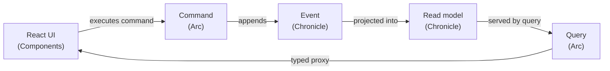

Most teams that want event sourcing end up assembling it themselves: an event store here, a CQRS library there, hand-written API controllers, a pile of glue to keep the frontend types in sync with the backend, and a folder structure that scatters one feature across `Commands/`, `Handlers/`, `Events/`, and `Components/`. It works, but the glue is where the bugs and the boredom live.

Cratis removes the glue. It is one coherent stack for building event-sourced applications, made of three pieces that are designed to fit together:

- **[Chronicle](/chronicle/)** — the event sourcing platform. It stores every change as an immutable event and turns those events into read models, reactions, and projections.
- **[Arc](/arc/)** — the full-stack application framework. It turns commands, queries, and projections into a CQRS application and **generates TypeScript proxies** so your React frontend stays in lockstep with your C# backend.
- **[Components](/components/)** — the React component library. Command forms, data tables, and dialogs that consume Arc's generated proxies, so a screen is a few lines, not a few files.

## How the pieces fit

A single user action flows through all three with no manual wiring in between:

You write the command, the event, and the projection once in C#. Arc generates the typed client. Components renders it. When the command's shape changes, the frontend types change with it — the compiler tells you what to fix instead of production telling your users.

## The principles behind it

Cratis is opinionated on purpose. The opinions are what make it productive:

- **Events are facts.** Immutable, past-tense, single-purpose. If you reach for a nullable field on an event, you need a second event.
- **High cohesion through [vertical slices](/arc/vertical-slices/).** Everything for one behavior — command, events, projection, UI, specs — lives in one folder, backend and frontend together. You navigate by feature, not by technical layer.
- **Full-stack type safety.** Models flow from C# through proxy generation to TypeScript, with no manual synchronization.
- **Easy to do the right thing.** Convention over configuration and artifact discovery by naming mean less boilerplate and fewer ways to get it wrong.

## When Cratis is a good fit

Reach for Cratis when history and change *matter*: audit and compliance, process-heavy domains, systems where "how did we get here?" is a real question, or anywhere you want a clean CQRS application without building the plumbing yourself.

## When it isn't

Event sourcing is not free. If your domain is genuinely CRUD — a few forms over a database where the current state is the whole story and nobody will ever ask what changed — the extra concepts (events, projections, eventual consistency) cost more than they return. Read [Why Event Sourcing](/chronicle/why-event-sourcing/) for an honest look at the trade-offs before you commit.

## Where to start

- **New to event sourcing?** Begin with [Why Event Sourcing](/chronicle/why-event-sourcing/), then the [Chronicle getting started](/chronicle/get-started/).
- **Want to build something now?** Scaffold a full-stack app from a template in the [Chronicle getting started](/chronicle/get-started/) and follow it through to a running screen.
