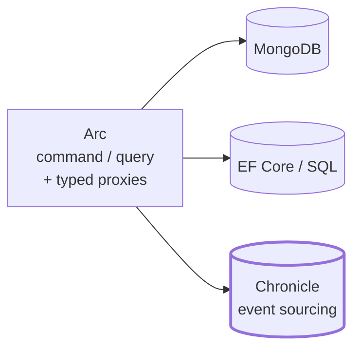
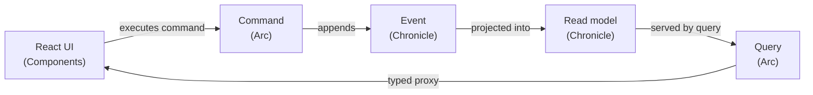

import { CardGrid } from '@astrojs/starlight/components';
import SimpleCard from '@components/SimpleCard.astro';
import TopicHero from '@components/TopicHero.astro';

<TopicHero icon="open-book" eyebrow="The Cratis stack" title="One stack for event-sourced apps">
Most teams assemble event sourcing themselves — an event store here, a CQRS library there, hand-written controllers, and a pile of glue to keep frontend types in sync. **Cratis removes the glue.** Three products that each earn their place on their own — and compose into one typed, full-stack, event-sourced loop when you want all three. [Get started →](/chronicle/get-started/) · [Build a full-stack feature →](/build-a-full-app/)
</TopicHero>

## The three products, one platform

<CardGrid>
  <SimpleCard title="Chronicle" icon="seti:db" link="/chronicle/">
    The event sourcing platform. Stores every change as an immutable event and turns those events into read models, reactions, and projections.
  </SimpleCard>
  <SimpleCard title="Arc" icon="puzzle" link="/arc/">
    The full-stack framework. Turns commands and queries into a CQRS app and generates TypeScript proxies so React stays in lockstep with C#.
  </SimpleCard>
  <SimpleCard title="Components" icon="laptop" link="/components/">
    The React library. Command forms, data tables, and dialogs that consume Arc's proxies — a screen is a few lines, not a few files.
  </SimpleCard>
  <SimpleCard title="CLI" icon="rocket" link="/cli/">
    A terminal window into a running store — inspect events, watch observers, and diagnose issues.
  </SimpleCard>
</CardGrid>

## Use them on their own — or together

The three products are built to stand alone. Each solves a complete problem by itself, so you can adopt exactly the part you need and nothing more:

- **Chronicle on its own** is an event-sourcing engine you can run from *any* .NET host — a worker, a console app, a different web framework. Append events, build projections, react to them. No Arc, no React required.
- **Arc on its own** is a full-stack CQRS framework with **generated, typed C# → TypeScript proxies**. Its commands and queries can persist however you like — straight to **MongoDB** or **EF Core / SQL**, with *no event sourcing at all* ([here's the standalone shape](/arc/arc-without-event-sourcing/)). You still get the typed frontend, the command forms, and live queries.
- **Components on its own** is a React library that renders Arc's generated proxies as forms, tables, and dialogs.

The dependency only runs one way. Arc is a layer that can sit **on top of** Chronicle — but Chronicle never knows Arc exists, which is why each works without the other. What the combination changes is *where Arc's data lives*: its persistence is pluggable, and Chronicle is the most powerful thing you can plug in.

| You want… | Reach for | Event sourcing? |
| --- | --- | --- |
| History as the source of truth, from any backend | **Chronicle** on its own | Yes |
| A typed full-stack app over a traditional database | **Arc + Components** over MongoDB / EF Core | No |
| A typed full-stack app *and* a full event history | **Arc + Chronicle + Components** — the whole loop | Yes |

The last row is where Cratis is at its best — but you never have to start there. New to the stack? [Choosing where to start](/adopting-cratis/) walks through which products to reach for first, in a new codebase or an existing one.

## Together: the whole loop

Pick Chronicle as Arc's persistence and add Components, and a single user action flows through all three with no manual wiring in between:

You write the command, the event, and the projection once in C#. Arc generates the typed client. Components renders it. When the command's shape changes, the frontend types change with it — the compiler tells you what to fix instead of production telling your users.

## The principles behind it

Cratis is opinionated on purpose. The opinions are what make it productive:

- **Events are facts.** Immutable, past-tense, single-purpose. If you reach for a nullable field on an event, you need a second event.
- **High cohesion through [vertical slices](/arc/vertical-slices/).** Everything for one behavior — command, events, projection, UI, specs — lives in one folder, backend and frontend together.
- **Full-stack type safety.** Models flow from C# through proxy generation to TypeScript, with no manual synchronization — [the proxy boundary](/arc/understanding-the-proxy-boundary/) is what keeps the two languages honest.
- **Easy to do the right thing.** Convention over configuration and artifact discovery by naming mean less boilerplate and fewer ways to get it wrong.

## When Cratis is a good fit — and when it isn't

Because the products are separable, "is Cratis a good fit?" is really two questions.

**Is Arc a good fit?** Reach for it whenever you're building a .NET backend with a TypeScript/React frontend and you're tired of hand-writing the layer between them — controllers, DTOs, fetch wrappers, validation duplicated on both sides. That's true *even for plain CRUD*: Arc gives you typed commands, queries, and a generated client over MongoDB or SQL, with no event sourcing required.

**Is event sourcing a good fit?** Reach for Chronicle when history and change *matter*: audit and compliance, process-heavy domains, systems where "how did we get here?" is a real question. It isn't free, though — if your domain is genuinely CRUD, where current state is the whole story and nobody will ever ask what changed, the extra concepts cost more than they return. Use Arc over a database instead, and add Chronicle the day history starts to matter. [Why Event Sourcing](/chronicle/why-event-sourcing/) is the honest look at that trade-off.

When *neither* fits — a couple of static pages, a non-.NET backend, or a throwaway prototype — Cratis is more than you need, and that's fine.

## Where to start

<CardGrid>
  <SimpleCard title="New to event sourcing?" icon="approve-check" link="/chronicle/why-event-sourcing/">
    Begin with the why — what facts buy you and when to reach for them — then the Chronicle getting started.
  </SimpleCard>
  <SimpleCard title="Just want a typed full-stack app?" icon="puzzle" link="/arc/">
    Start with Arc over a database — commands, queries, and a generated React client, no event sourcing needed.
  </SimpleCard>
  <SimpleCard title="Adding to an existing system?" icon="right-arrow" link="/adopting-cratis/">
    Greenfield or brownfield — how to choose an entry point and adopt one piece at a time.
  </SimpleCard>
</CardGrid>
