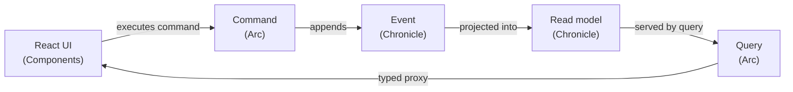

import { CardGrid } from '@astrojs/starlight/components';
import SimpleCard from '@components/SimpleCard.astro';
import TopicHero from '@components/TopicHero.astro';

<TopicHero icon="open-book" eyebrow="The Cratis stack" title="One stack for event-sourced apps">
Most teams assemble event sourcing themselves — an event store here, a CQRS library there, hand-written controllers, and a pile of glue to keep frontend types in sync. **Cratis removes the glue.** Three pieces, designed to fit together. [Get started →](/chronicle/get-started/) · [Build a full-stack feature →](/build-a-full-app/)
</TopicHero>

## The three products, one platform

<CardGrid>
  <SimpleCard title="Chronicle" icon="seti:db" link="/chronicle/">
    The event sourcing platform. Stores every change as an immutable event and turns those events into read models, reactions, and projections.
  </SimpleCard>
  <SimpleCard title="Arc" icon="puzzle" link="/arc/">
    The full-stack framework. Turns commands and queries into a CQRS app and generates TypeScript proxies so React stays in lockstep with C#.
  </SimpleCard>
  <SimpleCard title="Components" icon="laptop" link="/components/">
    The React library. Command forms, data tables, and dialogs that consume Arc's proxies — a screen is a few lines, not a few files.
  </SimpleCard>
  <SimpleCard title="CLI" icon="rocket" link="/cli/">
    A terminal window into a running store — inspect events, watch observers, and diagnose issues.
  </SimpleCard>
</CardGrid>

## How the pieces fit

A single user action flows through all three with no manual wiring in between:

You write the command, the event, and the projection once in C#. Arc generates the typed client. Components renders it. When the command's shape changes, the frontend types change with it — the compiler tells you what to fix instead of production telling your users.

## The principles behind it

Cratis is opinionated on purpose. The opinions are what make it productive:

- **Events are facts.** Immutable, past-tense, single-purpose. If you reach for a nullable field on an event, you need a second event.
- **High cohesion through [vertical slices](/arc/vertical-slices/).** Everything for one behavior — command, events, projection, UI, specs — lives in one folder, backend and frontend together.
- **Full-stack type safety.** Models flow from C# through proxy generation to TypeScript, with no manual synchronization.
- **Easy to do the right thing.** Convention over configuration and artifact discovery by naming mean less boilerplate and fewer ways to get it wrong.

## When Cratis is a good fit — and when it isn't

Reach for Cratis when history and change *matter*: audit and compliance, process-heavy domains, systems where "how did we get here?" is a real question, or anywhere you want a clean CQRS application without building the plumbing yourself.

Event sourcing is not free, though. If your domain is genuinely CRUD — a few forms over a database where the current state is the whole story and nobody will ever ask what changed — the extra concepts cost more than they return. [Why Event Sourcing](/chronicle/why-event-sourcing/) is the honest look at the trade-offs.

## Where to start

<CardGrid>
  <SimpleCard title="New to event sourcing?" icon="approve-check" link="/chronicle/why-event-sourcing/">
    Begin with the why — what facts buy you and when to reach for them — then the Chronicle getting started.
  </SimpleCard>
  <SimpleCard title="Want to build now?" icon="rocket" link="/chronicle/get-started/">
    Scaffold a full-stack app from a template and follow it through to a running screen.
  </SimpleCard>
</CardGrid>
