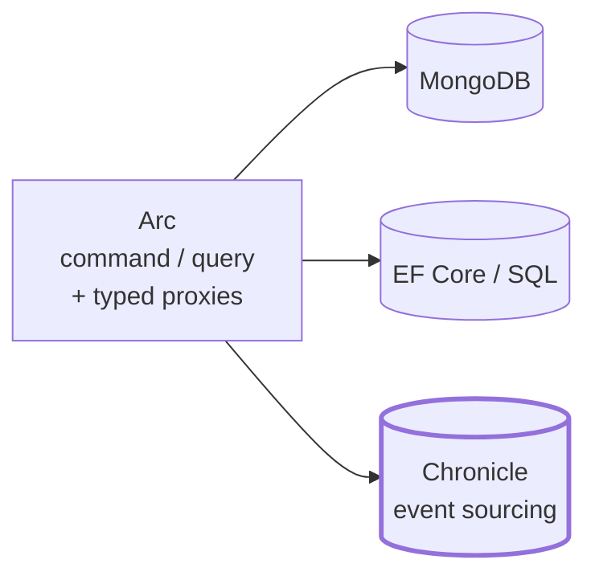
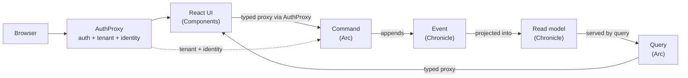

import { CardGrid } from '@astrojs/starlight/components';
import SimpleCard from '@components/SimpleCard.astro';
import TopicHero from '@components/TopicHero.astro';

<TopicHero icon="open-book" eyebrow="Why developers choose Cratis" title="Build the system you modeled">
Developers choose Cratis when they want the domain model, backend, frontend, identity boundary, UI, and operations view to line up. Chronicle, Arc, Components, AuthProxy, the CLI, and the AI tooling are opinionated in the same direction: write the behavior once, keep the contract typed, choose the right storage, handle the hard cross-cutting concerns, and make the running system inspectable. [Get started →](/chronicle/get-started/) · [Build a full-stack feature →](/build-a-full-app/)
</TopicHero>

## The developer payoff

<CardGrid>
  <SimpleCard title="The pieces fit together" icon="puzzle" link="/cratis-stack/">
    Chronicle, Arc, Components, AuthProxy, Studio, and the tools use the same domain language and conventions, so the stack feels designed as one platform.
  </SimpleCard>
  <SimpleCard title="Less glue between layers" icon="approve-check" link="/arc/understanding-the-proxy-boundary/">
    Commands and queries become HTTP endpoints and generated TypeScript proxies. You do not hand-write controllers, DTO mirrors, or fetch wrappers for every feature.
  </SimpleCard>
  <SimpleCard title="A compiler-enforced boundary" icon="seti:typescript" link="/arc/understanding-the-proxy-boundary/">
    The frontend imports code generated from the backend. If C# changes, TypeScript changes with it, and drift becomes a build error.
  </SimpleCard>
  <SimpleCard title="Predictable by convention" icon="approve-check" link="/code-analysis/">
    Cratis is opinionated about names, folders, attributes, and discovery. The conventions make codebases consistent, and analyzers catch convention drift at build time.
  </SimpleCard>
  <SimpleCard title="A feature you can read top to bottom" icon="seti:folder" link="/arc/vertical-slices/">
    A slice keeps intent, state, screen, and specs together. You change one behavior without spelunking through layers.
  </SimpleCard>
  <SimpleCard title="End-to-end foundations" icon="seti:lock" link="/authproxy/">
    Authentication, tenant resolution, identity enrichment, authorization, and tenant-isolated data are first-class parts of the platform, not scattered application boilerplate.
  </SimpleCard>
  <SimpleCard title="History you can trust" icon="seti:db" link="/chronicle/why-event-sourcing/">
    We treat event sourcing as the default for information systems. Chronicle records immutable facts and derives read models from them, so audit and replay are part of the design.
  </SimpleCard>
  <SimpleCard title="Screens that follow the model" icon="laptop" link="/components/">
    Components renders generated commands and observable queries as forms, dialogs, and tables, so UI code stays close to the model.
  </SimpleCard>
  <SimpleCard title="AI can work with it" icon="rocket" link="/ai-native-development/">
    The same conventions that help developers navigate the codebase are packaged as AI skills, rules, and diagnostics, so agents build with the grain of the framework.
  </SimpleCard>
  <SimpleCard title="Specs read like the model" icon="approve-check" link="/testing-with-cratis/">
    Given/when/then specifications line up with event modeling: existing facts, a command, and the facts or read models that should result.
  </SimpleCard>
  <SimpleCard title="Operations without guesswork" icon="rocket" link="/cli/">
    Inspect events, observers, read models, replay, and diagnostics from the CLI and Workbench instead of guessing what the runtime is doing.
  </SimpleCard>
</CardGrid>

## The big win: the platform fit

The point is not that Cratis has many packages. The point is that the packages agree about how an application is shaped. A command, an event, a read model, a tenant, an identity, a React form, and an operating tool are not separate islands with separate conventions. They are parts of one model.

| Concern | Where Cratis carries it |
|---|---|
| Domain behavior | Studio models it, Arc turns it into commands and queries, Chronicle records the facts as the default source of truth for information systems |
| Frontend contract | Arc generates TypeScript proxies from C#, and Components renders those proxies as forms, dialogs, and live tables |
| Chronicle client boundary | Chronicle exposes gRPC/protobuf contracts, with .NET as the first-class client and TypeScript and Elixir clients/contracts for other runtimes |
| Chronicle storage | MongoDB, PostgreSQL, Microsoft SQL Server, and SQLite implementations let the event store fit the deployment |
| Runtime scale | Chronicle runs its kernel on .NET Orleans, so event sequences, observers, jobs, and long-running processing live on a distributed actor runtime |
| Authentication and tenant resolution | AuthProxy handles the edge and forwards trusted identity and tenant context into the app |
| Authorization | Arc gates commands and queries at the boundary, with identity details available in backend and React |
| Tenant isolation | Arc tenancy and Chronicle namespaces keep one tenant's state away from another's by construction |
| Operations and observability | Workbench, CLI, OpenTelemetry, recommendations, replay, jobs, failed partitions, and diagnostics expose what the runtime is doing |
| Testing | Cratis Specifications, Arc command scenarios, and Chronicle in-process scenarios turn an event-model column into executable given/when/then specs |
| AI assistance | `.ai` skills, editor rules, analyzers, the CLI catalog, and the Chronicle MCP server give agents the same rails developers use |

That is why the opinions matter. They make codebases consistent. Consistency makes onboarding faster, reviews sharper, and AI assistance far less speculative.

## Chronicle as an architecture choice

Chronicle is more than a .NET package. It is a client-server event platform with an open protocol boundary and a kernel built for long-running event processing.

<CardGrid>
  <SimpleCard title="Language-neutral boundary" icon="puzzle" link="/chronicle/architecture/">
    Chronicle speaks gRPC/protobuf at the kernel boundary. The .NET client is the first-class, most mature experience, and the repo also ships TypeScript and Elixir clients/contracts.
  </SimpleCard>
  <SimpleCard title="Storage choice" icon="seti:db" link="/chronicle/hosting/configuration/storage/">
    The event store is storage-agnostic: MongoDB by default, with PostgreSQL, Microsoft SQL Server, and SQLite implementations when those fit better.
  </SimpleCard>
  <SimpleCard title="Built on Orleans" icon="rocket" link="/chronicle/architecture/">
    The kernel is built on .NET Orleans, giving Chronicle a distributed actor foundation for event sequences, observers, jobs, reminders, and recovery.
  </SimpleCard>
  <SimpleCard title="Operable by design" icon="approve-check" link="/cli/chronicle/">
    Workbench, CLI, OpenTelemetry, server recommendations, observer replay, failed partitions, jobs, and read-model inspection are part of the product, not an afterthought.
  </SimpleCard>
</CardGrid>

## What changes day to day

Cratis is not just a set of libraries. It changes the shape of the work:

| Instead of... | You work with... |
|---|---|
| Duplicating request and response shapes in C# and TypeScript | One C# command/query model, generated into typed frontend proxies |
| Spreading one feature across controllers, handlers, clients, and UI folders | A vertical slice organized by behavior |
| Rebuilding screens by hand after a write | Observable queries and components that follow the read model |
| Rebuilding authentication, tenancy, and identity plumbing per service | AuthProxy at the edge, Arc identity and tenancy inside the app, Chronicle namespaces underneath |
| Teaching every developer and AI assistant a project-specific architecture from scratch | Strong conventions, analyzers, and `.ai` guidance that make each feature look like the rest |
| Locking event history to one application language or database engine | Chronicle's gRPC boundary, .NET/TypeScript/Elixir clients/contracts, and MongoDB/PostgreSQL/SQL Server/SQLite storage implementations |
| Debugging from logs alone | Events, observers, read models, and replay visible through the tools |
| Treating CQRS and event sourcing as the same decision | Arc for the command/query boundary, Chronicle for the event-sourced backbone — independent, but strongest together |

The result is a workflow that stays close to the language developers already use: "what happened?", "what state does this screen need?", "what command changes it?", and "what did the runtime do with it?"

## The products behind it

<CardGrid>
  <SimpleCard title="Chronicle" icon="seti:db" link="/chronicle/">
    The event sourcing platform. gRPC/protobuf at the boundary, .NET-first client experience, storage choice underneath, and Orleans-powered processing inside.
  </SimpleCard>
  <SimpleCard title="Arc" icon="puzzle" link="/arc/">
    The full-stack framework. Turns commands and queries into a CQRS app and generates TypeScript proxies so React stays in lockstep with C#.
  </SimpleCard>
  <SimpleCard title="Components" icon="laptop" link="/components/">
    The React library. Command forms, data tables, and dialogs that consume Arc's proxies — a screen is a few lines, not a few files.
  </SimpleCard>
  <SimpleCard title="AuthProxy" icon="seti:lock" link="/authproxy/">
    The edge gateway. Handles authentication, tenant resolution, identity enrichment, routing, and invite-based onboarding.
  </SimpleCard>
  <SimpleCard title="Studio" icon="open-book" link="/studio/">
    The modeling surface. Capture the domain shape with the team, then generate type-safe C# from the model. Coming soon.
  </SimpleCard>
  <SimpleCard title="CLI" icon="rocket" link="/cli/">
    A terminal window into a running store — inspect events, watch observers, and diagnose issues.
  </SimpleCard>
</CardGrid>

## Use them on their own — or together

The core pieces are built to stand alone. Each solves a complete problem by itself, so you can adopt exactly the part you need and nothing more:

- **Chronicle on its own** is an event-sourcing engine you can run from *any* .NET host — a worker, a console app, a different web framework. The .NET client is the most mature path, but the kernel boundary is gRPC/protobuf and the repo also ships TypeScript and Elixir clients/contracts. Append events, build projections, react to them. No Arc, no React required.
- **Arc on its own** is a full-stack CQRS framework with **generated, typed C# → TypeScript proxies**. Its commands and queries can persist straight to **MongoDB** or **EF Core / SQL** when you deliberately want CQRS without an event log ([here's the standalone shape](/arc/arc-without-event-sourcing/)). You still get the typed frontend, the command forms, and live queries.
- **Components on its own** is a React library that renders Arc's generated proxies as forms, tables, and dialogs.
- **AuthProxy on its own** is a gateway for authentication, tenancy, identity enrichment, routing, and invites in front of any backend and frontend you point it at.

We think event sourcing is the default architecture for information systems. We also think CQRS is the right way to shape information going into and out of a system. Those ideas fit extremely well together and are often associated, but they are not co-dependent: you can use Chronicle without Arc, and Arc can run without Chronicle.

The dependency only runs one way. Arc is a layer that can sit **on top of** Chronicle — but Chronicle never knows Arc exists, which is why each works without the other. AuthProxy sits at the edge and can front the app whether Arc is backed by MongoDB, EF Core, or Chronicle. What the full combination changes is how much of the application is handled by one coherent set of conventions.

| You want… | Reach for | Event sourcing? |
| --- | --- | --- |
| History as the source of truth, from any backend or client runtime | **Chronicle** on its own | Yes |
| An event store over MongoDB, PostgreSQL, Microsoft SQL Server, or SQLite | **Chronicle** with the matching storage backend | Yes |
| A typed full-stack app over a traditional database | **Arc + Components** over MongoDB / EF Core | Not required |
| Authentication, tenancy, identity enrichment, and routing at the edge | **AuthProxy** in front of your services | Optional |
| A typed full-stack app *and* a full event history | **Arc + Chronicle + Components** — the domain loop | Yes |
| A product-grade SaaS shape with edge, identity, tenant isolation, typed UI, history, and operations | **AuthProxy + Arc + Components + Chronicle + CLI** | Default |

The last row is where Cratis is at its best, and it is the default recommendation for a new information system. New to the stack? [Choosing where to start](/adopting-cratis/) walks through how to start there, or how to adopt one piece at a time in an existing system.

## Together: the whole loop

Put AuthProxy at the edge, pick Chronicle as Arc's persistence, and add Components. A single user action now carries identity and tenant context through the whole stack with no manual API layer in between:

You write the command, the event, and the projection once in C#. AuthProxy resolves identity and tenant. Arc generates the typed client and enforces authorization at the boundary. Components renders it. Chronicle keeps the facts and tenant isolation underneath. When the command's shape changes, the frontend types change with it — the compiler tells you what to fix instead of production telling your users.

## The principles behind it

Cratis is opinionated on purpose. The opinions are what make it productive:

- **Events are facts.** Immutable, past-tense, single-purpose. We use them as the default source of truth for information systems; if you reach for a nullable field on an event, you need a second event.
- **Open boundaries keep options open.** Chronicle is a kernel with gRPC/protobuf contracts. .NET is first-class, but the protocol lets other client runtimes participate.
- **Storage is a deployment choice.** Chronicle supports MongoDB, PostgreSQL, Microsoft SQL Server, and SQLite without changing the domain model.
- **High cohesion through [vertical slices](/arc/vertical-slices/).** Everything for one behavior — command, events, projection, UI, specs — lives in one folder, backend and frontend together.
- **Full-stack type safety.** Models flow from C# through proxy generation to TypeScript, with no manual synchronization — [the proxy boundary](/arc/understanding-the-proxy-boundary/) is what keeps the two languages honest.
- **Cross-cutting concerns are first-class.** [Identity and access](/arc/understanding-identity-and-access/), [authorization](/arc/backend/core/authorization/), [tenancy](/arc/backend/tenancy/overview/), [AuthProxy](/authproxy/), and [Chronicle namespaces](/chronicle/concepts/namespaces/) are part of the platform story.
- **Operability is architecture.** Workbench, CLI, OpenTelemetry, recommendations, replay, jobs, and failed-partition recovery are part of how you run the event store.
- **Specifications are executable models.** [Testing with Cratis](/testing-with-cratis/) maps event modeling's given/when/then flow to Arc command specs and Chronicle event/read-model/reactor scenarios.
- **Easy to do the right thing.** Convention over configuration and artifact discovery by naming mean less boilerplate and fewer ways to get it wrong.
- **Predictable code helps humans and AI.** The conventions are documented, packaged as [AI tooling](/ai-native-development/), and enforced by [code analysis](/code-analysis/), so a new feature looks like the rest of the system.

## When Cratis is a good fit — and when it isn't

Because the products are separable, "is Cratis a good fit?" is really a set of connected questions.

**Is Arc a good fit?** Reach for it whenever you're building a .NET backend with a TypeScript/React frontend and you're tired of hand-writing the layer between them — controllers, DTOs, fetch wrappers, validation duplicated on both sides. Arc is the CQRS boundary: commands for things entering the system, queries for information leaving it, with generated contracts between C# and TypeScript.

**Is event sourcing a good fit?** For information systems, our default answer is yes. Reach for Chronicle when the system records decisions, process, responsibility, tenant state, compliance, integrations, or any place where "how did we get here?" will become a real question. The exception is a genuinely current-state-only slice — reference data, settings, small admin surfaces — where Arc over a database can be the simpler boundary. [Why Event Sourcing](/chronicle/why-event-sourcing/) explains why we think the default pays off.

When *neither* fits — a couple of static pages, a non-.NET backend, or a throwaway prototype — Cratis is more than you need, and that's fine.

## Where to start

<CardGrid>
  <SimpleCard title="New to event sourcing?" icon="approve-check" link="/chronicle/why-event-sourcing/">
    Begin with the why — what facts buy you and when to reach for them — then the Chronicle getting started.
  </SimpleCard>
  <SimpleCard title="Just want a typed full-stack app?" icon="puzzle" link="/arc/">
    Use Arc over a database when a bounded slice or adoption step needs CQRS and generated React contracts without an event log.
  </SimpleCard>
  <SimpleCard title="Adding to an existing system?" icon="right-arrow" link="/adopting-cratis/">
    Greenfield or brownfield — how to choose an entry point and adopt one piece at a time.
  </SimpleCard>
</CardGrid>
